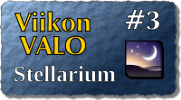

<!--
Title: Stellarium
Week: 1x03
Number: 3
Date: 2011/01/16 20:00
Tags: Linux,Mac OS X,Windows,Opiskelu,Tiede
Pageimage: valo3-stellarium.png
-->
**Stellarium on avoimen lähdekoodin planetaario omalla
tietokoneellasi.**

 Kun asennat
Stellariumin omalle koneellesi ja kerrot sille oman sijaintisi, pääset
katselemaan tähtitaivasta juuri sellaisena kuin se on. Ilman kiikareita
tai kaukoputkea. Ilman näkyvyyttä haittaavia pilviä tai valosaastetta.
Sijainniksi ja ajaksi voi toki asettaa mitä haluaa. Voit siis
tarkastella, miltä tähtitaivas on näyttänyt muinaisessa Egyptissä tai
joskus tulevaisuudessa. Voit katsella menneitä ja tulevia auringon- ja
kuunpimennyksiä eri puolilla maapalloa. Tähtitaivaan tarkastelu ei
rajoitu myöskään maapallon näkymiin vaan sijainnikseen voi valita vaikka
kuun, Marsin, auringon tai jonkin muun tarjolla olevista
taivaankappaleista. Valitse vaikka maisemaksi kuun pinta ja katsele
maannousua.

Stellariumiin voi ladata myös vapaaehtoisten tekemiä maisemia. Miltä
tuntuisi katsella tähtitaivasta Stonehengen kivipaasien keskellä niiden
pystytyksen aikoihin?

Kotisivu
:   <http://www.stellarium.org/fi/>

Lisenssi
:   [GNU GPL](GNU GPL "wikilink")

Toimii seuraavilla alustoilla
:   Linux, Mac OS X, Windows

VALO-CD
:   Stellarium löytyy myös
    [VALO-CD](http://www.valo-cd.fi/ilmainen_stellarium)-kokoelmasta.

Asennus
:   Ohjelman asennuspaketin voi ladata sen kotisivulta tai VALO-CD:ltä.
    Stellarium löytyy suoraan useimpien Linux-jakeluiden
    paketinhallinnasta.

Oppaita
:   [FLOSS Manuals](http://fi.flossmanuals.net/stellarium/)

* [Orion](images/stellarium-1.png)
* [Koko tähtitaivas kerralla](images/stellarium-2.png)
* [Ajan valinta](images/stellarium-3.png)
* [Merkinnät ja projektio](images/stellarium-4.png)
* [Maiseman valinta](images/stellarium-5.png)
* [Tähtikuvioiden valinta kulttuurin mukaan](images/stellarium-6.png)
* [Auringonpimennys](images/stellarium-7.png)
* [Tähdistöviivat näkyvissä](images/stellarium-8.png)
* [Tähdistöt kuvina](images/stellarium-9.png)
* [Kuu](images/stellarium-10.png)
* [Maa kuusta katsottuna](images/stellarium-11.png)
* [Maa kuusta katsottuna](images/stellarium-12.png)

*Teksti: pesasa*  
*kuvakaappaukset: pesasa*