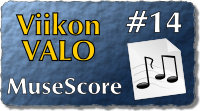

<!--
Title: MuseScore
Week: 1x14
Number: 14
Date: 2011/04/03
Pageimage: valo14-Musescore.png
Tags: Linux,Mac OS X,Windows,Musiikki
-->

**MuseScore on ilmainen ja kätevä WYSIWYG-nuotinnusohjelma
musiikintekijöille.**

 MuseScoren käyttöön
pääse helposti ja nopeasti — ehkäpä puolessa tunnissa — sisälle
katsomalla ohjelman kotisivulta löytyvät lyhyet opetusvideot.
MuseScoreen voidaan syöttää nuotteja suoraan näppäimistöltä. Nuottien
syöttöä voidaan nopeuttaa käyttämällä erillistä MIDI-näppäimistöä.
MuseScorella voi säveltää musiikkia vaikka suurelle
sinfoniaorkesterille, sillä viivastojen määrä ei ole rajattu. Ohjelmaan
on yhdistetty myös MIDI-sekvensseri ja ohjelmistosyntetisaattori. Koska
ohjelma tuo ja vie MIDI:ä, sen avulla voidaan tuottaa MIDI-tiedostoista
nuotinnuksia ja nuotinnoksista vastaavasti MIDI-tiedostoja. Lisäksi
käytettävissä on standardi XML-formaatti, joten siihen voi tuoda muilla
nuotinnusohjelmilla, kuten Finalella ja Sibeliuksella, tehtyjä
partituureja.

Ohjelma on monin tavoin kätevämpi käyttää kuin esim. 80-luvulta
periytyvä Finale. Finalestä löytyy tietysti monia ominaisuuksia, joita
ammattisäveltäjä saattaa tarvita työssään ja joita ei MuseScoresta
löydy. Ohjelma on käännetty monelle kielelle ja myös suomeksi.
Ohjelmistopaketit löytyvät niin Linuxiin, Macciin kuin Windowsiinkin.
Ohjelma on [GNU GPL](GNU_GPL) lisenssoitu. MuseScoresta on
vastikään ilmestynyt 1.0-versio. Aiemmat versiot olivat bugisempia,
mutta niissäkin bugeista aiheutuvia ongelmia oppi nopeasti välttämään.

Kotisivu
:   <http://musescore.org/> (kotisivu näkyy suomeksi jos selaimen
    kieliasetuksissa suomi on ensimmäisenä)

Lisenssi
:   [GNU GPL](GNU_GPL)

Toimii seuraavilla alustoilla
:   Linux, Mac OS X, Windows

Asennus
:   Viimeisimmät asennuspaketit löytyvät ohjelman kotisivulta.
    Useimmissa Linux-jakeluissa ohjelma löytyy myös jakelun omasta
    pakettivarastosta.

Esimerkki
:   [MuseScoreDemo1.pdf](Media:MuseScoreDemo1.pdf "wikilink")

* 
* 
* 
* 

Viitteitä
---------

-   Projekti [Open Goldberg Variations](http://www.kickstarter.com/projects/293573191/open-goldberg-variations-setting-bach-free)
    käyttää Musescorea.
-   [Musescoren käyttöopas](http://www.uta.fi/~jari.eerola/musescoreopas/etusivu.html)
-   [Nuotteja](http://musescore.com/sheetmusic)

*Teksti: ATTE TENKANEN*  
*kuvakaappaukset: pesasa*

