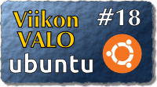

<!--
Title: 1x18 Ubuntu 11.04 - Viikon VALO #18
Date: 2011/05/01
Pageimage: valo18-ubuntu.png
Tags: Järjestelmä,Käyttöjärjestelmä
-->

 **[Ubuntu](http://www.ubuntu.com/) on helppokäyttöinen ja
vapaa Linux-käyttöjärjestelmä. Myös suomen kielellä.**

 Käyttöjärjestelmä on
nimetty eteläafrikkalaisen
[Ubuntu](http://fi.wikipedia.org/wiki/Ubuntu_%28filosofia%29)-ideologian
mukaan. Sana on bantukieltä ja tarkoittaa vapaasti käännettynä
"inhimillisyyttä toisia kohtaan". Käyttöjärjestelmänä Ubuntu pohjautuu
[Debian GNU/Linux](http://www.debian.org/) -järjestelmään (esitelty myös
[Viikon VALOna](http://viikonvalo.fi/Debian_GNU/Linux)), jonka
varastoista suuri osa ohjelmapaketeista on peräisin. Ubuntun
kehittämisen taustalla ovat eteläafrikkalaisen [Mark
Shuttleworthin](http://fi.wikipedia.org/wiki/Mark_Shuttleworth)
perustama yhtiö [Canonical Ltd.](http://www.canonical.com/) sekä
vapaaehtoisten muodostama yhteisö. Ubuntun [luvataan olevan vapaa nyt ja
tulevaisuudessa](http://www.ubuntu.com/project).

Asennus-CD:ltä vasta asennettu Ubuntu-järjestelmä on heti valmis
käytettäväksi. Asennus-CD on myös
[Live-CD](http://fi.wikipedia.org/wiki/Live_CD), eli käynnistämällä kone
CD:ltä Ubuntua voi kokeilla asentamatta mitään. Ohjelmien joukosta
löytyy muun muassa
[LibreOffice](http://viikonvalo.fi/LibreOffice_Writer)-toimisto-ohjelmapaketti
(vanhemmissa Ubuntuissa OpenOffice.org-nimisenä), [Firefox
4](http://viikonvalo.fi/Firefox) -selain, ohjelmat musiikin kuunteluun,
videoiden katseluun, valokuva-albumien ylläpitoon sekä yhteydenpitoon
verkossa. Valmiiksi asennettujen ohjelmien lisäksi Ubuntussa on
lukematon määrä erilaisia ohjelmia asennettavissa vain muutaman
hiirenklikkauksen päässä. Kuten muissakin Linux-jakeluissa, Ubuntuun
[asennettavia ohjelmia ei tyypillisesti etsitä verkkosivuilta ympäri
Internetiä](http://blog.ubuntu-fi.org/2007/viisi-tarkeinta-asiaa-uudelle-ubuntun-kayttajalle/)
vaan ne ovat valmiiksi tarjolla asennettaviksi Ubuntun ohjelmavaraston
kautta. Ubuntun paketinhallintatyökalu pitää yllä tietokantaa tarjolla
olevista ohjelmistoista ja sillä on helppo etsiä tarvittavaa ohjelmaa.
Kun ohjelma on löytynyt, se voidaan asentaa parilla hiiren
näpäytyksellä. Ohjelmien poistaminen onnistuu samalla tavoin.

Ubuntusta julkaistaan uusi versio noin kuuden kuukauden välein.
Suurimpaan osaan julkaisuista annetaan tukea mm. tietoturvapäivitysten
muodossa 18 kuukautta. Noin kahden vuoden välein julkaistavia
pitkäaikaistuettuja LTS-versioita (*long term support*) tuetaan
työpöytäkäytössä kolme ja palvelimissa viisi vuotta. Ubuntun tuorein
versio on 11.04, lempinimeltään **Natty Narwhal** (*siisti sarvivalas*
tai *tyylikäs sarvivalas*). Viimeisin LTS-versio on 10.04 **Lucid Lynx**
(*selvänäköinen ilves*). Ubuntu-julkaisujen versionumero koostuu
julkaisuvuoden ja -kuukauden numeroista. Lempinimet taas ovat
adjektiivilla kuvailtuja eläimiä, jotka etenevät aakkosjärjestyksessä
julkaisusta seuraavaan.

Natty Narwhal
-------------

Huhtikuussa 2011 julkaistu Ubuntu 11.04 Natty Narwhal sisältää muun
muassa seuraavia ominaisuuksia:

-   Uusi Unity-käyttöliittymä, joka on suunniteltu toimimaan
    työpöytäkoneiden ja kannettavien isolta näytöltä, mutta myös
    miniläppärien pienemmiltä näytöiltä.\
     Ubuntun perinteinen Gnome on myös vaihtoehtoisesti käytettävissä
    valitsemalla käyttöliittymä sisäänkirjautumisruudussa.
-   [LibreOffice](http://fi.libreoffice.org/) 3.3.2
    -toimisto-ohjelmisto\
     LibreOffice on käytännössä aiemmin OpenOffice.org-nimellä tunnettu
    toimistopaketti, mutta nyt uudella nimellä. LibreOffice-projekti on
    luonteeltaan aiempaa yhteisöllisempi.
-   [Firefox 4.0](http://firefox.com)-selain
-   [Shotwell](http://yorba.org/shotwell/) 0.9.1 - ohjelma digitaalisten
    valokuvien järjestelyyn ja katseluun
-   Evolution 2.32.2 - sähköpostiohjelma
-   [Banshee 2.0](http://banshee.fm/) - musiikinsoitto-ohjelma, joka
    sisältää muun muassa integraation Amazonin musiikkikauppaan.
-   [Ubuntu One](https://one.ubuntu.com/) -palvelu, joka helpottaa
    tiedostojen varmuuskopiointia ja synkronointia useamman koneen
    välillä.

Rinnakkaisversiot
-----------------

Ubuntusta on olemassa useita erilaisiin käyttöihin ja erilaisille
käyttäjille suunnattuja rinnakkaisversioita. Ne käyttävät taustalla
samaa perusjärjestelmää ja ohjelmapakettien varastoa, mutta erona on
asennuslevyltä oletuksena asentuvien ohjelmien kokoelma. Osassa on
käytössä jokin vaihtoehtoisista käyttöliittymistä, osassa taas
asennetaan kokoelma johonkin tiettyyn käyttötarkoitukseen sopivia
ohjelmia. Kaikki ohjelmat on mahdollista asentaa myös muihin
rinnakkaisversioihin joko yksittäin tai kokonaisuuksina. Yhden
rinnakkaisversion ohjelmakokonaisuuden asentaminen toiseen tapahtuu
helposti asentamalla yksi ohjelmapaketti. Esimerkiksi Lubuntun
sisältämien ohjelmien asentaminen onnistuu asentamalla paketti nimeltä
[**lubuntu-desktop**](http://packages.ubuntu.com/natty/lubuntu-desktop).
Erilaisia käyttöliittymiä käyttävät ohjelmat toimivat myös ristiin
versioiden välillä.

### Kubuntu

[Kubuntu](http://www.kubuntu.org/)-versiossa käyttöliittymänä on
[KDE](http://www.kde.org/)-työpöytä. KDE-työpöydän ulkoasu ja
käyttökokemus poikkeavat jonkin verran Ubuntun oletuksena asentuvasta
käyttöympäristöstä. Kokonaisuuden mukana asentuu joukko ohjelmia, jotka
vastaavat toiminnallisuudeltaan tavallisen Ubuntun kokoelmaa, mutta
sopivat ulkoasultaan ja toiminnaltaan paremmin valittuun
työpöytäympäristöön.

Muutamia uusia ominaisuuksia Kubuntu 11.04:ssä:

-   KDE 4.6.2
-   Tiedostojen jako Samballa entistä helpommin
-   Tuki [OwnCloud](http://owncloud.org) -pilvipalvelulle, jolla
    tiedostoja voi synkronoida verkkoon joko omalle tai muualta
    palveluna hankitulle palvelimelle.

### Xubuntu

[Xubuntu](http://www.xubuntu.org/) käyttää XFCE-työpöytää, joka on
suunniteltu kevyemmäksi käyttöliittymäksi. Xubuntu 11.04:ssä on käytössä
uusi Xfce 4.8 -versio.

### Lubuntu

[Lubuntu](http://lubuntu.net/) on toinen kevyellä käyttöliittymällä
varustettu Ubuntun rinnakkaisversio. Lubuntu käyttää
[LXDE](http://lxde.org)-työpöytää.

### Ubuntu Studio

[Ubuntu Studio](http://ubuntustudio.org/) on suunniteltu luovaan työhön.
Se sisältää parhaat vapaat työkalut äänen, kuvan ja videon käsittelyyn.

### Mythbuntu

[Mythbuntu](http://www.mythbuntu.org/)n avulla voi rakentaa itse oman
verkkotietoisen kotiteatterijärjestelmän, joka toimii hyvin yhteen kodin
muiden laitteiden kanssa.

### Edubuntu

[Edubuntun](http://www.edubuntu.org/) mukana asentuva ohjelmakokonaisuus
on koostettu opetustyötä silmälläpitäen. Edubuntuun on kerätty suuri
joukko koulutyössä hyödyllisiä ohjelmistoja.

Edubuntua voi kokeilla myös [selaimen
kautta](http://www.edubuntu.org/weblive).

Uusia ohjelmia Edubuntu 11.04:ssä:

-   [Pencil](http://www.pencil-animation.org/)-animaatio-ohjelma
-   [Geogebra](http://www.geogebra.org/) - ohjelma geometrian ja
    matematiikan opetteluun
-   [Calibre](http://calibre-ebook.com/) - sähkökirjojen lukemiseen ja
    hallintaan
-   [LibreCAD](http://librecad.com.ar/)
-   [Freemind](http://freemind.sourceforge.net/) - mindmap-työkalu
-   [Stellarium](http://www.stellarium.org/) - planetario-ohjelma

Näiden lisäksi tarjolla on myös muita rinnakkaisversioita. Joukossa on
esimerkiksi erilaisia lokalisoituja versioita, joilla Ubuntu asentuu
suoraan halutulla kielellä ja halutuilla paikallisasetuksilla,
esimerkiksi [suomeksi](http://wiki.ubuntu-fi.org/Ubuntu_Finnish_Remix).
Toinen esimerkki muunlaisista rinnakkaisversioista on sokeille ja
heikkonäköisille suunnattu
[Vinux](https://wiki.ubuntu.com/DerivativeTeam/Derivatives/Vinux).

Kotisivu
:   [<http://www.ubuntu.com/>](http://www.ubuntu.com/) ([Ubuntu
    Suomi](http://www.ubuntu-fi.org/))

Lisenssi
:   Sisältää ohjelmia useilla vapailla lisensseillä

Asennus
:   Asennus-cd:n levykuvan voi ladata joko suoraan Ubuntun kotisivuilta
    taikka Ubuntu Suomen
    [lataussivulta](http://www.ubuntu-fi.org/lataa.html). Sivuilla
    opastetaan lataamaan laitteeseen parhaiten sopiva versio. Ladattu
    levykuvatiedosto poltetaan cd-levylle tai kirjoitetaan
    USB-muistitikulle, jolta käyttöjärjestelmän asennus voidaan
    aloittaa.

Käyttöohjeet ja opastus
:    \* [Mitä uutta Ubuntussa?](http://www.ubuntu.com/ubuntu/whats-new)
:    \* [Viisi tärkeintä asiaa uudelle Ubuntun
käyttäjälle](http://blog.ubuntu-fi.org/2007/viisi-tarkeinta-asiaa-uudelle-ubuntun-kayttajalle/)
:    \* [Ubuntu
tutuksi](http://fi.wikibooks.org/wiki/Ubuntu_tutuksi)-wikikirja
:    \* [Ubuntu Suomen keskustelualueet](http://forum.ubuntu-fi.org/)
:    \* [Linux.fi-wiki](http://linux.fi), josta löytyy ohjeita ja opasteita
moneen Linux-aiheiseen asiaan.
:    \* [Ubuntu Suomen ohjesivu](http://wiki.ubuntu-fi.org/Ohjeet)

Muuta materiaalia
:   [Nelson Mandela kertoo, mistä ubuntussa on kyse.](http://www.youtube.com/watch?v=ODQ4WiDsEBQ)

-   
-   
-   
-   
-   
-   
-   
-   
-   
-   

*Teksti: pesasa*  
*kuvakaappaukset: pesasa*
