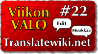

<!--
Title: 1x22 Translatewiki.net - Viikon VALO #22
Date: 2011/05/29
Pageimage: valo22-translatewiki.net.png
Tags: Kaikki alustat,Palvelu,Yhteisö
-->

**Translatewiki.net on avoimille ohjelmille suunnattu käännösalusta ja
-yhteisö.**

Translatewiki.net on paikka, jossa vapaaehtoiset kääntävät vapaita
ohjelmia omalle kielelleen. Kääntäminen tapahtuu pääasiassa selaimella.
Kääntäjien apuvälineinä on muun muassa käännösmuisti, Googlen ja
Microsoftin konekäännökset sekä muunkieliset käännökset.
Translatewiki.netissä voi kääntää esimerkiksi MediaWikiä, FreeColia sekä
OpenStreetMapin verkkosivua ja työkaluja. Yhteensä käännettäviä ohjelmia
on parisen kymmentä.

Translatewiki.netin erottaa muista
käännösalustoista ja -sivuistoista painotus yhteisöllisyyteen sekä
mahdollisuus kysyä apua. Tämä tarkoittaa sitä, että jos käännettävä
asiaa ei ymmärrä tai se ei ole yksiselitteinen (esimerkiksi onko *Open*
suomeksi *Avaa* vai *Avoin*), niin kääntäjä voi pyytää apua sivuston
muilta käyttäjiltä, jotka ottavat tarvittaessa yhteyttä ohjelmien
kehittäjiin, jotta kysymyksiin saataisiin vastaus. Jokaisella viestillä
on paikka, johon nämä selitykset lisätään ja selitykset näytetään
viestiä käännettäessä. Näitä selityksiä voi täydentää kuka tahansa ja se
onkin suotavaa, sillä näin asia tarvitsee selvittää vain kerran, ja
aikaa säästyy sadoilta seuraavilta käyttäjiltä. Selvitystyö on
välttämätöntä hyvien ja oikeiden käännösten tekemiseksi, ja se on
yleensä eniten aikaa vievä asia ohjelmistojen kääntämisessä.

Translatewiki.net on oiva paikka aloittaa tai jatkaa kuihtunutta
suomentamisharrastusta, sillä sinun ei tarvitse opetella uusia työkaluja
eikä selvitellä eri projektien yhteyshenkilöitä. Sen jälkeen kun olet
pyytänyt ja saanut kääntämisluvan, voit kääntää kaikkia saatavilla
olevia ohjelmia niin paljon tai vähän kerralla kuin haluat. Sivuston
ylläpitäjät vievät tehdyt käännökset säännöllisesti eteenpäin kuhunkin
ohjelmaan. Sivuston kääntäjät voivat tarkistaa toisten tekemiä
käännöksiä ja antaa tarvittaessa palautetta. Suomentaminen on
haasteellista ja edellyttää hyvää suomen kielen taitoa, kärsivällisyyttä
ja halua kehittyä ja oppia uutta. Uusia suomentajia tarvitaan kovasti,
jotta taitoja voidaan välittää eteenpäin ja käännettävää on aina enemmän
kuin kääntäjiä.

Kielten opiskelijat voivat Translatewikissä kerätä kokemusta tekemällä
oikeita käännöksiä. Käännökset tulevat käyttöön ohjelman seuraavan
julkaisun myötä, tai joissain tapauksissa aikaisemminkin.

Kotisivu
:   <http://translatewiki.net>

Toimii
:   selain

Suomen kielen käännöstilanne
:   <http://translatewiki.net/wiki/Special:LanguageStats?code=fi>

-   [Käännösnäkymä](images/Translate-extension.png)
-   [Suomenkielinen etusivu](images/Twn-etusivu.png)‎

*Teksti: Niklas Laxström (Nikerabbit)*  
*kuvakaappaukset: Niklas Laxström (Nikerabbit)*
