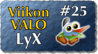

/*
Title: 1x25 LyX - Viikon VALO #25
Date: 2011/06/19
Pageimage: valo25-Lyx.png
Tags: Linux,Windows,Mac OS X,OS/2,Tekstinkäsittely,Toimisto
*/

**LyX on erilainen tekstinkäsittelyohjelma, joka tuottaa kaunista
painokelpoista jälkeä.**

 LyX on ulkoasultaan erittäin
hyvän näköistä jälkeä tuottava tekstinkäsittelyohjelma. Toisin kuin
suurin osa tekstinkäsittelyohjelmista, LyX ei pyri olemaan
WYSIWYG-tyyppinen (What You See Is What You Get) vaan sen toiminta
seuraa WYSIWYM-periaatetta (What You See Is What You Mean). Käytännössä
tämä tarkoittaa, että vaikka tekstiä editoitaessa sen ulkoasu näyttääkin
suurin piirtein siltä, kuin lopputuloksen on tarkoituskin, ei ohjelma
silti pyri tekemään tarkkaa ulkoasun asettelua vielä tässä vaiheessa.
Esimerkiksi tekstin rivitykset ja sivutukset eivät muokkausvaiheessa ole
vielä lopullisessa muodossaan. Sen sijaan ohjelma voi näyttää
käyttäjälle useita muokkaukseen liittyviä lisätietoja, jotka eivät päädy
lopulliseen tulostuvaan versioon. Esimerkiksi automaattisesti luotava
sisällysluettelo näkyy tekstin seassa vain sen paikan merkitsevänä
laatikkona, joka kertoo, mihin kohtaan sisällysluettelo tulee
lopullisessa versiossa. Samoin tekstin seassa olevat alaviitteet ovat
näkyvissä omana osionaan siinä kohtaa, johon viite tulee ja varsinainen
alaviite luodaan sivun alalaitaan vasta lopulliseen versioon. Saman
periaatteen mukaisesti esimerkiksi pakotetut pysty- ja vaakasuuntaiset
välit sekä sivunvaihdot on ohjelmassa selvästi merkitty näkyviin.
Ajatuksena siis on, että käyttäjä näkee aina, mitä on tekemässä ja
ohjelma ei tuota tässä suhteessa yllätyksiä käyttäjälle.

LyXissä tekstin käsitteleminen tapahtuu rakenteisesti ja erilaisia
tyylejä käyttämällä. Käyttäjä siis kertoo kunkin tekstikappaleen
merkityksen (otsikko, alaotsikko, luettelo, jne.) tekstissä ja kappaleen
ulkoasu muotoillaan sen merkityksen mukaan. Ulkoasuun vaikuttavat niin
kutsutut "kovat" muotoilut ovat myös mahdollisia, mutta niiden käyttöä
on tarkoituksella pyritty olemaan painottamatta. Asiakirjan ulkoasuun
vaikuttaa vahvasti valittu asiakirjatyyppi. Asiakirjatyyppien joukosta
löytyy pohjat muun muassa kirjaan, artikkeliin, raporttiin, kirjeeseen
sekä "kalvoesitykseen".

Ohjelmassa tekstin käsitteleminen ja taittaminen lopulliseen muotoonsa
on eriytetty toisistaan. Kun käyttäjä haluaa nähdä tekstinsä lopullisen
ulkoasun, pitää se taittaa esimerkiksi pdf-tiedostoksi. Käytännössä tämä
tapahtuu painamalla yhtä nappulaa ohjelman paneelissa, joten tämä vaihe
ei liiemmin hankaloita ohjelman käyttöä. Tällöin teksti taitetaan
automaattisesti pdf-muotoon ja avataan esikatseltavaksi. Tiedoston
taitto tapahtuu LaTeX-ladontaohjelmiston avulla ja lopputulos on yleensä
hyvinkin ammattimaisen viimeisteltyä. LaTeX-ladontajärjestelmä on
loppuunsa hiottu koneisto, joka osaa sovittaa muun muassa tekstin
rivitykset ja sivutukset sekä kuvien sijoittelut parhaalla mahdollisella
tavalla. Tieteellisessä maailmassa, erityisesti matematiikassa,
fysiikassa ja tietojenkäsittelytieteessä, LaTeX-järjestelmä on
tieteellisiin julkaisuihin käytetty standardi.

Matemaattisten kaavojen kirjoittaminen on tehty LyXissä hyvin helpoksi.
Toisin kuin monissa muissa tekstinkäsittelyohjelmissa, kaavat eivät
LyXissä ole lisäominaisuus vaan sisäänrakennettu toiminnallisuus, joiden
kirjoittaminen on lähes yhtä luontevaa kuin tavallisen tekstin
tuottaminen. Matematiikkatilaan LyXissä siirrytään Control-m
-näppäinyhdistelmällä ja matemaattiset rakenteet kirjoitetaan joko
hiirellä paneelin nappuloita painelemalla tai LaTeX-järjestelmästä
tuttuja komentoja suoraan näppäimistöllä kirjoittamalla. Kaavat ovat
nähtävillä sitä mukaa kuin niitä kirjoitetaan. Esimerkiksi
murtolukunappulaa painamalla kaavaan ilmestyy jakoviiva, jonka ylä- ja
alapuolella on tyhjät laatikot, joihin kaavan kirjoittamista voi jatkaa.

Muita ohjelman hyödyllisiä ominaisuuksia ovat muiden muassa:

-   lähdeviitteet käsitellään LaTeX-ympäristöstä tutun
    BibTeX-järjestelmän avulla
-   muutosten seuranta, joka helpottaa yhteistyössä tehtävää asiakirjan
    muokkaamista
-   huomautusten lisääminen tekstin joukkoon (huomiot eivät tulostu
    lopulliseen versioon)
-   mahdollisuus lisätä sisältöjä eri "haaroihin", joista voi
    taittovaiheessa valita, mitkä tulostuvat ja mitkä eivät (Tämä
    ominaisuus on käytännöllinen esimerkiksi koetta tekevälle
    opettajalle. Mallivastaukset voi kirjoittaa erilliseen haaraan, joka
    jätetään tulostamatta koepaperiin.)
-   tuki versionhallinnalle (svn, cvs)

Kotisivu
:   <http://www.lyx.org>

Lisenssi
:   [GNU GPL](GNU_GPL)

Toimii seuraavilla alustoilla
:   Linux, Windows, Mac OS X, OS/2

Asennus
:   Asennuspaketit eri alustoille ovat ladattavissa ohjelman
    kotisivuilta. Linux-jakeluihin ohjelma löytyy tyypillisesti myös
    jakelun omasta pakettivarastosta.

Käyttöohjeet
:   Ohjelmaan löytyy kattava ohjeistus sekä tutoriaali ohjelmasta
    itsestään Help-/Ohje-valikon kautta. Ohjelman kotisivujen kautta
    löytyy lisää dokumentaatiota.

-   
-   
-   
-   
-   
-   
-   

*Teksti: pesasa*  
*kuvakaappaukset: pesasa*
