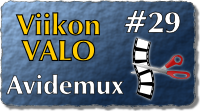

<!--
Title: 1x29 Avidemux - Viikon VALO #29
Date: 2011/07/17
Pageimage: valo29-Avidemux.png
Tags: Linux,Mac OS X,Windows,FreeBSD,OpenBSD,NetBSD,PC-BSD,Video
-->

**Avidemux on videoeditointiohjelma yksinkertaiseen videokuvan
leikkaamiseen, suodattamiseen ja muuntoon formaatista toiseen.**

 Avidemux on
graafiselta käyttöliittymältään selkeä ohjelma, jolla on helppo tehdä
esimerkiksi yksinkertaiset videon leikkaukset. Toisaalta myös hieman
monipuolisempien operaatioiden toteuttaminen onnistuu ja ohjelma
skaalautuu käyttäjän omien taitojen kasvaessa. Leikkaustoiminnot
löytyvät suoraan videokuvan alapuolelta ja videon aikajanalle on helppo
merkitä leikkauksen aloitus ja lopetuskohtia. Valitun kohdan voi joko
tallettaa tai leikata pois *delete*-näppäimellä. Ikkunan vasemmasta
reunasta saa valittua tallennettavan muodon osaset: *Videokoodekin*,
*äänikoodekin* sekä nämä yhdistävän *containerin* eli *säilön*. Näillä
valinnoilla voidaan kuvan ja äänen pakkaustapaa muuntaa muodosta
toiseen. Videon ja äänen tallennusmuodoiksi voi valita myös
kopiointivaihtoehdon, jolloin niitä ei pakata uudelleen vaan ne
kopioidaan häviöttömästi alkuperäisestä tiedostosta vain valituista
kohdista leikaten.

Pelkän leikkaamisen lisäksi Avidemuxilla voidaan suorittaa myös useita
muita muokkausoperaatioita. Kun videokuvan tallennusmuodoksi valitaan
jotain muuta kuin kopiointi, aktivoituu nappula, jota painamalla
päästään valitsemaan videokuvalle suotimia eli filttereitä. Suotimet on
jaoteltu luokkiin: transform, interlacing, colors, noice, sharpness,
subtitles, miscellaneous ja external. Näistä luokista esimerkiksi
transform sisältää kuvan fyysisiin ominaisuuksiin vaikuttavia suotimia,
kuten kuvan kierrot, skaalaukset, rajaukset ja peilaukset.
Colors-luokkaan on kerätty kuvan väreihin vaikuttavia toimintoja, kuten
kontrastin, kirkkauden ja värisävyjen säädöt. Subtitles-osiosta taas
löytyvät eri muodoissa olevien tekstitysten lisäämiset videotiedostoon.
Valitut suotimet sopivine asetuksineen lisätään aktiivisten suotimien
listaan ja videotiedostoa prosessoitaessa ne sovelletaan kuvaan listan
määräämässä järjestyksessä. Siispä esimerkiksi kuvan käännöt tai
pehmennykset kannattaa suorittaa ennen tekstitysten lisäämistä.

Myös ääniraidalle on mahdollista suorittaa joitain muunnoksia, mutta
valittavissa olevat vaihtoehdot ovat vähäisemmät kuin kuvalle, sillä
äänen muokkaamiseen on olemassa muita niihin erikoistuneita ohjelmia,
kuten Audacity.

Kuvan ominaisuuksia muutettaessa on hyödyllistä pystyä esikatselemaan
tulevaan jälkeä. Avidemuxissa on mahdollista näyttää joko *input*-kuva
tai *output*-kuva erikseen taikka molemmat rinnakkain tai päällekkäin.
Lisäksi on mahdollista irrottaa *output*-kuva omaksi ikkunakseen.
Videokuvan tarkastelu onnistuu helposti joko ruutu ruudulta ikkunan
alareunan nappuloilla tai oikean reunan "*rullaa*" liikuttamalla.

Vaikka Avidemuxilla on mahdollista säätää tallennettavan tiedoston
pakkausasetuksia, kuvakokoa, äänen näytteenottotaajuuksia sekä muita
yksityiskohtia hyvinkin tarkasti, voi asiaan tarkemmin perehtymätönkin
hyödyntää näitä ominaisuuksia *Auto*-valikon valmiiksi valittujen
asetusten avulla. Valikosta löytyvät useimmin tarvitut muunnosasetukset
valmiiksi paketoituina. Näitä ovat esimerkiksi videon muuntaminen
DVD-kelpoiseen muotoon tai Applen iPod- ja Sonyn PSP-laitteille sopiviin
muotoihin.

Avidemuxilla voi myös valmistella videomuuntotöitä jonoon ja laittaa sen
suorittamaan muunnokset eräajona. Muunnosten tekeminen onnistuu myös
suoraan komentoriviltä, jolloin ohjelmaa voidaan käyttää skriptien
osana.

Tarkempaa opastusta ohjelman käyttöön suomen kielellä löytyy [Floss
manuals -projektin
sivuilta](http://fi-new.flossmanuals.net/avidemux/index).

Kotisivu
:   <http://fixounet.free.fr/avidemux/>

Lisenssi
:   [GNU GPL](GNU_GPL)

Toimii seuraavilla alustoilla
:   Linux, Mac OS X, Windows, FreeBSD, OpenBSD, NetBSD, PC-BSD

Asennus
:   Windows- ja Mac OS X -järjestelmille asennuspaketit ovat saatavissa
    ohjelman kotisivulta. Linux-jakeluissa Avidemux löytyy
    paketinhallinnan kautta. PC-BSD-järjestelmiin sivuilta löytyy linkki
    lataussivustolle. Myös joillekin Linux-jakeluille saattaa löytyä
    uudempi versio ohjelman kotisivujen kautta.

Käyttöohjeet
:   Suomenkielinen opas Avidemuxin käyttöön löytyy [Floss manuals
    -projektin sivuilta](http://fi-new.flossmanuals.net/avidemux/index).

-   
-   
-   
-   
-   
-   
-   
-   
-   

*Teksti: pesasa*  
*kuvakaappaukset: pesasa*
