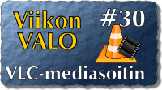

/*
Title: 1x30 VLC-mediasoitin - Viikon VALO #30
Date: 2011/07/24
Pageimage: valo30-Vlc.png
Tags: Windows,Linux,Mac OS X,iOS,FreeBSD,NetBSD,OpenBSD,Solaris,Android,QNX,Syllable,OS/2,BeOS,Multimedia,Video
*/

**VLC on vapaa mediasoitin videoiden katseluun ja musiikin kuunteluun.**

 VLC on hyvin viimeistelty ja
suuren suosion saavuttanut mediasoitinohjelma, jolla voi toistaa niin
DVD-, CD- ja VCD-levyt, ääni- ja videotiedostot kuin verkosta saatavat
ääni- ja videolähetyksetkin. Ohjelman tuki erilaisille videomuodoille on
hyvin laaja ilman erillisten koodekkien asennusta. Monipuolisuudestaan
huolimatta VLC:n käyttöliittymä on erittäin selkeä. Monipuolisuutensa ja
selkeytensä ansiosta VLC onkin erittäin suosittu mediasoitin riippumatta
alla olevasta käyttöjärjestelmästä.

VLC kykenee näyttämään videokuvaa tiedostojen, optisten levyjen ja
verkkolähteiden lisäksi myös tietokoneeseen liitetyistä laitteista,
kuten webbikamerasta, videokamerasta, digi-tv-kortilta sekä itse
näytöllä näkyvää kuvaa. Näyttämisen lisäksi ohjelma kykenee myös
tallettamaan sisään saamansa videovirran tiedostoon tai lähettämään sen
edelleen verkon yli toiselle koneelle. Koska tallennusmuodon voi valita
useasta valmiista profiilista tai vaikka luoda itse tarvitsemansa äänen-
ja kuvanpakkausmuotojen yhdistelmän, soveltuu VLC myös tiedostojen
muuttamiseen muodosta toiseen. Jos videolähteeksi valitaan näytöllä
näkyvä kuva ja tallennetaan tämä tiedostoon sopivassa tallennusmuodossa,
toimii VLC myös screencast-videoiden luontiin sopivana työkaluna. Näin
on helppoa tehdä esimerkiksi opetusvideoita jonkin työkaluohjelman
käytöstä.

VLC osaa näyttää myös videoon liittyvän tekstityksen joko videotiedoston
mukana tulevasta informaatiosta, esimerkiksi digi-tv-lähetyksissä, tai
erillisestä tiedostosta.

VLC:n käyttöliittymä on vapaasti muokattavissa. Oletuskäyttöliittymän
nappuloita ja niiden sijaintia voi muutella haluamallaan tavalla.
Vaihtoehtoisesti ulkoasua voi muuntaa valitsemalla käyttöön jonkin
ohjelman web-sivuilta ladattavista
[skineistä](http://www.videolan.org/vlc/skins.php).

VLC-mediasoittimen ohjelmoijat kunnioittavat käyttäjien yksityisyyttä ja
ovat tarkkoja esimerkiksi siitä, että ohjelma ei käytä Internet-yhteyttä
käyttäjän tietämättä. Siksi se esimerkiksi pyytää luvan saatavilla
olevien päivitysten tarkistamiseen ja kansikuvatiedostojen etsimiseen
verkosta heti ensimmäisellä käynnistyksellä. Kummankin toiminnon
käyttäjä voi kieltää niin halutessaan.

Askartelijoille VLC on hedelmällinen työkalu sillä sen useat
käyttöliittymävaihtoehdot mahdollistavat monenlaisten
mediakoneratkaisujen rakentamisen. VLC:tä on mahdollista ohjata
esimerkiksi web-käyttöliittymällä.

Kotisivu
:   <http://www.videolan.org/vlc/>

Lisenssi
:   [GNU GPL](GNU_GPL) v.2

Toimii seuraavilla alustoilla
:   Windows, Linux, Mac OS X, iOS, FreeBSD, NetBSD, OpenBSD, Solaris,
    Android, QNX, Syllable, OS/2, BeOS

Asennus
:   Asennuspaketit eri alustoille löytyvät ohjelman kotisivuilta.
    Linux-järjestelmiin VLC löytyy myös suoraan paketinhallinnan kautta.

VALO-CD
:   VLC löytyy myös
    [VALO-CD](http://www.valo-cd.fi/ilmainen_vlc)-kokoelmasta.

Ohjeita
:   Joissain Linux-järjestelmissä vlc:stä puuttuu oletuksena kyky
    toistaa css-kryptauksella salattuja DVD-levyjä. Tällöin koneelle on
    asennettava tarvittavat kirjastot muuta kautta. Esimerkiksi Ubuntuun
    ohjeet löytyvät [Ubuntun omilta
    ohjesivuilta](https://help.ubuntu.com/community/RestrictedFormats/PlayingDVDs).

-   
-   
-   
-   
-   
-   
-   

*Teksti: pesasa*  
*kuvakaappaukset: pesasa*
