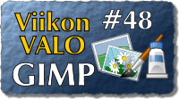
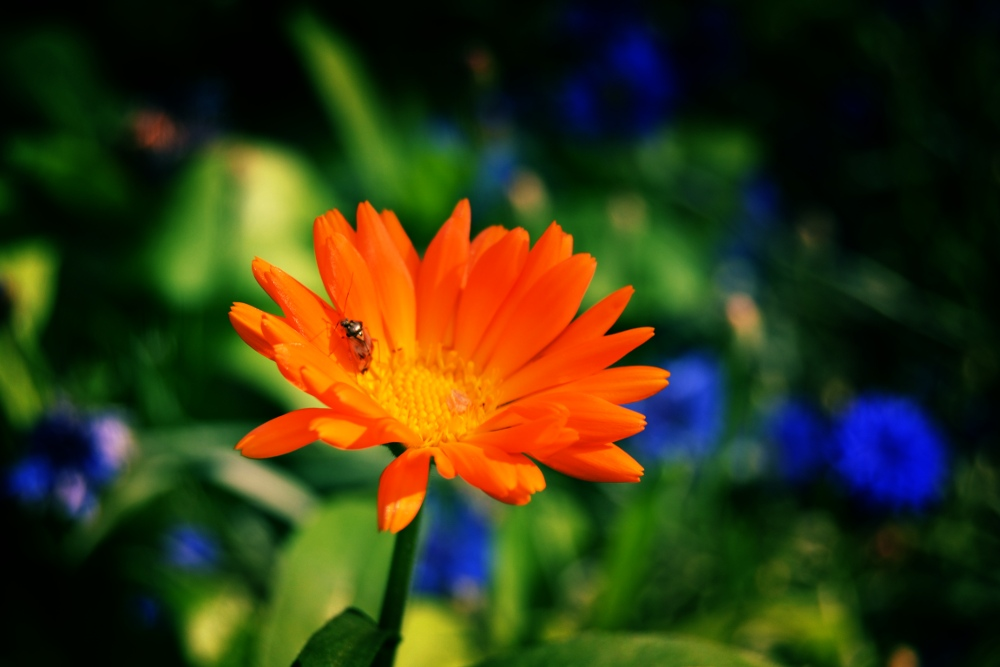

<!--
Title: 1x48 GIMP - Viikon VALO #48
Date: 2011/11/27
Pageimage: valo48-gimp.png
Tags: Windows,Linux,Mac OS X,FreeBSD,OpenBSD,NetBSD,Solaris,Kuvat,Kuvankäsittely
-->

**GIMP on jo klassikoksi vakiintunut vapaa avoimen lähdekoodin
kuvankäsittelyohjelma.**

 Ohjelman nimi, GIMP, on
lyhenne sanoista *GNU Image Manipulation Program*, eli GNU (-projektin)
kuvankäsittelyohjelma. GIMP varsin kypsä ohjelma, jonka kehitys on
aloitettu jo vuonna 1995. GIMP soveltuu hyvin niin kuvankäsittelyyn kuin
piirtämiseenkin. Sillä onnistuu valokuvien jälkikäsittely, kuten
punaisten silmien poisto sekä perspektiivi- ja värivirheiden korjaus,
web-sivujen grafiikoiden tekeminen sekä digitaalisten taideteosten
luonti. Se tukee useita tiedostomuotoja ja sitä voikin käyttää myös
kuvien muuntamiseen tiedostomuodosta toiseen.

GIMP on ominaisuksiltaan sen verran laaja, että siinä riittää
toiminnallisuuksia sekä satunnaisille harrastajille kuin
ammattilaisillekin. Tavallinen kotikäyttäjä saa ohjelmalla tehtyä
digivalokuviensa rajaukset, horisontin oikaisut, punaisten silmien
poistot sekä valotuksen korjailut. Samoin kuvien koon muutokset sekä
erilaiset efektit, kuten seepia, "vanha valokuva" tai "kahvitahra", ovat
helposti tehtävissä. Monimutkaisempia toimintoja kaipaavankaan käytössä
GIMPin ominaisuudet eivät lopu kesken ja suuri osa esimerkiksi
Photoshopille suunnatuista ohjeista on sovellettavissa GIMP-käyttöön.
Eri ohjelmissa samat toiminnot saattavat olla valikoissa hieman eri
paikoissa ja hiukan eri nimillä.

Käyttöliittymältään GIMP poikkeaa hieman monesta muusta
kuvankäsittelyohjelmasta. Tämän takia jotkut käyttäjät ovat hieman
vierastaneet GIMPiä, mutta kyseessä lienee suurimmaksi osaksi
tottumuskysymyksestä. Kun monissa muissa kuvankäsittelyohjelmissa on
yksi pääikkuna, jonka sisällä muokattavat kuvat sekä erilaiset
työkalupalkit sijaitsevat, käyttää GIMP monen ikkunan käyttöliittymää.
Monen ikkunan käyttöliittymässä kukin muokattava kuva on omassa
ikkunassaan ja työkalupaletit sekä muut apuvälineet omissa ikkunoissaan.
Muihin kuvankäsittelyohjelmiin tottuneet käyttäjät ovat toisinaan
pitäneet tätä hankalana ja sen vuoksi versiossa 2.8 GIMPiin onkin
tulossa oletukseksi käyttöön yhden ikkunan käyttöliittymä. Toisaalta,
esimerkiksi kahta tai useampaa näyttöä käytettäessä monen ikkunan
käyttöliittymä on käytännöllinen, kun muokattava kuva voidaan sijoittaa
mahdollisimman suurena yhdelle näytölle ja omina ikkunoinaan olevat
työkalut toiselle näytölle. Tällainen järjestely ei yhden ikkunan
käyttöliittymällä onnistu.

GIMPin käyttöliittymä
koostuu kuvaikkunoiden lisäksi työkaluikkunasta (toolbox) sekä suuresta
joukosta erilaisia telakoitavia dialogi-ikkunoita. Telakoitavia
ikkunoita ovat esimerkiksi tasoluettelo (layers), värikanavat
(channels), työkalujen asetukset (tool options) sekä luettelo
väriliu'uista (gradients). Telakoitavia ikkunoita voi raahaamalla
yhdistellä toisiinsa, jolloin niiden sisällöt ovat samassa ikkunassa
joko peräkkäin tai vaihtoehtoisina välilehtinä. Näin käyttäjä voi
kustomoida käyttöliittymän omien mieltymystensä mukaan. GIMPissä on myös
kattava työkalu omien näppäinoikoteiden määrittelyyn työskentelyn
nopeuttamiseksi ja sujuvoittamiseksi.

GIMPin ominaisuuksiin lukeutuvat muun muassa tasojen kanssa tapahtuva
työskentely, erilliset editoitavat tekstitasot, kustomoitavat
siveltimet, kustomoitavat väriliu'ut, kloonityökalu, maskit, lukuisat
suotimet, efektit sekä plugineina tai skripteinä toteutetut
lisätoiminnallisuudet. GIMPistä jo löytyviä toimintoja voi ohjelmoida
toimimaan peräkkäin komentosarjana yhdellä komennolla tekemällä niistä
skriptejä muun muassa Scheme-, Python- ja Perl-kielillä. Myös kokonaan
uusien toimintojen toteuttaminen on mahdollista liitännäisinä, eli
plugineina. Yksi esimerkki tällaisesta pluginista on [liquid
rescale](http://liquidrescale.wikidot.com/), jolla on mahdollista
skaalata kuvaa pienemmäksi tai suuremmaksi säilyttäen kuvan elementtejä
valikoivasti. Samalla pluginilla pystyy myös poistamaan kuvasta
haluttuja osia saumattomasti. (Youtube-videoita liquid rescalen
toiminnasta: [1](http://www.youtube.com/watch?v=kNVdBJQVhFE),
[2](http://www.youtube.com/watch?v=f_P4flXIl0Y),
[3](http://www.youtube.com/watch?v=zBdg6EIXeVY) ja
[4](http://www.youtube.com/watch?v=Wfz3DcrHQaQ).)

Kuvia avattaessa ja tallennettaessa GIMP osaa useita tiedostomuotoja.
Työtiedostot kannattaa tallettaa GIMPin omaan .xcf-muotoon tai sen
pakattuun versioon .xcf.gz-muotoon. Näin tallennettuna säilyvät
työskentelyssä käytetyt tasot, tekstitasot, käytössä oleva valinta,
värikanavat sekä muutamia muita työtilaan liittyviä ominaisuuksia.
Valmis lopputulos tallennetaan työskentelyn lopuksi haluttuun
käyttömuotoon, kuten jpeg, png tai gif. Myös gif-animaatioiden teko
onnistuu GIMPillä tekemällä kustakin ruudusta oma taso ja tallentamalla
gif-muotoon, jolloin GIMP kysyy, halutaanko kuvasta animaatio.

GIMP ei sisällä vielä varsinaista toiminnallisuutta julkaisualalla
käytetylle
[CMYK](http://en.wikipedia.org/wiki/CMYK_color_model)-värierottelulle.
Siihen on kuitenkin saatavilla osittainen toteutus
[separate+](http://sourceforge.jp/projects/separate-plus/)-pluginin
muodossa. CMYK-värienhallinta on kuitenkin olennaista vain
painotuotteiden kanssa. Digitaalisen median, esimerkiksi verkkosivujen
kanssa toimittaessa riittää hyvin GIMPin käyttämä RGB-väriavaruus.
Tulosteidenkin kanssa useimmat tulostinlaitteet toimivat suoraan
RGB-väreillä ja monet niin kutsutut digipainot hyväksyvät aineiston
RGB-väreillä.

Verkosta löytyy useita tutorialeja GIMPin käytöstä. Erityisen
hyödyllisiä ovat Youtube-videot, joissa ohjelman käyttöön vihkiytyneet
käyttäjät opastavat erilaisia käyttötapauksia. Esimerkkejä tällaisista
videoista ovat nimimerkki
[GimpKnowHow](http://www.youtube.com/user/GimpKnowHow):n tekemät videot
[Cool Photo Manipulation in
Gimp](http://www.youtube.com/watch?v=A8OTSC_iVT0) ja [Gimp101- Possessed
Eye in Gimp](http://www.youtube.com/watch?v=FqnO3tRES20).

Kotisivu
:   <http://www.gimp.org/>

Suomenkielinen nettiyhteisö
:   <http://www.gimp-suomi.org/>

Lisenssi
:   [GNU GPL](GNU_GPL)

Toimii seuraavilla alustoilla
:   Linux, Windows, Mac OS X, FreeBSD, OpenBSD, NetBSD, Solaris

Asennus
:   Linux-jakeluihin GIMP on suositeltavinta asentaa jakelun omasta
    pakettivarastosta, sillä sitä kautta asennettuna siihen tulevat
    kaikki päivitykset suoraan jakelun kautta. Muille alustoille
    asennuspaketit tai ohjeet asentamiseen löytyvät ohjelman
    kotisivuilta.

VALO-CD
:   GIMP löytyy myös
    [VALO-CD](http://www.valo-cd.fi/ilmainen_gimp)-kokoelmasta.

Ohjeita
:   [GIMP-pikaohje](http://porixi.l-a.fi/GIMP_pikaohje) (Porixi)
:   [Värienhallintaa
    GIMPillä](http://www.brankovukelic.com/post/513356271/gimp-color-management-for-dtp)
:   [GIMP-opas](http://www.joutsi.com/gimp.html)
:   [GIMP Wikibooksissa](http://fi.wikibooks.org/wiki/GIMP) (suomeksi)
:   [GIMP Wikibooksissa](http://en.wikibooks.org/wiki/The_GIMP)
    (englanniksi, laajempi)

Muita linkkejä
:   [Plugin-kokoelma](http://registry.gimp.org/)

-   
-   
-   
-   
-   
-   

*Teksti: pesasa*  
*kuvakaappaukset: pesasa*
