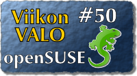

/*
Title: 1x50 openSUSE 12.1 - Viikon VALO #50
Date: 2011/12/11
Pageimage: valo50-opensuse.png
Tags: Käyttöjärjestelmä,Järjestelmä
*/

**OpenSUSE on helppokäyttöinen ja vapaa GNU/Linux-käyttöjärjestelmä,
jota kehitetään yhteisövetoisesti.**

 OpenSUSE-projekti
kehittää yhtä parhaista Linux-järjestelmistä ja sen tavoitteena on
järjestelmä, joka on helppokäyttöinen ja helposti hankittava.
Käyttöjärjestelmän lisäksi openSUSE pyrkii tarjoamaan ympäristön avoimen
lähdekoodin kehitystyölle sekä yksinkertaistamaan ja avaamaan kehitys-
ja paketointiprosesseja. Tätä tavoitetta edistää muun muassa *openSUSE
Build Service*, joka helpottaa ohjelmistopakettien tekemistä openSUSEn
lisäksi myös muille Linux-jakeluille.

OpenSUSEn viimeisin versio 12.1 julkaistiin 16. marraskuuta 2011. Tässä
versiossa on valittavissa neljä vaihtoehtoista tuettua
työpöytäjärjestelmää, joista käyttäjä voi valita itselleen mieluisimman.
Työpöytäympäristöistä KDE ja juuri uusiutunut Gnome 3.2 ovat näyttäviä
ja kaikenkattavia, mutta hieman raskaampia, kun taas Xfce ja LXDE on
suunniteltu kevyemmiksi vaihtoehdoiksi.

Työpöytäympäristön ohella openSUSEn oletusasennus sisältää muun muassa
Mozilla Firefox -selaimen, sähköpostiohjelman,
[GIMP](GIMP "wikilink")-kuvankäsittelyohjelman,
[LibreOffice](LibreOffice_Writer "wikilink")-toimisto-ohjelmiston
(tekstinkäsittely, taulukkolaskenta, esitysgrafiikka),
musiikinsoitto-ohjelman, CD/DVD-levyjen poltto-ohjelman ja paljon muuta.
Näiden lisäksi openSUSE sisältää lukemattomat määrät vapaita
sovellusohjelmia, jotka ovat kaikki asennettavissa helposti ja
ilmaiseksi vain muutamalla hiiren napsautuksella järjestelmän
paketinhallinnan kautta. Nämä ohjelmat ovat valmiiksi paketoituina
openSUSEn palvelimella odottamassa asentamistaan samaan tapaan kuin
älypuhelinten ohjelmat ovat ladattavissa marketista tai storesta.

OpenSUSEssa järjestelmän asetusten hallinta tapahtuu YaST-ohjelmalla,
joka antaakin helpon graafisen käyttöliittymän tavallisimpiin ja
useimmin tarvittuihin järjestelmän asetuksiin. Sen kautta ovat
valittavissa niin ohjelmistojen asennukset ja päivitykset kuin
laitteiden ja palveluidenkin tärkeimmät asetukset.

Uusia ominaisuuksia openSUSE 12.1:ssä ovat muun muassa entistä parempi
tuki pienille näytöille sekä useammalle näytölle, keskitetty hallinta
online-tunnuksille, parannettu
[Oyranos](http://www.oyranos.org/)-värienhallintajärjestelmä. OpenSUSE
tarjoaa myös mahdollisuuden luoda oman Dropboxin kaltaisen
pilvitallennusjärjestelmän OwnCloud-ohjelmistolla. Työpöytäkäyttöön sen
voi integroida Mirall-ohjelmalla, joka synkronoi tiedostot
OwnCloud-pilven ja paikallisen koneen välillä.

OpenSUSEn voi hankkia joko ilmaisena, verkosta ladattavana versiona tai
maksullisena myyntiversiona, joka sisältää ohjekirjan ja puhelintuen.

Kotisivu
:   <http://www.opensuse.org/fi/>
:   <http://opensuse.fi/> (suomenkielisen yhteisön kotisivu)

Lisenssi
:   Sisältää ohjelmia useilla vapailla lisensseillä, kuten [GNU GPL](GNU_GPL)

Asennus
:   openSUSEn DVD-levykuvan voi ladata sen
    [lataussivulta](http://software.opensuse.org/121/fi). Sivulta löytyy
    myös tarvittavia lisäohjeita levykuvan polttamisesta tyhjälle
    DVD-levylle tai käynnistyvän usb-tikun luomisesta.

Käyttöohjeet ja tuki
:   Lisää ohjeita ja vertaistukea löytyy suomenkielisen
    openSUSE-yhteisön [sivuilta](http://opensuse.fi/Ohjeet).
:   [openSUSEn
    asennusopas](http://opensuse.fi/Asennusopas_openSUSE_12.1)
:   [opensuse.fi:n keskustelualue](http://opensuse.fi/keskustelu/)
:   openSUSEsta voi keskustella myös irc-kanavalla \#opensuse-fi, joka
    löytyy Freenode-verkosta. Kanavalle pääsee muun muassa
    [web-irkki](http://embed.mibbit.com/?server=irc.freenode.net&channel=%23opensuse-fi)-sovelluksella.

-   
-   
-   
-   
-   
-   
-   
-   
-   
-   
-   
-   
-   
-   
-   

*Teksti: pesasa*  
*Kuvakaappaukset: pesasa*
