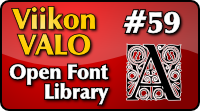

<!--
Title: 2x07 Open Font Library - Viikon VALO #59
Date: 2012/02/12
Pageimage: valo59-openfontlibrary.png
Tags: Kaikki alustat
-->

**Open Font Library on vapaita, ilmaisia fontteja, eli kirjasintyyppejä,
tarjoava sivusto.**

 Open
Font Library on kirjasintyyppien suunnittelijoiden muodostama yhteisö,
jonka tarkoituksena on edistää vapautta kirjasintyyppien käytössä.
Suunnittelijat ovat laatineet ja antaneet vapaaseen käyttöön jo toista
sataa erilaista kirjasintyyppiä. Kirjasintyypit ovat vapaita käyttää,
tutkia ja opiskella, jakaa sekä muokata. Kirjastossa on kirjasimia
useilla vapailla lisensseillä sekä muutama tekijänoikeuksista vapaa
[public domainiin](http://fi.wikipedia.org/wiki/Public_domain), eli
julkiseksi omaisuudeksi, laskettu fontti. Ylivoimaisesti suurin osa
kirjasintyypeistä on julkaistu [SIL Open Font
Lisenssiä](http://scripts.sil.org/cms/scripts/page.php?site_id=nrsi&id=OFL)
käyttäen. Lisenssi antaa hyvin vapaat kädet fonttien käyttöön,
muokkaamiseen ja levitykseen. Vain pelkkkien fonttitiedostojen myynti on
kiellettyä, mutta niiden välittäminen jonkin muun myytävän tuotteen
yhteydessä on luvallista. Kirjasimia esimerkiksi oman tuotteen
yhteydessä jakavan kannattaa lukea lisenssi ja varsinkin useimmin
kysytyt kysymykset
([FAQ](http://scripts.sil.org/cms/scripts/page.php?item_id=OFL-FAQ_web)).
Lisenssi on kuitenkin hyvin liberaali ja suunniteltu edistämään juuri
kirjasintyyppien vapaata käyttöä, joten kirjasimia voi käyttää varsin
huolettomin mielin.

Kirjasintyypit on sivustolla luokiteltu sekä kirjasimen tyylin että
lisenssin mukaan. Tarjolla olevia luokkia kirjasintyypeille ovat:
Blackletter, Dingbat, Display, Handwriting, Monospaced, Sans-serif sekä
Serif. Kustakin jaossa olevasta kirjasintyypistä on sivulla lyhyt
esittely, jonka yhteydessä on kerrottu kirjasimen nimen, suunnittelijan
ja lisenssin lisäksi myöskin kirjasintyypistä löytyvä kielituki, eli
minkä merkistöjen merkkejä kyseinen fontti sisältää. Kirjasintyypit ovat
varsin laadukkaita ja kattavia joten usein niistä löytyvät myös
skandinaaviset kirjaimet, joiden puute tapaa usein olla ongelma muuten
kauniiden ilmaisten kirjasintyyppien kanssa. Kirjasintyyppejä on myös
mahdollista kokeilla suoraan niiden esittelysivulla asentamatta niitä
omalle koneelle.

Kirjasintyyppejä on mahdollista käyttää normaaliin tapaan omissa teksti-
ja kuvatiedostojen luonnissa. Kuitenkin vapauden ansiosta niitä voi
käyttää myös julkisempaan jakoon altistuvassa käytössä, kuten
www-sivuilla palvelimelta ladattavana kirjasimena tai oman
tietokoneohjelman mukaan liitettynä.

Kotisivu
:   <http://openfontlibrary.org/>

Lisenssit
:   [CC-BY](http://creativecommons.org/licenses/by/2.0/),
    [CC-BY-SA](http://creativecommons.org/licenses/by-sa/3.0/), [GNU GPL](GNU_GPL),
    [GNU LGPL](GNU_LGPL), [MIT (X11) License](MIT_X11),
    [OFL (SIL Open Font License)](http://scripts.sil.org/cms/scripts/page.php?site_id=nrsi&id=OFL),
    Public Domain

-   
-   
-   
-   
-   
-   
-   

*Teksti: Pesasa*  
*Kuvakaappaukset: Pesasa*
