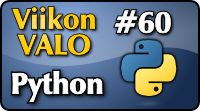

<!--
Title: 2x08 Python - Viikon VALO #60
Date: 2012/02/19
Pageimage: valo60-python.png
Tags: Linux,Windows,Mac OS X,FreeBSD,NetBSD,OpenBSD,S60,Solaris
-->

**Python on monipuolinen tulkattava korkean tason ohjelmointikieli.
Python soveltuu ensimmäiseksi ohjelmointikieleksi helpon oppimisen ja
kielen selkeyden ansiosta.**

 Python on alun perin
nimetty brittiläisen komediaryhmä [Monty
Pythonin](http://fi.wikipedia.org/wiki/Monty_Python) tunnetun Monty
Pythonin lentävä sirkus -televisiosarjan mukaan. Python-nimi koettiin
lisäksi tarpeeksi lyhyeksi, yksilöiväksi sekä sopivan mysteeriseksi.
Kielen dokumentaation koodiesimerkeissäkin pyritään välttämään
liiallista vakavuutta satunnaisilla viittauksilla ryhmän tuotantoon.
[(1)](http://docs.python.org/faq/general#why-is-it-called-python)

Tällä hetkellä Pythonista
ovat olemassa versiot 2.x ja 3.x. Yleensä vanhat ohjelmat ovat toimineet
sellaisenaan uudessa Pythonin versiossa. Poikkeuksellisesti
kolmosversioon on tehty muutoksia jotka rikkovat yhteensopivuuden.
Tarvittavat muutokset on
[dokumentoitu](http://docs.python.org/py3k/whatsnew/3.0.html) ja on
olemassa [apuohjelma](http://docs.python.org/library/2to3.html) joka
auttaa muuttamaan Python 2.x:llä kirjoitetut ohjelmat Python 3.x:lle.
Linux-järjestelmissä oletuspython on vielä 2.x sarjaa. Saatavilla toki
on myös 3.x python ja molemmat voivat olla asennettuina samaan aikaan.
Omia ohjelmia laadittaessa voi päättää, mitä tulkkia niiden
suorittamiseen käytetään. Linux- ja Unix-järjestelmissä tämä tapahtuu
ohjelmatiedoston ensimmäisellä rivillä.

Lisäksi versioissa 2.6 ja 2.7 on mahdollista käyttää eräitä version 3
ominaisuuksia. Näin voi vähitellen siirtää koodikantansa kolmosversioon.
[(2)](http://docs.python.org/whatsnew/2.7.html#python-3-1-features)

Pakollinen Hello Wordl! ohjelma esiteltävällä ohjelmointikielellä:

```python
#! /usr/bin/env python2.6
# -*- coding: utf-8 -*-
print "Terve metsä taas!"
```

Python tukee nykyisiä ohjelmointiparadigmoja kuten olio-ohjelmointia.
Python soveltuu laajojen ohjelmistojen toteuttamiseen sekä
yksinkertaisten skriptien tekemiseen. Jollei varta vasten käytä
alustariippuvia ominaisuuksia, on Python-koodi siirrettävissä kaikille
tuetuille alustoille. Windowsille on saatavilla
[py2exe](http://www.py2exe.org/) joka on Python-kielen
[käännin](http://fi.wiktionary.org/wiki/k%C3%A4%C3%A4nnin). Se siis
tuottaa Python-tiedostoista .exe -tiedoston, jonka voi suorittaa
Windows-koneessa, jossa ei tarvitse olla asennettuna Pythonin
ajoaikaista tukea.

Python ei käytä sulkumerkkejä tai varattuja sanoja lohkoerottimina.
Lohkon alku merkitään sisentämällä, ja lohko loppuu kun palataan tältä
sisennystasolta. Tämä kannustaa rivittämään ja sisentämään ohjelmakoodin
vastaamaan lohkorakennetta jolloin ohjelmakoodia on selkeämpi lukea.
Kannattaa käyttää ohjelmoijan teksturia joka ymmärtää Pythonin, jolloin
teksturi huolehtii oikeasta sisennyksestä. Esimerkiksi
[Emacs](http://www.emacswiki.org/emacs/?action=browse;oldid=PythonMode;id=PythonProgrammingInEmacs)
ja [Bluefish](http://bluefish.openoffice.nl/features.html) tukevat hyvin
Pythonia, mutta [muitakin ohjelmoijan
editoreita](http://wiki.python.org/moin/PythonEditors) on. Lisäksi on
integroituja ohjelmankehitysympäristöjä kuten [Eric4 ja
Eric5](http://eric-ide.python-projects.org/index.html) jotka on
erityisesti kehitetty Pythonilla ohjelmoimiseen.

Saatavilla on paljon
[koodikirjastoja](http://docs.python.org/py-modindex.html), moduuleita.
Ne ovat valmiita toimivaksi testattuja luokkia, aliohjelmia yms. ja
helposti liitettävissä omaan ohjelmaan. Myös [graafisia
käyttöliittymiä](http://wiki.python.org/moin/GuiProgramming) on
mahdollista tehdä, esimerkiksi [WxPythonilla](http://wxpython.org/).
Graafisen käyttöliittymän saa nopeasti toteutettua
[GUI-designerilla](http://en.wikipedia.org/wiki/Graphical_user_interface_builder)
kuten [wxGladella](http://wxglade.sourceforge.net/).

Pythonia voi käyttää kuten muita perusohjelmointikieliä, esimerkiksi C,
Java tms., mutta Python mahdollistaa pythonmaisemmat ratkaisut.
Esimerkiksi lukujen neliöt sisältävän taulukon voi tehdä näin:

```python
neliöt = [x**2 for x in range(10)]
```

Seitsemän kertotaulun saa näin:

```python
kertotaulu7 = [7*n for n in range(1, 11)]
```

Taulukoille tai muillekaan tietorakenteille ei tarvitse varata tilaa,
eikä huolehtia muistin vapauttamisesta. Python-järjestelmä tekee nämä
automaattisesti.

Pythonin ensimmäinen versio julkaistiin vuonna 1991, versio 2.0 vuonna
2000 ja versio 3.0 vuonna 2008. Kehitys jatkuu Pythonin alkuperäisen
kehittäjän [Guido van
Rossumin](http://en.wikipedia.org/wiki/Guido_van_Rossum) johdolla
[Python säätiössä](http://python.org/psf/). Pythonia käytetään jo niin
[monissa
paikoissa](http://wiki.python.org/moin/OrganizationsUsingPython) että
kielen tulevaisuus näyttää turvatulta.

Kotisivu
:   <http://python.org/>

Lisenssi
:   Python säätiön lisenssi joka on [GNU GPL](GNU_GPL) yhteensopiva

Toimii seuraavilla alustoilla
:   Linux, Mac OS X, OS/2, Windows, melkein kaikki muutkin alustat,
    esimerkiksi Symbian OS series 60 puhelimet.
    [3](http://en.wikipedia.org/wiki/Python_for_S60)

Asennus
:   Linux-jakeluissa valmiiksi asennettuna (ohjelmankehitysympäristön
    joutunee asentamaan). Muille alustoille saatavilla asennuspaketti
    kotisivuilta tai muualta.

Käyttöohjeet
:   Linux.fi Python-ohje
    [<http://linux.fi/wiki/Python>](http://linux.fi/wiki/Python)
:   Turuxin Python-kurssin
    [muistiinpanot](http://turuxi.org/Turuxi-py:Etusivu)
:   Python-projektin kaikki ohjeet, englanniksi
    [<http://docs.python.org>](http://docs.python.org)
:   Opetusvideo GUI:n teosta WxPythonilla
    [Englanniksi](http://showmedo.com/videotutorials/series?name=PythonWxPythonBeginnersSeries)
:   Ohjelmointiputkan asennusohje [Python
    Windowsissa](http://www.ohjelmointiputka.net/oppaat/opas.php?tunnus=python_l1)
:   Vanhala, Nikula: Python 3 – ohjelmointiopas
    [PDF-tiedostona](http://www.doria.fi/bitstream/handle/10024/63381/isbn%209789522149701.pdf?sequence=1)
:   [How to Think Like a Computer Scientist: Learning with
    Python](http://openbookproject.net/thinkcs/python/english2e/)

<div class="psgallery" markdown="1">
-   [IDE Eric4 muokkaa ohjelmatiedostoa Lottorivinarvonta.py3](images/Kuvakaappaus-eric4-Lottoriviarvonta-py3.png)
-   [GNU Emacs muokkaa ohjelmatiedostoa](images/Kuvakaappaus-emacs-WriteNtimes.png)
-   [Python-ohjelman voi käynnistää komentoriviltä](images/Kuvakaappaus-Suoritetaan-Pythonohjelma.png)
-   [Python syntaksikorostus pastebinissä](images/Kuvakaappaus-Python-pastebinis.png)
-   [Tehdään graafinen käyttöliittymä wxGladella](images/Kuvakaappaus-python-wxglade.png)
</div>

*Teksti: Taleman* <br />
*Kuvakaappaukset: Taleman*
