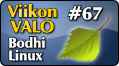

<!--
Title: Bodhi Linux
Week: 2x15
Number: 67
Date: 2012/04/08
Pageimage: valo67-bodhilinux.png
Tags: Käyttöjärjestelmä
-->

**Bodhi Linux on minimaalinen ja hitaampiinkin koneisiin soveltuva
Linux-jakelu, joka painottaa käyttäjän valinnanvapautta jättäen
asennettavat ohjelmistot ja ulkoasun alusta alkaen käyttäjän
päätettäviksi.**

 Bodhi Linuxin
kaksi tärkeintä tavoitetta ovat käyttäjän valinnan vapauden vaaliminen
ja minimaalisuus. Valinnan vapauteen pyritään minimaalisuuden kautta,
sillä Bodhi Linuxin oletusasennuksessa on asennettuna mahdollisimman
vähän ohjelmia, jotta käyttäjä voi itse valita haluamansa ja
tarvitsemansa työkalut. Samalla tavoitellaan keveyttä, koska
järjestelmään ei asenneta tarpeettomia osia ja ohjelmia. Oletuksena
käyttöliittymäksi on asennettuna Enlightenment-ikkunanhallintaohjelma,
joka on samalla sekä kevyt että näyttävä. Www-selaimena
oletusasennuksessa on kevyeksi ja nopeaksi suunniteltu Midori. Kaiken
muun tarvitsemansa käyttäjä voi asentaa
Synaptic-paketinhallintaohjelmalla tai Bodhi Linuxin web-sivujen kautta
käyttämällä [Bodhi AppCenteriä](http://appcenter.bodhilinux.com/).
AppCenteristä on mahdollista asentaa yksittäisten ohjelmien lisäksi
[Nikhila](http://appcenter.bodhilinux.com/software/softbundles/1)- tai
[Pratibha](http://appcenter.bodhilinux.com/software/softbundles/2)-nimiset
ohjelmistokokoelmat. Nikhilaan on koottu kattava kokoelma ohjelmia lähes
kaikkeen käyttöön. Pratibha taas keskittyy kokoelmaan kevyitä ohjelmia.

Bodhi Linux pohjautuu Ubuntun viimeisimpään pitkäaikaistuettuun versioon
(LTS), joten asennettavia ohjelmia löytyy kyllä joka tarpeeseen. Myös
käytettävä kieli on mahdollista vaihtaa ainakin suurelta osin suomeksi
asentamalla tarvittavat kielipaketit (*language-support-fi* ja
*language-pack-gnome-fi*) sekä valitsemalla asetustyökalusta kieleksi
suomen. Seuraava suurempi versiopäivitys Bodhi Linuxiin on odotettavissa
[heinäkuussa version 2.0.0](http://wiki.bodhilinux.com/doku.php?id=future) myötä. Ubuntun
lähteiden lisäksi osa ohjelmista tulee Bodhi Linuxin omista lähteistä.
Näin erityisesti keskeisessä osassa oleva Enlightenment pidetään
jatkuvasti suhteellisen tuoreena versiona.

Bodhi Linuxin käyttöliittymäksi valittu
[Enlightenment](http://www.enlightenment.org/) on jotain perinteisten
Unix-tyyppisten ikkunamanagerien ja täysiveristen työpöytäympäristöjen
väliltä. Pelkän ikkunanhallinnan lisäksi modulaarinen Enlightenment
sisältää kirjastoja muiden ohjelmien käyttöliittymien tekoon,
työpöytäsovelmia sekä järjestelmätyökaluja. Enlightenment on aina
pyrkinyt olemaan varsin näyttävä ulkonäöltään siitä huolimatta, että se
pyrkii toisaalta olemaan kevyt. Bodhi Linuxin nimi onkin peräisin juuri
Enlightenmentilta, sillä englannin kielen sana *enlightenment* on
sanskritin kielellä *bodhi* ja tarkoittaa suomeksi valaistumista.

Enlightenment antaa valita käyttöliittymän tyylin useasta profiilista,
joista osa muistuttaa enemmän perinteistä työpöytää sovellusvalikkoineen
ja käynnistyspalkkeineen. Profiilien joukossa on kuitenkin myös
esimerkiksi kosketusnäytöille ja tablettilaitteille soveltuva profiili
sekä käynnissä olevat ikkunat [tiilitetysti esittävä](http://en.wikipedia.org/wiki/Tiling_window_manager)
vaihtoehto.

Bodhi Linuxin laitteistovaatimukset ovat varsin vaatimattomat: 300 MHz:n
i386-prosessori, 128 megatavua muistia ja 1,5 gigatavua tallennustilaa.
Vaatimukset toki nousevat, jos järjestelmään asennetaan raskaita
ohjelmia.

Kotisivu
:   <http://www.bodhilinux.com>

Lisenssi
:   Useita vapaita lisenssejä

Toimii seuraavilla alustoilla
:   i386-yhteensopivat prosessorit, tulevaisuudessa myös ARM-prosessorit

Asennus
:   Asennuslevyn kuva löytyy Bodhi Linuxin kotisivulta. Levykuva
    poltetaan cd-levylle ja tietokone käynnistetään tältä levyltä.
    Asennuskuvake kiintolevylle asentamista varten löytyy käynnistyvältä
    työpöydältä.
:   Lista Bodhi Linuxin kanssa [todetusti yhteensopivista
    laitteista](http://wiki.bodhilinux.com/doku.php?id=hardware)

Videoita
:   [Arvostelu Youtubessa](http://www.youtube.com/watch?v=zew22fRREQ0)

-   
-   
-   
-   
-   
-   
-   
-   
-   

*Teksti: Pesasa*  
*Kuvakaappaukset: Pesasa*
