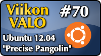

<!--
Title: Ubuntu 12.04
Week: 2x18
Number: 70
Date: 2012/04/29
Pageimage: valo70-ubuntu.png
Tags: Käyttöjärjestelmä
-->

**Ubuntu 12.04 Precise Pangolin on keväällä 2012 julkaistu versio
suositusta vapaasta Linux-käyttöjärjestelmäpaketista.**

 Ubuntun versio 11.04
esiteltiin [Viikon Valona numero 18](Ubuntu_11.04 "wikilink"). Ubuntun
ideologiasta ja perusasioista kannattaa lukea tuosta artikkelista, tässä
keskitytään uuden Ubuntun uutuuksiin.

Ubuntu 12.04 on julkaistu versionumeronsa mukaisesti huhtikuussa 2012 ja
on leikkisältä kutsumanimeltään **Precise
[Pangolin](http://en.wikipedia.org/wiki/Pangolin)**, eli **Tarkka
[Muurahaiskäpy](http://fi.wikipedia.org/wiki/Muurahaisk%C3%A4vyt)**.
Tämä julkaisu on jälleen kahden vuoden tauon jälkeen niin sanottu
[LTS-versio](https://wiki.ubuntu.com/LTS), eli pitkään tuettu versio
(Long Term Support). Tällä tarkoitetaan sitä, että Ubuntua julkaiseva
yhtiö, [Canonical](http://www.canonical.com/), lupaa tukea ja päivittää
järjestelmää normaalin 18 kuukauden sijasta kokonaista 5 vuotta. Pitkä
tukiaika on yleensä oleellista erityisesti yrityskäytössä ja
palvelimissa. Tässä julkaisussa viiden vuoden tuki on ulotettu
palvelinkäytön lisäksi myös työpöytäkäyttöön.

Myös suomenkielinen [Finnish
Remix](http://wiki.ubuntu-fi.org/Ubuntu_Finnish_Remix) on saatavilla.
Ubuntu Finnish Remix on virallisesta Ubuntu-CD-levystä minimimuutoksin
muokattu CD-levykuva, joka sisältää täyden suomen kielen tuen valmiiksi
CD-levyllä. Tästä on etua, jos tarkoituksena on joko esitellä Ubuntua
CD-levyltä tai asentaa Ubuntu paikassa, jossa ei ole Internet-yhteyttä
saatavilla. Huomattavaa on, että myös viralliselta Ubuntu-CD-levyltä
asentuu suomen kielen tuki automaattisesti, jos Internet-yhteys on
käytettävissä asennuksen aikana ja asennuskieleksi on valittu suomi.

Perus-Ubuntun lisäksi on saatavilla valmiita
[rinnakkaisjakeluita](http://wiki.ubuntu-fi.org/Kuvia_ja_videoita).
Jakelut käyttävät pääosin samaa Ubuntun pakettivarastoa, mutta
poikkeavat toisistaan oletuksena asennettavien ohjelmistokokonaisuuksien
suhteen. Kaikki samat ohjelmat ovat kuitenkin asennettavissa kaikkiin
näistä. Saatavilla ovat ainakin

-   [Ubuntu](http://www.ubuntu.com),
-   palvelinasennuksiin tarkoitettu [Ubuntu
    Server](https://wiki.ubuntu.com/PrecisePangolin/ReleaseNotes/UbuntuServer)
-   hyvin pieni ja riisuttu [Ubuntu Core](https://wiki.ubuntu.com/Core),
    tarkoitettu niille jotka itse muokkaavat asennustaltion
    erikoistarkoituksiin,
-   [Kubuntu](http://www.kubuntu.org) vaihtoehtoisella KDE-työpöydällä,
-   koulu- ja muuhun opetuskäyttöön suunnattu
    [Edubuntu](http://www.edubuntu.org/),
-   kevyemmällä työpöydällä varustettu [Xubuntu](http://xubuntu.org)
-   kevyemmällä työpöydällä varustettu [Lubuntu](http://lubuntu.net),
-   multimediatyöskentelyyn ja muuhun luovaan työhön optimoitu [Ubuntu
    Studio](http://ubuntustudio.org/) sekä
-   kotiteatterisoittimeksi sopiva
    [Mythbuntu](http://www.mythbuntu.org/).

Uutta Ubuntussa
---------------

Ubuntun julkaisun suomenkielinen
[lehdistötiedote](http://wiki.ubuntu-fi.org/Ubuntu_12.04_LTS_lehdist%C3%B6tiedote).

Unity-ominaisuuksia muun muassa uraa uurtava **HUD-hakutoiminto**, jolla
valikkojen selaamisen voi halutessaan jättää historiaan.

Muuta uutta: kirjautumisnäkymää uudistettu, Sovellusvalikoimaan lisätty
suositukset, Landscape-hallintapalvelu integroituna, viiden vuoden
työpöytätuki, videonäkymä Unity-valikkoon, Unity-valikon etusivu
uudistettu, Tomboy poistettu, musiikkisoittimeksi vaihdettu
Rytmilaatikko, LibreOfficesta versio 3.5.2

Ubuntun Unity-työpöydän **esittely selaimessa**:
<http://ubuntu-fi.org/Ubuntu_12.04_verkkoesittely/>. Kyseessä on aidon
näköinen demo, ei siis oikeasti selaimessa täysin toimiva Unity. Sillä
voi kuitenkin kokeilla muutamien ohjelmien toimintaa ja käyttöliittymän
yleistä tuntumaa.

Ubuntu 12.04 LTS:n **oletuslatausvaihtoehto** on Ubuntu Suomi-sivuilla
nyt **64-bittisille** suorittimille, joita useimmat tietokoneet
viimeisen 5 vuoden ajalta sisältävät. Ubuntu toimii näillä laitteilla
entistäkin nopeammin. Myös 32-bittinen vaihtoehto löytyy.

Kubuntu
-------

Kubuntu tarjoaa käyttöön uusimmat versiot KDE:n Plasma-työpöydästä ja
ohjelmista. Kehitystä on tapahtunut muun muassa
**Dolphin**-tiedostonhallintaohjelmassa, joka on nopeutunut.
KDE-ympäristön Webkit-pohjainen selain **Rekonq** on niin ikään
päivittynyt ja nopeutunut. **Amarok**-musiikkisoittimessa on uusittu ja
kehitetty usb-tikkujen ja verkkolevyjen käyttöä.

Työpöytäjärjestelmän **virranhallinta** on uusittu ja nyt voi muun
muassa laittaa erilaiset asetukset eri
[aktiviteeteille](http://userbase.kde.org/Plasma#Activities). Tämä
mahdollistaa erilaiset asetukset koti- ja työkäyttöön tai vaikka omat
asetukset esitystilalle, jolloin esimerkiksi näytönsäästäjä ei keskeytä
käynnissä olevaa esitystä.

Muihin uutuuksiin lukeutuu muun muassa uusi vaihtoehtoinen
**tehtävänhallinta**, joka näyttää käynnissä olevat ohjelmat
työkalupalkissa kompaktisti vain ikoneina ilman ohjelman nimeä.

Oman henkilökohtaisen pilvipalvelun pystyttämiseen sopiva **Owncloud**
on saanut uusia sovelluksia, kuten musiikin suoratoiston. Myös
käyttöliittymä on kehittynyt sulavammaksi.

Paketinhallintana Kubuntussa toimii **Muon-sovellustenhallinta**, jossa
ohjelmia voi selata kategorioittain, aakkosjärjestyksessä tai haulla ja
jossa ovat näkyvissä myös käyttäjien arvostelut. Ohjelmien päivitys
tapahtuu saatavilla olevista päivityksistä ilmoittavan
**Muon-päivitystyökalun** avulla.

Uusina ohjelmina Kubuntu tarjoaa muun muassa **Calligra Suiten**,
KOfficen pohjalta syntyneen uuden toimisto-ohjelmistokokonaisuuden, joka
sisältää seuraavat ohjelmat:

-   **Calligra Words** (tekstinkäsittely)
-   **Calligra Spreads** (taulukkolaskenta)
-   **Calligra Stage** (esitysohjelma)
-   **Calligra Flow** (vuokaavio-ohjelma)
-   **Calligra Plan** (työkalu projektinhallintaan ja suunnitteluun)
-   **Krita** (kuvankäsittely)
-   **Kexi** (tietokantatyökalu)

Pikaviestien lähettämiseen ja vastaanottamiseen on **Kopeten** rinnalle
tullut **KDE Telepathy**, joka osaa GoogleTalkin, Facebook Chatin, MSN
Messengerin sekä monen muun viestijärjestelmän käytön.

Kubuntua on mahdollista käyttää myös uuden kosketusnäytöille optimoidun
Plasma Active -käyttöliittymän kanssa.

Julkaisutapahtumat
------------------

Ubuntun suomalaiset käyttäjät järjestävät julkaisutapahtumia ja
-tapaamisia ympäri Suomea. Pääjulkaisutapahtuma järjestetään
[Tampereella tiistaina 15.5.2012](http://coss.fi/ubuntufest2012).

Kotisivu
:   <http://www.ubuntu.com/> ([Ubuntu Suomi](http://www.ubuntu-fi.org/))

Lisenssi
:   Sisältää ohjelmia useilla vapailla lisensseillä

Asennus
:   Asennus-cd:n levykuvan voi ladata joko suoraan Ubuntun kotisivuilta
    taikka Ubuntu Suomen
    [lataussivulta](http://www.ubuntu-fi.org/lataa.html). Sivuilla
    opastetaan lataamaan laitteeseen parhaiten sopiva versio. Ladattu
    levykuvatiedosto poltetaan cd-levylle tai kirjoitetaan
    USB-muistitikulle, jolta käyttöjärjestelmän asennus voidaan
    aloittaa.

Käyttöohjeet
:   [Ubuntun
    käyttöopas](https://help.ubuntu.com/12.04/ubuntu-help/index.html.fi)
:   [Kokeile](http://www.ubuntu-fi.org/Ubuntu_12.04_verkkoesittely/fi/)
    Ubuntun käyttöä selaimella
:   [Mitä uutta Ubuntussa?](http://www.ubuntu.com/ubuntu/whats-new)
:   [Viisi tärkeintä asiaa uudelle Ubuntun
    käyttäjälle](http://blog.ubuntu-fi.org/2007/viisi-tarkeinta-asiaa-uudelle-ubuntun-kayttajalle/)
:   [Ubuntu Suomen keskustelualueet](http://forum.ubuntu-fi.org/)
:   [Linux.fi-wiki](http://linux.fi/), josta löytyy ohjeita ja opasteita
    moneen Linux-aiheiseen asiaan.
:   [Ubuntu Suomen ohjesivu](http://wiki.ubuntu-fi.org/Ohjeet)

-   
-   
-   
-   
-   
-   
-   
-   
-   
-   
-   
-   
-   

*Teksti: Pesasa, Taleman*  
*Kuvakaappaukset: Pesasa*
