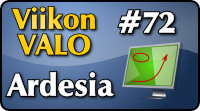

<!--
Title: 2x20 Ardesia - Viikon VALO #72
Date: 2012/05/13
Pageimage: valo72-ardesia.png
Tags: Linux,Windows
-->

**Ardesia on vapaa työkalu, jolla voi piirtää havainnollistuksia
ohjelmien ja esitysten päälle sekä tehdä videotallenteita tietokoneen
ruudulta.**

 Ardesia on
helppokäyttöinen työkalu tilanteisiin, joissa tarvitsee korostaa
näytöllä näkyviä asioita yleisölle. Se on kuin tavallinen, hyvin
yksinkertainen piirto-ohjelma, mutta oman piirtoikkunan sijasta
piirtäminen tapahtuukin koko näytön alueelle kaikkien muiden ohjelmien
ja työpöydän päälle. Ardesia luo näytön päälle eräänlaisen kalvon, jolle
käyttäjä voi tehdä korostuksiaan ja piirroksiaan. Piirretyt kuviot ovat
erillään niiden takana näkyvistä ohjelmista eivätkä vaikuta niiden
toimintaan. Ardesian avulla voi esimerkiksi puhuja elävöitää esitystään
painottamalla tiettyjä osia näytöllä näkyvästä sisällöstä.

Aiemmin puhujat ja opettajat käyttivät usein
[liitu-](http://fi.wikipedia.org/wiki/Liitutaulu),
[valko-](http://fi.wikipedia.org/wiki/Valkotaulu) tai
[fläppitaulua](http://fi.wikipedia.org/wiki/Fl%C3%A4ppitaulu) ja
piirsivät sekä kirjoittivat puheensa edetessä puhetta havainnollistavia
kaavakuvia ja tekstejä. Piirrokset etenivät puheen tahdissa ja puhuja
pystyi joustamaan niiden käytössä kuulijoiden ja tilanteen mukaan.
Tietokoneiden myötä opetuksen havaintovälineeksi ovat tulleet
tietokoneella ennalta valmistellut esitykset esimerkiksi pdf- tai
PowerPoint-muodossa. Nämä ovat usein tarjonneet esitykselle
visuaalisemman ja ennakkoon viimeistellymmän ulkoasun, mutta esitykset
ovat samalla menettäneet joustavuuttaan ja esiintyjä on helposti jäänyt
vain esityksen sivujen sisällön lukijaksi. Ardesian avulla esityksiin
saadaan hieman takaisin aiempaa dynaamisuutta, kun esityksen pitäjä voi
joustavasti lisätä alleviivauksia, nuolia, korostuksia ja piirroksia
valmiin pohjan päälle puheensa edetessä.

Esitysgrafiikan päälle piirtämisen lisäksi Ardesiaa voi toki käyttää
myös muiden ohjelmien kanssa. Opettaja voi esimerkiksi näyttää
karttaohjelmalla tai -sivustolla maailmankarttaa ja piirtää sen päälle
löytöretkien reittejä. Ardesia soveltuu erinomaisesti myös ohjelmistojen
käytön opetukseen. Sillä voidaan korostaa ohjelman ikkunasta esiteltävät
kohdat, kuten painikenappulat tai valikot.

Alla olevan työpöydän ja ohjelmien lisäksi Ardesiassa voi valita
taustaksi jonkin valmiista taustakuvista tai oman taustakuvan. Näin
Ardesiaa voi käyttää sopivalla taustakuvalla vaikka liitutaulun sijasta.
Toisaalta taustakuvaksi voi valita tarpeen mukaan nuottiviivaston,
kartan tai kaavakuvan ihmisen luuston rakenteesta.

Piirtotyökaluina Ardesiassa ovat vain oleellisimmat. Kynä, läpinäkyvä
korostuskynä, täyttötyökalu, tekstityökalu, pyyhekumi sekä nuolipäisiä
viivoja piirtävä työkalu. Työkalujen toiminnan oppi nopeasti ja helposti
kokeilemalla niitä. Piirtojäljen ja tekstin koon voi valita neljästä eri
koosta ja piirtotilaksi on valittavissa kolme eri tilaa: täysin vapaa
piirtäminen sekä kulmikkaita tai kaarevia murtoviivoja piirtävät tilat.
Piirtovärin voi valita viidestä tarjolla olevasta väristä tai valita
oman värin siihen tarkoitetulla työkalulla. Nuolityökalu sen sijaan
päästää käyttäjän käyttämään "kalvon" alla olevia muita ohjelmia
normaalisti.

Ardesiasta on mahdollista myös tallettaa näytön sen hetkinen sisältö
png-kuvana tai pdf-tiedostona. Mielenkiintoinen ominaisuus on myös
mahdollisuus tehdä näytön tapahtumista videotallenne. Ardesia tallentaa
videolle samalla myös äänen, joten tällä toiminnolla on helppoa tehdä
esityksestä myöhemminkin katsottava tallenne. Näin on myös mahdollista
tehdä helposti jonkin ohjelman käyttöä opettavia tai esitteleviä
videoita. Videot tallennetaan vapaassa Ogg Theora -muodossa, jonka
katsominen onnistuu esimerkiksi
[VLC-mediasoittimella](VLC-mediasoitin "wikilink") tai
[Firefox](Firefox "wikilink")-selaimella.

Ardesia vaatii Linux-ympäristössä toimiakseen kompositointiin kykenevän
ikkunoidenhallinnan. Tyypillisillä KDE-, Gnome- tai Unity-työpöydillä
tämän ei pitäisi olla ongelma.

Kotisivu
:   <http://code.google.com/p/ardesia/>

Lisenssi
:   [GNU GPL](GNU_GPL) v3

Toimii seuraavilla alustoilla
:   Linux, Windows (Vista ja 7)

Asennus
:   Uusimmissa Ubuntuissa ja luultavasti monissa muissakin
    Linux-järjestelmissä ohjelma löytyy suoraan pakettivarastoista.
    Windows Vista ja Windows 7 -järjestelmiin ohjelma löytyy sen
    kotisivuilta.

Käyttöohjeet
:   Lyhyen esittelyn Ardesian käytöstä voi katsoa
    [Youtube-videosta](http://www.youtube.com/watch?v=4Wd8SsmIjzs).

-   
-   
-   
-   
-   
-   

*Teksti: Pesasa*  
*Kuvakaappaukset: Pesasa*
