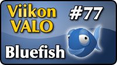

<!--
Title: 2x25 Bluefish - Viikon VALO #77
Date: 2012/06/17
Pageimage: valo77-bluefish.png
Tags: Linux,Windows,Mac OS X,Solaris,Unix,Tekstieditori
-->

**Bluefish on kehittynyt
[tekstieditori](http://fi.wikipedia.org/wiki/Tekstieditori) webbisivujen
tekoon ja ohjelmatiedostojen kirjoittamiseen.**

 Bluefishissä on
runsaasti työkaluja dynaamisten webbisivujen kehitystyöhön. Bluefishissä
on tuki ohjelmointiin ainakin seuraaville kielille: Ada, ASP .NET ja
VBS, C/C++, CSS, CFML, Clojure, D, gettext PO, Google Go, HTML, XHTML ja
HTML5, Java ja JSP, JavaScript ja jQuery, Lua, Octave/MATLAB, MediaWiki,
NSIS, Pascal, Perl, PHP, Python, R, Ruby, Shell, Scheme, SQL, SVG, Vala,
Wordpress ja XML.

Bluefish on toteutettu C-ohjelmointikielellä ja
GTK+-käyttöliittymäkirjastolla. Bluefish on suunnattu
käyttötarkoitukseltaan perustekstieditorin ja integroidun
kehitysympäristön väliin. Sen
[ominaisuusvalikoima](http://bluefish.openoffice.nl/features.html) on
kattava ja siitä pitäisi löytymän kaikki mitä teksturilta voi
edellyttää.

Bluefish osaa muokata etätiedostoja
[gvfs](http://en.wikipedia.org/wiki/GVFS):n kautta. Eli omalla
työasemalla toimiva Bluefish voi muokata webbipalvelimella olevaa .html
tiedostoa suoraan, tarvitsematta noutaa sitä omalle koneelle ja kopioida
muokkauksen jälkeen takaisin. Tämä ominaisuus on [webbisivun
mukaan](http://bluefish.openoffice.nl/features.html) vaillinaisesti
toteutettu Bluefishin Windows ja Mac OS X -versioissa.

Käytä Bluefishiä jos kirjoitat webbisivuja käsin, siis itse kirjoitat
.html ja .css tiedostot. Toinen tapahan on käyttää
[työkalua](http://en.wikipedia.org/wiki/Website_builder), jolla
webbisivut kuvataan ja työkalu tuottaa HTML- ja CSS-tiedostot. Näissä ei
välttämättä voi paljoakaan vaikuttaa millaista koodia työkalu tuottaa,
mutta Bluefishillä voi kirjoittaa juuri sillä tavalla kuin tarvitaan.

Bluefish aloitti vuonna 1997, tekijöinä Chris Mazuc ja Olivier Sessing.
Tavoitteena oli työkalu auttamaan Linuxia käyttäviä ammatikseen
webbisivuja tekeviä. Tuosta alkaen Bluefishiä on kehittänyt vaihteleva
joukko ammattimaisia web-kehittäjiä Olivier Sessinkin johdolla.
Projektin nimi on ollut vaihtuvainen, alkuperäinen nimi Thtml hylättiiin
liian salaperäisenä. Seuraava nimi oli Prosite, se hylättiin koska useat
web-kehitysyhtiöt käyttivät nimeä useissa maissa. Nimeksi tuli Bluefish,
kun logoksi ehdotettiin lapsen piirrosta sinisestä kalasta. Nykyinen
logo on ollut käytössä versiosta 1.0 alkaen.

Uusin versio 2.2.2 julkaistiin maaliskuun 1. päivänä.

Kotisivu
:   <http://bluefish.openoffice.nl/index.html>

Lisenssi
:   [GNU GPL](GNU_GPL)

Toimii seuraavilla alustoilla
:   Linux, Mac OS X, Solaris, Unix, Windows

Asennus
:   Linux-jakeluissa tulee jakelun omista pakettivarastoista. Muut
    käyttäjät joutunevat noutamaan asennustiedoston kotisivulta.

Käyttöohjeet
:   [Linux.fi Wikin lyhyt ohje](http://linux.fi/wiki/Bluefish)
:   [Englanninkielinen käsikirja,
    keskeneräinen](http://bfwiki.tellefsen.net/index.php/Manual_2_ToC)
:   [Bluefish Wiki](http://bfwiki.tellefsen.net/index.php/Main_Page)

Katso myös
:   [Notepad++](Notepad++), [GNU Emacs](GNU_Emacs)

-   [Juuri käynnistetty](images/Bluefish_1.png)
-   [Mediawiki wikiteksti](images/Bluefish_2.png)
-   [HTML-tiedosto](images/Bluefish_3.png)

*Teksti: Taleman*  
*Kuvakaappaukset: Taleman*
