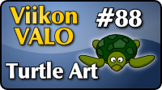

<!--
Title: Turtle Art
Week: 2x36
Number: 88
Date: 2012/09/02
Pageimage: valo88-turtleart.png
Tags: Linux,Ohjelmointi,Opetus
-->

**Turtle Art on ohjelmoinnin alkeisopetukseen sopiva
kilpikonnagrafiikkaa hyödyntävä ohjelmointiympäristö, jossa ohjelmointi
tapahtuu palikoilla rakentamalla.**

 Turtle Art (ja sen
laajempi versio Turtle Blocks) on ohjelmointiympäristö, joka on
tarkoitettu madaltamaan kynnystä ohjelmoinnin periaatteiden opetteluun.
[Ohjelmakoodin](http://fi.wikipedia.org/wiki/L%C3%A4hdekoodi)
kirjoittamisen sijaan siinä rakennetaan ohjelmia tarjolla olevista
värikkäistä toisiinsa loksahtavista palikoista, joilla kullakin on oma
toimintonsa. [Ohjelmointi](http://fi.wikipedia.org/wiki/Ohjelmointi)
tapahtuu siis samaan tapaan kuin
[Scratch](http://scratch.mit.edu/)-ympäristössä. Turtle Art hyödyntää
nimensä mukaisesti myös LOGO-ohjelmointikielestä tutuksi tullutta
[kilpikonnagrafiikkaa](http://fi.wikipedia.org/wiki/Kilpikonnagrafiikka),
jossa ruudulla kulkevaa ja jälkeensä viivaa piirtävää kilpikonnaa
ohjataan yksinkertaisilla komennoilla, kuten "*eteen 50 askelta*" tai
"*oikealle 90 astetta*". Palikoista rakentaminen mahdollistaa
ohjelmoinnin menetelmien ja
[rakenteiden](http://fi.wikipedia.org/wiki/Lause_(ohjelmointi)), kuten
silmukoiden ja ehtojen hahmottamisen visuaalisesti. Varsinkin
pienemmille oppijoille valmiiden rakenteiden raahaaminen hiirellä
tarvittaviin kohtiin on varmastikin helpompaa ja opettavaisempaa kuin
kryptisemmän ohjelmakoodin kirjoittaminen. Tämä mahdollistaa samalla
myös erilaisten kokeilujen tekemisen helposti.

Ohjelma on alun perin kehitetty aktiviteetiksi erityisesti kehitysmaiden
lapsille suunnatun *[One Laptop Per
Child](http://one.laptop.org/)*-projektin
[XO](http://en.wikipedia.org/wiki/OLPC_XO-1)-koneiden
[Sugar](http://en.wikipedia.org/wiki/Sugar_%28interface%29)-järjestelmään,
mutta Python-pohjaisena toteutuksena se toimii luontevasti myös muissa
Linux-järjestelmissä.
[Käyttöliittymä](http://fi.wikipedia.org/wiki/K%C3%A4ytt%C3%B6liittym%C3%A4)
on Sugar-aktiviteeteille tyypillisesti toteutettu suurilla ja selkeillä
kuvakkeilla.

Turtle Artissa ohjelmointiin käytettävät komponentit on jaoteltu
muutamaan kategoriaan: kilpikonnan liikuttelu, piirtokynän ominaisuudet,
värit, numeeriset operaatiot, kontrollirakenteet, muuttujakomponentit,
ekstrat sekä esityspohjat. Näistä raahaamalla ja toisiinsa kytkemällä
rakennetaan kokonaisuus, jonka voi suorittaa "run"-komennolla. Suoritus
alkaa "start"-komponentista ja etenee rakennelmaa ylhäältä alaspäin
suorittaen matkan varrella kunkin komponentin määräämän toiminnon.
Suorituksessa voidaan myös edetä askel askeleelta hidastettuna tai
[virheenjäljitys](http://www.cs.helsinki.fi/compfac/ohjeet/C/gdb.html)-
eli "debug"-tilassa, jolloin voidaan seurata muuttujien arvoja
suorituksen aikana.

Kotisivu
:   <http://wiki.sugarlabs.org/go/Activities/Turtle_Art>

Lisenssi
:   [MIT](MIT)

Toimii seuraavilla alustoilla
:   Linux (mahdollisesti muitakin, toteutettu Pythonilla)

Asennus
:   Löytyy joidenkin Linux-jakeluiden pakettivarastosta.

Käyttöohjeet
:   [Floss-manuals](http://en.flossmanuals.net/turtle-art/)
:   [Turtle Art student
    guide](http://wiki.laptop.org/go/Turtle_Art_student_guide)
:   [Turtle
    Confusion](http://wiki.sugarlabs.org/go/Activities/Turtle_Confusion)
    - kokoelma tehtäviä

Lähdekoodi
:   [Git-repository](http://git.sugarlabs.org/turtleart)

-   [Yksinkertaiset komennot kilpikonnan
    ohjailuun.](images/turtleart-1.png)
-   [Kynän ominaisuudet, kuten värit.](images/turtleart-2.png)
-   [Numeeriset operaatiot, mukaan lukien
    satunnaislukugeneraattori.](images/turtleart-3.png)
-   [Kilpikonna kulkee satunnaisesti.](images/turtleart-4.png)
-   [Nimetyn alirutiinin käyttöä.](images/turtleart-5.png)
-   [Ekstrakomennot](images/turtleart-6.png)
-   [Esitystoiminnot](images/turtleart-7.png)
-   [Roskakori](images/turtleart-8.png)

*Teksti: Pesasa*  
*Kuvakaappaukset: Pesasa*
