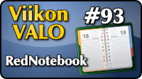

<!--
Title: RedNotebook
Week: 2x41
Number: 93
Date: 2012/10/07
Pageimage: valo93-rednotebook.png
Tags: Linux,Mac OS X,Windows,OpenBSD,Muistiinpanot,Kalenteri
-->

**RedNotebook on selkeä ja kätevä päiväkirjaohjelma.**

 RedNotebook on
helppo työkalu päivittäisten muistiinpanojen ja havaintojen ylös
kirjaamiseen. Sitä voi käyttää tavallisena päiväkirjana,
työaikakirjanpitoon tai vaikka kokousmuistioiden kirjoittamiseen. Se
sisältää muun muassa kalenterinavigoinnin, tunnisteet (tags), sisällön
luokittelun, sanapilven, muokattavat tekstipohjat sekä hakutoiminnot.
Ohjelman näkymä on jaettu kolmeen palstaan. Näistä vasemmanpuolimmainen
sisältää kalenterin ja navigoinnin, mukaan lukien sanapilven ja
hakutoiminnot. Keskimmäisessä palstassa on valitun päivän tekstisisältö
joko muokkaus- tai esikatselutilassa. Oikeassa reunassa taas on kyseisen
päivän sivuhuomautukset, kuten tunnisteet sekä muut valinnaiset päivälle
merkityt eri luokkiin kuuluvat merkinnät.

Päivän muistiinpanoteksti kirjoitetaan wiki-merkinnän kaltaisella
syntaksilla, jossa esimerkiksi otsikot merkitään kolmella
yhtäsuuruusmerkillä, luettelot rivin aloittavalla viivalla sekä
lihavointi kahdella tähdellä ennen ja jälkeen lihavoitua tekstiä. Kaikki
muotoilut saa joko kirjoitettua tekstiin suoraan tai valittua valikosta.
Ohjelmassa on valmiina tarjolla muutama mallipohja esimerkiksi puhelun,
matkan tai tapaamisen dokumentointiin. Olemassa olevien pohjien muokkaus
ja uusien luonti onnistuu helposti valikosta valitsemalla ja
kirjoittamalla halutut merkinnät tekstipohjalle.

Ikkunan oikean reunan sivuhuomautuksiin voi kullekin päivälle lisätä
haluamansa luokkanimen alle erilaisia päivään liittyviä pieniä
merkintöjä (Annotate). Esimerkiksi, jos haluaa pitää kirjaa katsomistaan
elokuvista, voi lisätä päivän kohdalle lisätä uuden merkinnän, jonka
luokaksi tulee sana "Elokuva" ja merkinnän sisällöksi katsotun elokuvan
nimi. Samalle päivälle voi merkitä useampia samoihin tai eri luokkiin
kuuluvia merkintöjä. Merkintöjä on sitten myöhemmin helppo etsiä vaikka
luokkien mukaan. Merkintöjen sisältöteksteissä voi käyttää samoja
muotoilumerkintöjä, kuin varsinaisessa päiväkirjatekstissäkin, eli
esimerkiksi lihavointia, kursivointia, alleviivausta ja yliviivausta.
Luokka nimeltä "Tags" on erikoisasemassa, sillä siihen kuuluvia
merkintöjä voi lisätä suoraan "Tunniste"-nappia painamalla ja ohjelma
käyttää näitä merkintöjä päivälle merkittyinä avainsanoina.

Ikkunan vasemman reunan hakutoiminnon haut voi kohdistaa joko
päiväkirjatekstiin, luokkiin tai tunnisteisiin (Tags). Haku etsii
silloin kirjoitettua tekstiä tekstisisällöstä, luokan nimestä tai
tunnisteiden asiasanoista. Toinen voimakas hakuominaisuus ovat
sanapilvet, joita ohjelma muodostaa automaattisesti päiväkirjateksteissä
esiintyvistä sanoista, luokista sekä tunnisteista. Sanapilvissä useimmin
käytetyt sanat, luokat ja tunnisteet on esitetty suuremmalla
kirjasimella ja harvinaisemmat pienemmillä. Sanaa klikkaamalla ohjelma
antaa luettelon päivistä, joissa kyseinen sana esiintyy pyydetyssä
yhteydessä, eli tekstissä, luokkana tai tunnisteena.

Luokittelua voi hyödyntää myös esimerkiksi TODO-listojen tekemiseen.
Tällöin uuden tehtävän voi merkitä jonkin päivän, esimerkiksi tehtävän
takarajan kohdalle luokalla "TODO". Kun luokkien sanapilvestä klikkaa
sanaa "TODO", saadaan lista tehtävistä asioista. Kun tehtävä on
suoritettu, sen voi käydä yliviivaamassa klikkaamalla listasta kyseistä
päivää ja muokkaamalla "TODO"-merkintää.

Erityyppisten muistiinpanojen, esimerkiksi työ ja vapaa-aikaan
liittyvien asioiden merkitseminen voidaan tehdä joko erottelemalla ne
päivätekstissä väliviivalla ja otsikolla tai kirjoittamalla ne kokonaan
eri päiväkirjaan. "Päiväkirja"-valikosta on mahdollista luoda uusia
päiväkirjoja ja avata jo olemassa olevia. Päiväkirja koostuu kansiosta,
jonka sisällä merkinnät on järjestetty kuukausittain tekstitiedostoihin.
Ohjelma tallentaa kirjoitetut tekstit automaattisesti tasaisin väliajoin
sekä ohjelmaa suljettaessa, päiväkirjaa vaihdettaessa tai käyttäjän niin
pyytäessä. Ohjelmassa on myös helppo varmuuskopiointitoiminto, joka
tekee avoimen päiväkirjan sisällöstä zip-paketin, jonka voi tallentaa
varmaan paikkaan turvaan.

Päiväkirjan sisältö on myös mahdollista viedä pelkäksi tekstiksi tai
html-, latex- tai pdf-muotoiseen tiedostoon, josta sitä on mahdollista
käyttää muilla ohjelmilla. Ohjelma on myös tarvittaessa mahdollista
asentaa usb-tikulle ja käyttää sitä sieltä, jolloin päiväkirja on mukana
kuljetettavassa muodossa.

Kotisivu
:   <http://rednotebook.sourceforge.net/>

Lisenssi
:   [GNU GPL](GNU_GPL)

Toimii seuraavilla alustoilla
:   Linux, Windows, Mac OS X, OpenBSD

Asennus
:   Ohjelma on ladattavissa sen kotisivuilta. Linux-jakeluissa ohjelma
    todennäköisesti löytyy suoraan paketinhallinnan kautta.

Aiempia saman tyylisiä VALOja
:   [Tomboy](Tomboy), [Emacs Org-mode](Emacs_Org-mode)

-   
-   
-   
-   
-   
-   
-   

*Teksti: Pesasa*  
*Kuvakaappaukset: Pesasa*
