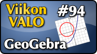

<!--
Title: 2x42 GeoGebra - Viikon VALO #94
Date: 2012/10/14
Pageimage: valo94-geogebra.png
Tags: Linux,Windows,Mac OS X,FreeBSD,OpenBSD,NetBSD,Solaris,Matematiikka,Opetus
-->

**GeoGebra on ilmainen ohjelma matematiikan oppimisen ja opettamisen
avuksi .**

 GeoGebra on
matematiikkaohjelma, jossa yhdistyy monipuolinen piirto-ohjelma
funktioiden kuvaajille ja geometrisille konstruktioille,
[tietokonealgebrajärjestelmä
(CAS)](http://fi.wikipedia.org/wiki/Symbolinen_laskenta) sekä
taulukkolaskenta. GeoGebran käyttöliittymässä pääosassa on
koordinaatistolla varustettu piirtoalue, johon ikkunan yläreunan
painikkeista valittavilla työkaluilla voi lisätä pisteitä, janoja,
suoria, ympyröitä, ellipsejä, kulmia, liukusäätimiä sekä muita
geometrisia ja matemaattisia objekteja. Piirtoalueen vasemmalla puolella
on tarvittaessa piilotettavissa oleva algebraikkuna, eli lista
määritellyistä objekteista. Listassa objektit on jaoteltu vapaisiin ja
riippuviin. Vapaita objekteja ovat sellaiset objektit, jotka ovat
kokonaan käyttäjän määriteltävissä. Esimerkiksi vapaata pistettä voi
hiirellä raahata piirtoalueella täysin vapaasti. Riippuvat objektit sen
sijaan määräytyvät joko kokonaan tai osittain toisten objektien avulla.
Esimerkiksi suora määräytyy täysin kahden pisteen sijainnista ja kahden
suoran leikkauspiste taas voi olla määritelty näiden suorien avulla.
Osittain riippuvat objektit taas omaavat jonkin verran vapauksia.
Esimerkiksi ympyrän kehälle sijoitettu piste riippuu ympyrästä, mutta
käyttäjä on vapaa liikuttamaan sitä pitkin ympyrän kehää. Objektijoukon
koostaminen vapaista ja riippuvista objekteista mahdollistaa sellaisten
konstruktioiden rakentamisen, joissa on vain vähän vapaita objekteja,
joita liikuttamalla koko konstruktio muuttaa muotoaan säilyttäen
kuitenkin keskeiset ominaisuutensa. Esimerkiksi, jos kahden pisteen
välisen janan keskipiste ja keskinormaali etsitään käyttäen kahta
samansäteistä ympyrää ja näiden leikkauspisteitä, voidaan konstruktion
jälkeen alkuperäisiä pisteitä liikutella ja silti keskipiste ja
keskinormaali säilyvät kuvassa, kuten pitääkin. Algebraikkunasta voidaan
valita piirtoalueella näytettävät objektit, jolloin lopullisessa kuvassa
voivat olla näkyvissä vain halutut objektit ja konstruktion piirtämiseen
käytetyt apukuviot ja -objektit ovat piilotettuina.

Piirtoalueen alapuolella on lisäksi syöttökenttä, jota käyttämällä
objektit voi syöttää GeoGebralle suoran kirjoittamalla. Geometristen
objektien lisäksi syöttökentällä voidaan syöttää myös funktioita, jotka
lisätään algebraikkunaan uusina objekteina ja joiden kuvaaja piirretään
samalla piirtoalueelle. GeoGebraa voi käyttää myös tietokonealgebrana,
joka kykenee muun muassa sieventämään lausekkeita, ratkaisemaan
yhtälöitä ja derivoimaan funktioita. GeoGebran tulossa oleva uusi versio
4.2 tukee laajempaa joukkoa
[CAS-toimintoja](http://wiki.geogebra.org/en/CAS_View).

Kolmantena osana GeoGebra sisältää taulukkolaskennan, joka toimii
saumattomasti yhteen piirtoalueen ja syöttökentän toimintojen kanssa.
Syöttökentältä syötettävissä objekteissa voidaan esimerkiksi viitata
taulukon soluihin ja siten käyttää taulukosta löytyviä arvoja hyödyksi.
Taulukkonäkymä sisältää myös työkaluja todennäköisyys- ja
tilastolaskennan käyttöön.

GeoGebra sopii graafisena ja hyvin havainnollistavana työkaluna erittäin
hyvin opetuskäyttöön sekä opettajalle että opiskelijalle. Opettajan on
mahdollista luoda GeoGebralla tarvittavat objektit sisältävä
tehtäväympäristö ja tallentaa tämä GeoGebra-sovellus dynaamisena
työtiedostona, joka on käytännössä html-sivu, johon on upotettu
tarvittava Java-sovelma. Työtiedoston GeoGebra-sovelluksesta opettaja
voi poistaa valintansa mukaan toimintoja ja jättää vain haluamansa,
opetettavaa asiaa havainnollistavat tai tehtävän suorittamiseen
tarvittavat toiminnallisuudet käytettäviksi. Esimerkiksi toisen asteen
polynomia ja sen määrittelemää paraabelia voidaan havainnollistaa
[GeoGebra-sovelluksella](http://www.geogebratube.org/student/m6500),
jossa käyttäjä voi liukusäätimillä kokeilla polynomin kertoimien
vaikutusta kuvaajaan, ja josta muut GeoGebran toiminnallisuudet on
kytketty käytöstä. Työtiedostoja voi tallentaa omalle koneelleen
html-tiedostona ja tarvittavina Java-tiedostoina taikka julkaista
[GeoGebraTube](http://www.geogebratube.org/)ssa, yhteisöllisessä
palvelussa, johon GeoGebran käyttäjät ovat keränneet laajan kokoelman
tekemiään GeoGebra-sovelluksia.

GeoGebran käyttäjät muodostavatkin aktiivisen yhteisön ja Suomessa
GeoGebran käyttöä edistää [Suomalainen
GeoGebra-verkosto](http://geogebra.fi/). GeoGebran käytöstä voi
keskustella ja pyytää apua ja vihjeitä GeoGebran pääsivuston foorumilla
taikka suomeksi Suomalaisen GeoGebra-verkoston
[keskustelupalstalla](http://www.geogebra.org/forum/viewforum.php?f=33).

GeoGebra on Java-ohjelmisto, joka vaatii, että tietokoneelle on
asennettuna Java-ympäristö. Sitä on mahdollista käyttää joko omalle
koneelle ladattuna ohjelmana tai www-selaimella suoraan verkosta
GeoGebran kotisivuilta käynnistettävänä Java-sovelmana.

GeoGebra on
[julkaistu](http://blog.geogebra.org/2012/06/geogebra-chrome-app-released/)
myös Googlen Chrome-selaimelle [Chrome Web
Storessa](https://chrome.google.com/webstore/search/geogebra). Tämä
versio on toteutettu kokonaan Javascriptillä html5-sovelluksena, eikä
siksi tarvitse toimiakseen Javaa. Selainsovellus vaatii kuitenkin
Google-tunnukset, sillä siinä tallennukset tapahtuvat Googlen Drive
-palveluun. Vaikka web-sovellus on nimellisesti suunnattu Chromelle,
toimii se yhtä hyvin myös esimerkiksi
[Firefox](Firefox)-selaimella menemällä osoitteeseen:
<http://geogebraweb.appspot.com/> .

GeoGebran www-sivuilla sanotaan: *"Voit kopioida, jakaa ja välittää
GeoGebraa ei-kaupallisiin tarkoituksiin."*
[Lisenssitekstistä](http://www.geogebra.org/download/license.txt) käy
kuitenkin ilmi, että rajoitus ei-kaupallisen käyttöön koskee vain
GeoGebran asennusohjelmaa, joka on lisensoitu
[CC-BY-NC-SA](http://creativecommons.org/licenses/by-nc-sa/3.0/)-lisenssillä.
GeoGebran lähdekoodi sen sijaan on julkaistu [GNU
GPL](GNU_GPL) -lisenssillä. GeoGebran kielitiedostot sekä
dokumentaatio taas on julkaistu
[CC-BY-SA](http://creativecommons.org/licenses/by-sa/3.0/)-lisenssillä.

Kotisivu
:   <http://www.geogebra.org/>

Lisenssi
:   [GNU GPL](GNU_GPL) v.3

Toimii seuraavilla alustoilla
:   Linux, Windows, Mac OS X, FreeBSD, OpenBSD, NetBSD, Solaris
    (Järjestelmät, joihin on saatavilla Java)

Asennus
:   Asennuspaketit löytyvät GeoGebran kotisivuilta. Unix-tyyppisiin
    järjestelmiin sivuilta on ladattavissa .tar.gz-paketti, joka
    sisältää ohjelman ajettavan version suoraan ilman erillistä
    asentamista. Yleisimpiin Linux-järjestelmiin ohjelma löytyy joko
    suoraan järjestelmän omasta paketinhallinnasta tai GeoGebran
    sivuilla opastetuista erillisistä pakettivarastoista.

Käyttöohjeet
:   Käyttöohjeita ja vertaistukea löytyy paljon sekä [GeoGebran omilta
    sivuilta](http://www.geogebra.org) että [Suomalaisen
    GeoGebra-verkoston](http://www.geogebra.fi) sivuilta.

Videoita
:   [Yhtälön ratkaiseminen graafisesti
    GeoGebralla](http://www.youtube.com/watch?v=sRHxVz51uZI) (Youtube)
:   [Tulevan 4.2-version
    CAS-näkymä](http://www.youtube.com/watch?v=UzoQE20b5vQ) (Youtube)
:   [GeoGebran virallinen
    Youtube-kanava](https://www.youtube.com/user/geogebrachannel)

-   [Janan keskipisteen ja keskinormaalin etsiminen
    harppi-viivain-konstruktiona GeoGebralla. Vain alkuperäiset janan
    päätepisteet ovat vapaita objekteja. Kaikki muut objektit ovat
    riippuvia ja seuraavat mukana, jos pisteitä A tai B
    siirretään.](images/geogebra-1.png)
-   [Ympyrän keskipiste A ja kehällä oleva piste B ovat vapaita
    objekteja. Ympyrä riippuu näistä kahdesta pisteestä ja ympyrän
    kehällä oleva piste C on osittain riippuva, sillä sitä voi siirtää
    pitkin ympyrän kehää. Muut objektit, eli janat ja kulma ovat
    riippuvia ja muuttuvat pisteiden A, B ja C sijainnin
    mukaan.](images/geogebra-2.png)
-   [Pisteitä voi määritellä muun muassa objektien
    leikkauspisteinä.](images/geogebra-3.png)
-   [Pisteistä voi muodostaa monikulmioita.](images/geogebra-4.png)
-   [Liukusäätimillä voi luoda helposti kokeiltavia käyttöliittymiä.
    Kuvassa liukukytkin määrittää arvon a, jota käytetään pisteiden P ja
    Q x-koordinaatteina. Pisteiden y-koordinaatit lasketaan arvoista
    f(a) ja g(a), kun f(x)=sin(x) ja
    g(x)=sin(4x)/x.](images/geogebra-5.png)
-   [Objekteja voi syöttää suoraan myös syöttökentän
    kautta.](images/geogebra-6.png)
-   [Laskentataulukon arvoihin voi viitata suoraan
    objekteista.](images/geogebra-7.png)

*Teksti: Pesasa*  
*Kuvakaappaukset: Pesasa*
