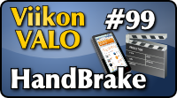

<!--
Title: HandBrake
Week: 2x47
Number: 99
Date: 2012/11/18
Pageimage: valo99-handbrake.png
Tags: Linux,Mac OS X,Windows,Video
-->

**HandBrake on avoimen lähdekoodin videomuunto-ohjelma.**

 HandBrake on
helppokäyttöinen usealla käyttöjärjestelmällä toimiva työkalu
videotiedostojen muuntamiseen muodosta ja koosta toiseen. Videon
muuntaminen toiseen muotoon voi olla hyödyllistä esimerkiksi, jos
halutaan ottaa DVD-levyllä oleva elokuva matkalle mukaan katsottavaksi
mobiililaitteella, kuten tabletilla tai puhelimella. HandBrakella
voidaan määritellä useampia muunnoksia valmiiksi jonoon ja laittaa
ohjelman tekemään ne kerralla peräkkäin. Jo jonoon laitettuja töitä
voidaan vielä muokata uudelleen ennen muunnoksen käynnistämistä.

Lähtötiedostoiksi HandBrakelle kelpaa lähes mitä tahansa yleisimmin
käytettyä tiedostomuotoa oleva tiedosto. HandBrake hyödyntää videoiden
lukemiseen *libavformat*- ja *libavcodec*-kirjastoja. Lisäksi HandBraken
videomuunnoksen lähteeksi sopii myös DVD-levy tai Bluerayn tapainen
lähde, joka ei ole kopiosuojattu.

Tulostiedostolle HandBrakella on muutama valittavissa oleva
tiedostomuoto. Säilöksi tiedostolle voidaan valita joko
[MP4](http://en.wikipedia.org/wiki/MPEG-4_Part_14) (M4V) tai MKV
([Matroska](http://en.wikipedia.org/wiki/Matroska)). Videomuodoiksi
näihin tiedostomuotoihin voi valita jonkin seuraavista: H.264, MPEG-4,
MPEG-2 tai Theora (Matroska-säilöllä) ja audiomuodoksi jonkin
seuraavista vaihtoehdoista: AAC, CoreAudio AAC/HE-AAC (vain OS X), MP3,
Flac, AC3, Vorbis, AC-3, DTS, DTS-HD, AAC ja MP3 pass-thru. Tiedostoon
on mahdollista lisätä useampia, esimerkiksi erikielisiä, ääniraitoja.

HandBrake tukee myös tekstitysten lisäämistä luotaviin videoihin.
Tekstitykset voidaan valita joko lähteenä toimivalta DVD-levyltä tai tai
tuoda erillisestä SRT-muotoisesta tiedostosta. Tekstityksiä voi samaan
videoon lisätä useita, eli esimerkiksi eri kieliä varten. Tekstityksen
voi niin halutessaan myös "polttaa" videokuvaan, jos jostain syystä tämä
on tarpeen. Videon ja äänen asetuksia voi säätää monipuolisesti tai
vaihtoehtoisesti valita jonkin valmiista esiasetetuista säädöistä.
Esiasetettuja säätöjä on esimerkiksi erilaisille kannettaville
laitteille, kuten Android- ja iOS-laitteille, optimoituja
videotiedostoja varten.

HandBrakea voidaan tarvittaessa käyttää myös komentoriviltä.

Kotisivu
:   <http://handbrake.fr/>

Lisenssi
:   [GNU GPL](GNU_GPL)

Toimii seuraavilla alustoilla
:   Linux, Windows, Mac OS X

Asennus
:   Ohjelman asennuspaketit Windows-, Mac OS X- ja Linux-alustoille
    löytyvät ohjelman kotisivujen kautta. Valitettavasti
    Linux-jakeluista vain Ubuntulle on tarjolla valmiiksi käännetty
    versio ja muiden Linux-järjestelmien käyttäjät joutuvat joko
    kääntämään ohjelman itse tai etsimään jostain kolmannen osapuolen
    valmiiksi kääntämän paketin.

Käyttöohjeet
:   [HandBrake-opas](https://trac.handbrake.fr/wiki/HandBrakeGuide)

-   [HandBraken perusnäkymä, kun ohjelma on juuri
    käynnistetty](images/handbrake-1.png)
-   [Lähteeksi valittuna DVD-levy](images/handbrake-2.png)
-   [Videomuodon valinta, valittuna tallennus H.264 videomuodossa
    MP4-tiedostoon.](images/handbrake-3.png)
-   [Audioraitojen ja tallennusmuodon valinta](images/handbrake-4.png)
-   [Mukaan valittavat tekstitykset ja niiden
    asetukset](images/handbrake-5.png)
-   [Monipuoliset edistyneet asetukset](images/handbrake-6.png)
-   [Kappalemerkinnät](images/handbrake-7.png)
-   [Kuva-asetusten säätö](images/handbrake-8.png)
-   [Videon voi tallentaa myös esimerkiksi Theora-muodossa
    Matroska-tiedostoon.](images/handbrake-9.png)
-   [Valittavassa on useita valmiita erilaisille laitteille optimoituja
    asetuksia.](images/handbrake-10.png)

*Teksti: Pesasa*  
*Kuvakaappaukset: Pesasa*
