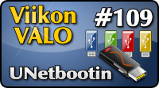

<!--
Title: UNetbootin
Week: 3x05
Number: 109
Date: 2013/01/27
Pageimage: valo109-unetbootin.png
Tags: Linux,Windows,Mac OS X
-->

**UNetbootin-ohjelman avulla voi käyttää useita GNU/Linux-jakeluita tai
muita järjestelmiä suoraan muistitikulta.**

 Useimpia
Linux-jakeluja voi polttaa CD-levylle ja niitä voi käyttää tietokoneessa
ilman asentamista. Tällainen Live-CD on hyödyllinen etenkin
GNU/Linux-jakelujen koekäytössä. Jakelua voi testata, eikä tietokoneen
tiedostoihin tehdä muutoksia. Live-CD on myös hyödyllinen tilanteissa,
joissa halutaan ratkoa tietokoneen ongelmatilanteet, mutta
käyttöjärjestelmää ei saada käynnistettyä. Joissakin tapauksissa
CD-asemaa ei ole tai sitä ei muista syistä haluta käyttää. UNetbootinin
avulla voi helposti siirtää jakelun CD-levyn sijaan muistitikulle tai
muulle tallennusmedialle.

UNetbootinia voi käyttää yksinkertaisella graafisella käyttöliittymällä
tai komentokehotteesta. Ohjelman käyttö on suoraviivaista: joko levykuva
ladataan itse jakelun kotisivuilta tai sitten UNetbootin etsii oikean
levykuvan. Jälkimmäisessä tapauksessa käyttäjä valitsee valikosta
sopivan jakelun nimen (esimerkiksi
[Debianin](Debian_GNU/Linux)), ja ohjelma hakee oikean
levykuvan asennettavaksi. UNetbootinin valikkoon määriteltyjen jakelujen
määrä on rajallinen, mutta monet listan ulkopuoliset jakelut toimivat,
kunhan niiden levykuva haetaan itse.

CD:lle tai DVD:lle siirretyn jakelun käytön aikaiset muutokset häviävät
sammuttaessa, jos niitä ei tallenna ulkoiselle medialle. Kun käytetään
muistitikkua, muutokset on tiettyjen jakelujen kanssa mahdollista
tallentaa käytössä olevalle tikulle. Tähän tarkoitukseen UNetbootinin
alareunassa on levytilan määrittelyyn tarkoitettu kenttä. Se soveltuu
vain tietyille GNU/Linux-jakeluille
([Ubuntulle](Ubuntu_12.04) ja joillekin sen
[johdannaisille](Bodhi_Linux)).

Muistitikun lisäksi jakelun voi siirtää muulle massamuistille.
Vaatimuksena on, että levy on alustettu FAT32-tiedostojärjestelmällä,
jota käytetään muistitikuissa oletuksena. UNetbootin purkaa levykuvan
sisällön tälle valitulle osiolle ja tekee muutoksia osion
alkulatausohjelmaan. Kun Live-CD:n siirto on valmis, voi koneen
käynnistää uudelleen. Käynnistyksen aikana on siirryttävä
BIOS-asetuksiin (esimerkiksi painamalla ESC, F1, F2 tai F12) ja
valittava käynnistettäväksi laitteeksi USB-muisti. Ohjelmalla tehtyjä
live-tikkuja ei voi käynnistää Mac-koneilla, mutta Mac-koneita voi
käyttää tikkujen tekemiseen.

Kotisivu
:   <http://unetbootin.sourceforge.net/>

Lisenssi
:   [GNU GPL](GNU_GPL)

Toimii seuraavilla alustoilla
:   Linux, Mac OS X, Windows

Asennus
:   Ohjelmiston voi ladata Unetbootin kotisivuilta tai vaihtoehtoisesti
    Linux-jakelun paketinhallintaohjelmistosta.

Käyttöohjeet
:   Englanninkielisiä lisäohjeita voi lukea projektin
    [wiki-sivustolta](http://sourceforge.net/apps/trac/unetbootin/wiki).

-   [UNetbootinin päävalikko on pelkistetty.](images/Unetbootin-1.png)
-   [Valikkoon on listattu joukko jakeluja, jotka UNetbootin lataa ja asentaa tikulle automaattisesti.](images/Unetbootin-2.png)
-   [Hyväksymisen jälkeen Unetbootin ilmoittaa asennuksen etenemisestä.](images/Unetbootin-3.png)
-   [Jakelun siirtäminen on valmista.](images/Unetbootin-4.png)

*Teksti ja kuvakaappaukset: Mikko Harhanen*  

