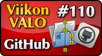

<!--
Title: 3x06 GitHub - Viikon VALO #110
Date: 2013/02/03
Pageimage: valo110-github.png
Tags: Kaikki,Ohjelmointi
-->

**GitHub on erityisesti ohjelmoijille suunnattu sosiaalisen median
tavoin toimiva lähdekoodinjakopalvelu, jossa on tarjolla paljon vapaasti
lisensoituja ohjelmia ja muuta materiaalia.**

 GitHub on Linus
Torvaldsin kehittämää avoimen lähdekoodin Git-versionhallintaa
hyödyntävä lähdekoodin hallinta- ja jakopalvelu. Kuka tahansa voi tehdä
itselleen käyttäjätunnuksen palveluun ja luoda sinne projektikohtaisia
lähdekoodivarastoja, *repositoryja* eli *repoja*. Repo voi olla julkinen
tai yksityinen. Julkisen repon luominen on ilmaista ja yksityisen repon
luominen vastaavasti maksullista. Palvelussa on valtava määrä julkisia
repoja, joista suurin osa on lisensoitu avoimen lähdekoodin lisenssillä.
GitHub luokittelee repot automaattisesti [ohjelmointikielen
mukaan](https://github.com/languages). Tällä hetkellä suosituin kieli on
JavaScript 21 prosentin osuudella, mutta myös Ruby, Java, Python, Shell,
PHP, C, C++, Perl ja Objective-C ovat runsaasti edustettuina.

Git on versionhallinta, kuten [Subversion](Subversion), mutta
se on uudempi ja hajautetulla arkkitehtuurilla toteutettu. GitHub toimii
taustalla olevan Git-versionhallinnan graafisena käyttöliittymänä, jolla
voi helposti tarkastella eri lähdekooditiedostojen sisältöjä ja niiden
muutoksia versioiden edetessä. Repon muutokset ovat selattavissa
*[committeina](http://en.wikipedia.org/wiki/Commit_%28data_management%29)*,
eli lähdekoodiin tehtyinä muutoskokonaisuuksina. Versionhallintaan
tehtyjen vaihtoehtoisten ja kokeellisten haarojen, *branch*, selaaminen
on myös helppoa GitHubin käyttöliittymällä. GitHubissa voi olla myös
binäärimuotoisia tiedostoja, kuten ohjelmien tarvitsemia kuvatiedostoja,
mutta erityisen hyödyllistä versionhallinta on tekstimuotoisten
tiedostojen kanssa, sillä niiden muutokset ovat helposti esitettävissä.
Ohjelmakoodin lisäksi GitHub sopiikin myös muun tekstimuotoisen
materiaalin versionhallintaan ja jakamiseen. Hyvä esimerkki tällaisesta
projektista on [Oppikirjamaraton](https://github.com/Oppikirjamaraton)
ja sen [Vapaa matikka](Vapaa matikka 1) -kirjasarja.

GitHub sisältää sosiaalisen median kaltaisia ominaisuuksia. Kuka tahansa
käyttäjä pystyy
*[forkkaamaan](http://en.wikipedia.org/wiki/Fork_%28software_development%29)*
minkä tahansa julkisen repon, eli tekemään itselleen kopion haluamastaan
reposta ja aloittamaan oman version kehittämisen. Omaan versioon tehtyjä
*committeja* voi puolestaan tarjota alkuperäiselle kehittäjälle *pull
requestien* muodossa. Alkuperäisen repon ylläpitäjä voi sitten päättää,
ottaako vastaan tarjotun toteutuksen. Juuri vapaan kopioinnin ja
osallistumisen vuoksi GitHubin julkiset repot sopivatkin erityisen hyvin
avoimen lähdekoodin projekteille. Omaan julkiseen projektiin onkin syytä
epäselvyyksien välttämiseksi merkitä selkeästi lisenssi, jolla se on
käytettävissä. Tämä tapahtuu tyypillisesti LICENSE- tai
COPYING-nimisellä tiedostolla. Muita sosiaalista mediaa muistuttavia
ominaisuuksia ovat repojen seuraaminen, committien kommentointi vaikka
koodirivikohtaisesti sekä ohjelmasta löytyvien virheiden tai muiden
huomioiden raportointi repon *Issues*-osiossa.

GitHubissa on lisäksi tarjolla yksinkertainen repokohtainen wiki
projektin dokumentointia varten, erilaisia graafeja havainnollistamaan
projektin haaroja ja tapahtumia sekä mahdollisuus tehdä ohjelman
toimintaa esittelevä tai demoava web-sivusto html-tiedostoina
*gh-pages*-nimiseen haaraan. Esimerkkinä Viikon VALO -sivustolla
käytetyn galleriaohjelman
[gh-pages](https://github.com/pesasa/psgallery/tree/gh-pages)-haarasta
muodostuva [demo-sivu](http://pesasa.github.com/psgallery/).

GitHub helpottaa avoimelle lähdekoodille luonteenomaista jakamista ja
yhteistyötä. Hajautettuna versionhallintajärjestelmänä Git mahdollistaa
samanaikaisesti ohjelmankehityksen tekemisen toisaalta omassa rauhassa
omaan repoon ja toisaalta yhteistyössä muiden kanssa. GitHub on
erinomainen työkalu, joka helpottaa tätä yhteistyötä madaltamalla
kynnystä osallistua kehittämiseen joko vain kommentoimalla tai jopa
aloittamalla kokeilut omalla kopiolla ja tarjoamalla tuotoksia takaisin
alkuperäiseen projektiin.

Kotisivu
:   <https://github.com/>

Käyttöohjeet
:   [Ohjeita GitHubin käyttöönottoon](https://help.github.com/)

-   [GitHubin käytön aloitus askel askeleelta. 1) Git käyttövalmiiksi 2)
    Luodaan repository 3) Forkataan muiden projekteja 4) Sosiaalinen
    verkosto](images/github-1.png)
-   [Oppikirjamaratonin Avoin matikka 1 -kirjan raakamateriaali
    GitHubissa.](images/github-2.png)
-   [Yksittäisen lähdekooditiedoston sisältöä. (Opinsys /
    Walma)](images/github-3.png)
-   [Viimeisimmät ohjelmaan tehdyt commitit.](images/github-4.png)
-   [Commitissa tehtyjen muutosten tarkastelu. Lisätyt rivit vihreällä,
    poistetut punaisella.](images/github-5.png)
-   [Muutoksia voi kommentoida rivi kerrallaan.](images/github-6.png)
-   [Muiden kuin alkuperäisen tekijän lähettämiä muutosehdotuksia, "pull
    requesteja".](images/github-7.png)
-   [Committien määrät viikonpäivän ja kellonajan suhteen graafisesti
    esitettynä.](images/github-8.png)
-   [Projektille tehtyjä huomioita, eli "issueita". Ohjelmointivirheitä,
    ominaisuustoiveita jne.](images/github-9.png)
-   [Projektin dokumentointiin käytettävä wiki.](images/github-10.png)
-   [Projektin demoamista varten voidaan käyttää "gh-pages"-haaran
    pohjalta luotavaa sivustoa.](images/github-11.png)

*Teksti: Pesasa*  
*Kuvakaappaukset: Pesasa*

