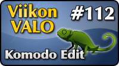

<!--
Title: Komodo Edit
Week: 3x08
Number: 112
Date: 2013/02/17
Pageimage: valo112-komodo_edit.png
Tags: Linux,Windows,Mac OS X,Tekstieditori,Ohjelmointi
-->

**Komodo Edit on vapaa monipuolinen tekstieditori ohjelmoijille.**

 Komodo Edit
on osittain Mozillan ohjelmakoodin varaan rakennettu tekstieditori, joka
sopii useiden ohjelmointi- ja merkkauskielten kirjoittamiseen. Tuettujen
kielten joukossa ovat PHP, Python, Ruby, JavaScript, Perl, Tcl, XML,
HTML 5, CSS 3, Java, LaTeX sekä useita muita kieliä. Ohjelma näyttää
tuntemilleen kielille syntaksikorostuksen käyttäjän valitsemalla tai
omaan makuunsa muokkaamalla väriteemalla. Tämän lisäksi ohjelma osaa
tarkistaa, että kielen syntaksi on oikein ja varoittaa virheistä. Tämä
on erittäin hyödyllistä, koska yksinkertaiset virheet, kuten sulkeiden
ja lainausmerkkien puuttumiset, on helppo huomata ja korjata jo
ohjelmakoodia kirjoittaessa. Ohjelma osaa myös ehdottaa varattuja sanoja
sekä funktioiden ja muuttujien nimiä täydennyksinä ohjelmakoodin
kirjoittamisen aikana. Ehdotukset annetaan kirjoitettavan sanan alle
ilmestyvänä pudotusvalikkona häiritsemättä käyttäjän kirjoittamista.
Täydennys pyritään tekemään älykkäästi siten, että esimerkiksi
html-tiedostoa kirjoitettaessa ehdotetaan vain kyseisen tiedoston
dokumenttityypin mukaisia vaihtoehtoja. Ohjelmointikielen funktion
kutsua kirjoittaessa Komodo osaa näyttää työkaluvihjeenä dokumentaatiota
funktiosta ja sen ottamista argumenteista.

Komodo Editiin on määritelty eri kielten rakenteille valmiita lyhenteitä
(abbreviations), joilla koodin rutiiniosien kirjoittamista voi
nopeuttaa. Lyhenteet toimivat siten, että esimerkiksi
JavaScript-tiedostoa kirjoittaessa ohjelmoija voi kirjoittaa lyhenteen
"func" ja painaa tämän jälkeen näppäinoikotietä ctrl-t, joka täydentää
lyhenteen tilalle pohjan funktion määrittelylle. Pohjassa ovat valmiina
tyhjät täydennettävät kentät funktion nimelle, parametrimuuttujille sekä
funktion rungolle. Kenttien välillä voi siirtyä sarkainnäppäimellä.
Lyhenteet ovat käyttäjän muokattavissa ja niitä voi luoda itse lisää.

Editorin näppäimistöoikotiet ovat varsin monipuoliset ja käyttäjän
muokattavissa. Käyttäjä voi luoda oikoteistä omia kokonaisuuksia, jotka
voi valita käyttöön ohjelman asetuksista. Oletuksena
näppäimistöoikoteiksi on valittavissa kolme kokonaisuutta: Komodon
oletus, Emacs ja Vi. Komodo hallitsee, kuten hyvän ohjelmointieditorin
kuuluukin, sisennysten, sulkeiden sekä lainausmerkkien käytön
älykkäästi, mutta käyttäjää häiritsemättä. Esimerkiksi merkkijonoa
kirjoitettaessa ohjelma lisää aloittavan lainausmerkin yhteydessä
automaattisesti myös lopettavan lainausmerkin kohdistimen oikealle
puolelle. Ohjelman älykkyys näkyy kuitenkin siinä, että jos käyttäjä
myös itse kirjoittaa merkkijonon loppuun lainausmerkin, ohjelma ymmärtää
sen samaksi jo lisätyksi päättäväksi lainausmerkiksi eikä lisää kolmatta
lainausmerkkiä. Sama järjestelmä toimii myös sulkeiden kanssa.

Ohjelman taustalla oleva Mozilla-projektin koodi näkyy muun muassa
siinä, että editorin välilehteen voi avata selainnäkymän esimerkiksi
luotavan html-tiedoston esikatselua varten. Tämän lisäksi Komodoon voi
asentaa Mozilla-laajennoksia samoin kuin
[Firefox](Firefox)-selaimeen ja
[Thunderbird](Mozilla Thunderbird)-sähköpostiohjelmaan.
Komodo tukee myös JavaScriptin käyttöä editorin toimintojen
laajentamiseen omilla makroilla. Toinen käytettävissä oleva kieli on
Python, jonka tulkki tulee editorin mukana.

Ohjelmassa on lisäksi useita muita hyödyllisiä ominaisuuksia. Näitä ovat
esimerkiksi palvelimella olevien tiedostojen editointi, siirtyminen
funktion tai muuttujan määrittelyyn klikkaamalla hiirellä funktion
kutsua tai muuttujan nimeä control-näppäin (Macissa command-näppäin)
pohjaan painettuna ja värin esikatselu css-tiedostossa pitämällä
control-näppäin pohjassa ja viemällä hiiri värin nimen tai rgb-koodin
päälle. Värin voi myös valita sisäänrakennetulla valitsimella, joka
tulee esiin pitämällä control-näppäin pohjassa ja klikkaamalla värin
nimeä tai värikoodia. Yleisemminkin control ja hiiren vieminen jonkin
avainsanan päälle antaa lisätietoa, kuten dokumentaatiota funktion
kutsusta, ja sanan control-klikkaaminen saa sen toimimaan linkityksenä
toiseen kohtaan koodia, toiseen tiedostoon tai web-osoitteeseen.
Esimerkiksi, jQuery-hakulausekkeen control-klikkaaminen html-tiedostoon
upotetussa javascript-koodissa siirtää kohdistuksen hakulausekkeella
löytyvän elementin kohdalle. Hiirellä raahaaminen control näppäin
pohjassa sen sijaan antaa käyttäjän valita tekstistä suorakaiteen
muotoisen osuuden normaalin rivittäisen valinnan sijasta. Lisäksi Komodo
tukee muun muassa ohjelmarivien merkitsemistä kirjanmerkeiksi sekä
makrojen nauhoittamista ja toistamista.

Komodo Editin maksullinen "isoveli" on Komodo Ide, joka sisältää vapaan
Edit-version toiminnallisuuksien lisäksi myös muita erityisesti
integroiduille kehitysympäristöille tyypillisiä toimintoja.

Kotisivu
:   <http://www.activestate.com/komodo-edit>
:   <http://www.openkomodo.com/> (Open Komodo: Komodo Editin lähdekoodi)

Lisenssi
:   [Mozilla Public License](http://www.mozilla.org/MPL/)

Toimii seuraavilla alustoilla
:   Linux, Windows, Mac OS X

Asennus
:   Ohjelman asennuspaketit eri alustoille löytyvät ohjelman
    kotisivuilta.

Käyttöohjeet
:   Ohjelmassa on sisäänrakennettu ohjejärjestelmä sekä kommentoituja
    esimerkkitiedostoja muutamalla ohjelmointikielellä.

-   [Komodo Editin aloitusnäkymä. Start Page -välilehdellä ovat
    esimerkiksi linkit edellisiin editoituihin
    tiedostoihin.](images/komodo_edit-1.png)
-   [Ohjelman tekstintäydennys antaa tiedoston tyypin mukaiset
    täydennysvaihtoehdot pudotusvalikkona.](images/komodo_edit-2.png)
-   [Ikkunan voi jakaa kahtia ja näkymissä voi olla muokattavana joko
    eri tiedostoja taikka sama tiedosto eri
    kohdista.](images/komodo_edit-3.png)
-   [Komodo sisältää sisäänrakennetun Mozillan Gecko-moottorilla
    toimivan web-selaimen.](images/komodo_edit-4.png)
-   [Komodon työkalulaatikko (toolbox) sisältää makroja ja erilaisia
    kielikohtaisia lyhenteitä (abbreviations), joilla voidaan luoda
    ohjelmointikielen rakenteita valmiista malleista
    täydentämällä.](images/komodo_edit-5.png)
-   [Editori näyttää ohjeita funktion käytöstä sen kutsua
    kirjoittaessa.](images/komodo_edit-6.png)
-   [Sisäänrakennettu syntaksitarkistin merkitsee virheelliset kohdat
    näkyvästi ja näyttää virheilmoituksen työkaluvihjeenä, kun hiiren
    vie virheellisen kohdan päälle.](images/komodo_edit-7.png)
-   [Ikkunan vasempaan reunaan saa näkymään tiedostoselaimen ja
    projektityökalun.](images/komodo_edit-8.png)
-   [Editorin asetukset ovat monipuolisesti muokattavissa oman mielen
    mukaiseksi. Syntaksikorostuksen väritykselle on useita valmiita
    väriteemoja, jotka ovat myös
    muokattavissa.](images/komodo_edit-9.png)
-   [Mozilla-tyylisten lisäosien asentaminen tapahtuu samoin kuin
    Firefox-selaimessa ja
    Thunderbird-sähköpostiohjelmassa.](images/komodo_edit-10.png)

*Teksti: Pesasa*  
*Kuvakaappaukset: Pesasa*

