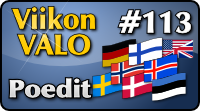

<!--
Title: Poedit
Week: 3x09
Number: 113
Date: 2013/02/24
Pageimage: valo113-poedit.png
Tags: Linux,Windows,Mac OS X,FreeBSD,NetBSD,Unix,Lokalisointi
-->

**Poedit on sovelluksien kieleltä toiselle kääntämistä helpottava
työkalu.**

Jos on kiinnostunut vapaiden ja avointen ohjelmien kehittämisestä, voi
yhteisöä auttaa kääntämällä sovelluksia kieleltä toiselle. Useat
ohjelmat hyödyntävät GNU Gettext -kirjastoa, jolloin ohjelman
lähdekoodista saadaan eriteltyä omaksi tiedostokseen kääntämistä
vaativat tekstikohdat. Näitä katalogeiksi kutsuttaja po-päätteisiä
tiedostoja voi muokata valitsemallaan tekstieditorilla. Katalogien
käsittelyyn on myös omia työkaluja, joihin kuuluu vapaa käännöstyökalu
Poedit.

Kun Poedit-ohjelmalla avataan katalogitiedosto, ohjelma listaa
käännettävissä olevat tekstikohdat ja näyttää valitun alkuperäistekstin
sekä käännöksen. Poedit riisuu käännöstiedoston merkinnöistä, jotka
eivät koske kääntäjän käännöstyötä. Näin näkymä on selkeä ja riski tehdä
katalogin rikkovia merkkivirheitä pienenee. Ohjelma kertoo käännöksen
edistymisestä ilmoittamalla, kuinka suuri osa tiedostosta on vielä
kääntämättä. Kääntämättömät kohdat korostetaan väreillä ja ryhmitellään
käännöslistan kärkeen. Tällöin käyttäjä näkee heti, mikä osio vaatii
työstämistä. Lisäksi Poedit erottelee sumeasti eli koneellisesti tai
heikosti käännetyt kohdat, jotka vaativat tarkistusta.

Poedit-ohjelmassa on useita kääntämistyötä tukevia ominaisuuksia.
Tarvittaessa Poedit pitää kirjaa käännetyistä teksteistä (engl.
translation memory) ja tarjoaa samaa käännöstä samankaltaisiin
tilanteisiin. Näin nopeutetaan ohjelmien kääntämistä, jolle on
tyypillistä tekstin toistuvuus. Käännöksen laadun tarkistamista keventää
oikolukuohjelman tuki, jolloin kirjoitusvirheet voidaan korostaa.

Poedit osaa käyttää apunaan käännettävän ohjelman lähdekoodia.
Tarvittaessa se etsii lähdekoodista sen kohdan, jota käännettävä teksti
koskee. Tämä on avuksi silloin, kun kääntäjälle jää epäselväksi tekstin
konteksti. Joissakin erityistapauksissa käyttäjä voi haluta päivittää
katalogeja. Silloin Poedit hakee lähdekoodista uusia käännettäviä kohtia
ja tunnistaa katalogista ne kohdat, joita ei enää tarvita.

Ohjelmassa on ominaisuuksia, jotka ovat hyödyksi käännöksen julkaisu-
tai testausvaiheessa. Alkuperäis- ja käännöstekstin lisäksi
katalogitiedostoissa on ylätunniste, joka sisältää lisätietoa
käännöksestä. Poedit osaa lisätä automaattisesti muokkaajan nimen
kääntäjälistan joukkoon. Kun uutta käännöstä halutaan käyttää tai
kokeilla, tarvitaan usein konekielelle muutettu käännöstiedosto. Poedit
osaa luoda tällaisen mo-päätteisen tiedoston automaattisesti
katalogista.

Kotisivu
:   <https://www.poedit.net/>

Lisenssi
:   [MIT](MIT)

Toimii seuraavilla alustoilla
:   FreeBSD, Linux, Mac OS X, NetBSD, Unix, Windows

Asennus
:   Asennustiedosto ladataan ohjelman kotisivuilta tai ohjelma
    asennetaan jakelun pakettienhallintaohjelmistolla

Lisätietoa kääntämisestä
:   <http://linux.fi/wiki/Kotoistus>

-   [Poedit korostaa sinisellä tekstillä kääntämättömät ja keltaisella
    sumeasti käännetyt kohdat.](images/Poedit-1.png)
-   [Käännöstyötä voi nopeuttaa hyödyntämällä aiemmin käännettyjä
    kohtia.](images/Poedit-2.png)
-   [Katalogin käännöksiin voi lisätä kommentteja.](images/Poedit-3.png)
-   [Tiettyyn käännöskohtaan voi palata nopeasti kirjanmerkin
    avulla.](images/Poedit-4.png)
-   [Poeditin asetusikkuna](images/Poedit-5.png)

*Teksti ja kuvakaappaukset: Mikko Harhanen*  

