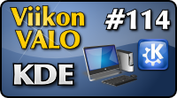
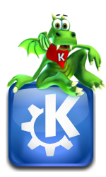

<!--
Title: KDE
Week: 3x10
Number: 114
Date: 2013/03/03
Pageimage: valo114-kde.png
Tags: Linux,Windows,Mac OS X,FreeBSD,OpenBSD,NetBSD,Solaris,Työpöytä
-->

**KDE SC on täyden työpöytäympäristön sisältävä vapaa
ohjelmistokokonaisuus usealle käyttöjärjestelmälle.**

 KDE SC (Software Compilation)
on yhteisnimitys kokonaisuudelle, joka koostuu KDE Plasma -työpöydästä
([KDE Plasma
Workspaces](http://en.wikipedia.org/wiki/KDE_Plasma_Workspaces)),
KDE-ohjelmistoalustasta sekä suuresta joukosta KDE-sovellusohjelmia (KDE
Apps). Kokonaisuutta kehittää
[KDE-yhteisö](http://fi.wikipedia.org/wiki/KDE).

KDE:n kehitys alkoi vuonna 1996, jolloin todettiin, että Unix-tyyppisten
järjestelmien ohjelmille kaivattaisiin yhtenäistä ulkoasua. Ratkaisuna
syntyi KDE, joka oli alkujaan lyhenne sanoista *Kool Desktop
Environment* (kool = cool), ja myöhemmin vain sanoista *K Desktop
Environment*. Qt-kirjastoon pohjautuva KDE toi mahdollisuuden tehdä
yhtenäiseen ulkoasuun pohjautuvia helppokäyttöisiä ohjelmia, joiden
kontrollit toimivat keskenään samoin. Sittemmin projekti on siirtynyt
käyttämään yhteisöstä nimeä KDE ja ohjelmistokokonaisuudesta lyhennettä
KDE SC.

KDE-ympäristön näkyvimpiä osia ovat Plasma-työpöytä sekä
ikkunanhallintaohjelma Kwin, jotka huolehtivat käyttöliittymän
toteuttamisesta. Työpöytänä Plasma koostuu erilaisista sovelmista,
plasmoideista, jotka voivat joko olla itse toiminnallisia tai sisältää
muita plasmoideja. Esimerkiksi työpöydän tausta sekä paneelit ovat
plasmoideja, jotka sisältävä muita plasmoideja, kuten kuvakkeita,
valikoita, kellon, kalenterin, ikkunaluettelon ja niin edelleen. Tämä
rakenne sekä lukuisa määrä erilaisia sovelmia mahdollistaa työpöydän
joustavan muokkaamisen käyttäjän omien mieltymysten mukaan. Oletuksena
Plasma-työpöytä on varsin vähäeleinen ja selkeä, tyhjä taulu, jonka
käyttäjä voi itse täytää makunsa mukaan, jos haluaa.

Perinteisesti työpöydällä näytetään joukko käyttäjän kotihakemiston
*Desktop*-kansiossa (tai *Työpöytä*-kansiossa) olevia kuvakkeita. KDE:n
Plasma-työpöydällä tämä on oletuksena toteutettu siten, että työpöydällä
on "*Kansionäkymä*"-plasmoidi (*Folder View*), joka näyttää sisältönään
kyseisen kansion sisällön. Tämän toteutuksen erityisenä hyötynä on se,
että plasmoidi on vain yksi muiden joukossa ja se on helppoa vaihtaa
näyttämään jonkin toisen kansion sisällön. Samoin
"Kansionäkymä"-plasmoideja voi olla työpöydällä useita ja niihin voi
määritellä näkymään esimerkiksi kulloinkin meneillään olevan projektin
tiedostot. Lisäksi on mahdollista asettaa näkymälle suodattimia, joilla
kansiosta näytetään vain tietyn tyyppiset tiedostot. Jos
työpöytäkuvakkeiden esittäminen tällä tavoin ei miellytä, on toki
mahdollista valita myös perinteiden tapa näyttää kuvakkeet suoraan
työpöydällä.

Työpöydän ulkoasun muokkaamiseen KDE-projektilla on käytössä
[kde-look.org](http://kde-look.org/)-sivusto, johon yhteisö on tuottanut
suuren määrän taustakuvia, plasmoid-tyylejä, ikkunoinnin tyylejä,
kuvakekokoelmia sekä muuta ulkoasullista materiaalia. Sivuston käyttö on
integroitu suoraan KDE:n käyttöliittymään siten, että esimerkiksi
työpöydän taustakuvaa vaihtaessa "Hae uusia taustakuvia"-nappia
painamalla esiin tulee luettelo kde-look.org-sivustolta löytyvistä
taustakuvista, joita on mahdollista selata esimerkiksi arvostelujen ja
latausmäärien mukaisessa järjestyksessä ja joita voi tästä listasta
asentaa omaan käyttöön vain nappia painamalla. Samalla tavoin
plasmoidien tyylit, ikkunointityylit, kuvakekokoelmat ja väriteemat ovat
ladattavissa suoraan niiden vaihtoon käytettävän työkalun kautta
menemättä erikseen selaimella kde-look.org-sivustolle. Myös uusien
plasmoidien lataaminen [kde-apps.org](http://kde-apps.org/)-sivustolta
hoituu samaan tapaan.

Plasma-työpöytä tarjoaa oletuksena käyttöön kaksi
[virtuaalityöpöytää](http://en.wikipedia.org/wiki/Virtual_desktop)
joilla auki olevia ikkunoita voi ryhmitellä helpommin hallittaviksi
kokonaisuuksiksi. Virtuaalityöpöytien määrää voi joustavasti lisätä ja
vähentää oman tarpeen mukaan. Oletuksena Plasma-työpöydän alapalkissa on
perinteisen kaltainen aukiolevien ohjelmien lista, joka osaa
tarvittaessa niputtaa saman ohjelman erilliset ikkunat yhden valinnan
taakse sekä näyttää valinnan mukaan ikkunat joko kaikilta tai vain
valitulta työpöydältä. Vaihtoehtona tälle voi toki käyttää myös
"Kuvakenäkymä"-plasmoidia, joka näyttää auki olevat ohjelmat samaan
tyyliin, kuin monet muutkin nykyiset työpöydät (Ubuntun Unity, Windows
7, Mac OS X) vain yhtenä kuvakkeena. Auki olevan ohjelman kuvakkeen voi
hiiren oikean näppäimen takaa valita pysymään näkyvissä
käynnistyskuvakkeena myös ohjelman ollessa suljettuna.

Plasma-työpöytä sisältää lisäksi ominaisuuden nimeltä Aktiviteetit
(Activities), jolla on mahdollista muodostaa useampi erilainen
rinnakkain käytettävä työpöytänäkymä. Käyttäjä voi esimerkiksi luoda
erillisen aktiviteetin työkäyttöön ja toisen vapaa-ajalle. Tällöin
työkäyttöön tarkoitettu aktiviteetti voi sisältää työpöydällä
esimerkiksi kansionäkymät sillä hetkellä käynnissä oleviin
työprojekteihin sekä kuvakkeita työssä tarvittaviin ohjelmiin, kun taas
vapaa-ajalle tarkoitettu aktiviteetti voi ulkoasultaan näyttää aivan
toisenlaiselta. Kuhunkin aktiviteettiin avatut ikkunat näkyvät vain
siinä, jos niin halutaan. Aktiviteetteja voi hyödyntää myös yhdessä
virtuaalityöpöytien kanssa, jolloin kullekin virtuaalityöpöydälle on
mahdollista valita eri plasmoideja.

Työpöytäkäyttöön suunnatun Plasma Desktop -ympäristön lisäksi KDE Plasma
Workspaces tarjoaa rinnakkaiset [Plasma
Netbook](http://www.kde.org/workspaces/plasmanetbook/) ja [Plasma
Active](http://plasma-active.org/) -toteutukset. Näistä ensimmäinen on
suunnattu rajallisella näyttötilalla varustettuihin miniläppäreihin
(netbooks) ja jälkimmäinen tablettikäyttöön. Nämä Plasman kolme
toteutusta muodostavat siis kolme eri käyttöyhteyteen suunnattua näkymää
samaan käyttöympäristöön.

Työpöydän lisäksi KDE-ohjelmistokokoelma sisältää suuren määrän
tietokoneen peruskäytössä tarvittavia ohjelmia, joilla on yhtenäinen
ulkoasu ja käyttölogiikka. Näitä ovat esimerkiksi Konqueror- ja
Rekonq-www-selaimet, Okular-katseluohjelma pdf-tiedostoille sekä monille
muille dokumenttityypeille, Gwenview-kuvankatselin,
Dolphin-tiedostonhallinta, Amarok-musiikkisoitin, DigiKam-albumiohjelma,
Kate-tekstieditori, Kontact-kokonaisuus sähköpostien, kalenterin,
yhteystietojen yms. hallintaan sekä
[Marble](Marble)-karttaohjelma. Myös pelejä löytyy melko
laaja valikoima. KDE-ympäristön kanssa toimivat toki myös kaikki muut
samalla käyttöjärjestelmällä käytettävissä olevat ohjelmat, jotka voivat
kuitenkin ulkoasultaan poiketa jonkin verran KDE-ohjelmista. Silti
esimerkiksi gtk-pohjaiset ohjelmat KDE pyrkii näyttämään mahdollisimman
saman kaltaisella teemalla kuin KDE-ohjelmat.

Tekniseltä puolelta KDE-ohjelmistoalusta pyrkii yhtenäistämään
esimerkiksi multimedian ja erikoislaitteiston, kuten piirtopöydän,
käsittelyn niin, että yksittäisen KDE-ohjelman tekijän ei tarvitse
huolehtia niiden toteutuksesta. Näin esimerkiksi musiikkisoittimen
tekijän ei tarvitse itse toteuttaa vaikkapa ogg-, mp3- ja
flac-tiedostomuotojen tukea vaan hän voi käyttää KDE-ohjelmistoalustan
Phonon-multimediajärjestelmän tarjoamaa toteutusta. Toinen erinomainen
KDE:n tarjoama ominaisuus on KIO (KDE Input/Output), joka mahdollistaa
sen, että mikä tahansa KDE-ohjelma pystyy avaamaan ja käsittelemään
tiedostoja minkä tahansa KIO:n tukeman käytännön (protokollan) kautta.
Käytännössä tämä tarkoittaa siis sitä, että esimerkiksi
Gwenview-kuvankatseluohjelmalla voi avata kuvan suoraan ssh-yhteyden yli
toiselta koneelta tai http-yhteydellä halutusta www-osoitteesta. Samoin
Kate-tekstieditorilla voi muokata vaikka html-tiedostoa suoraan
palvelimella ssh- tai ftp-yhteyden kautta. KIO tukee useita protokollia,
kuten: http, ftp, smb, ssh, fish, sftp, svn ja tar.

KDE:n taustalla käytetyn Qt-kirjaston ansiosta se on melko laajalti
sovitettavissa usealle alustalle. Pitkälti samoin toimiviin
Unix-tyyppisiin järjestelmiin KDE-ympäristö on helposti saatavilla.
Lisäksi ympäristöstä on kokeiluasteella olevat versiot myös Windows- ja
Mac OS X -käyttöjärjestelmille.

Kotisivu
:   <http://kde.org>

Lisenssi
:   [GNU LGPL](GNU_LGPL) (ja muita)

Toimii seuraavilla alustoilla
:   Linux, FreeBSD, NetBSD, OpenBSD, Solaris sekä kokeiluasteella
    Windows ja Mac OS X

Asennus
:   Asennuspaketit löytyvät Linux-jakeluihin tyypillisesti
    paketinhallinnan kautta. Osa jakeluista käyttää KDE-ohjelmia
    oletuksena, josaan ne ovat asennettavissa jälkikäteen. Esimerkiksi
    Ubuntun voi asentaa suoraan KDE-käyttöliittymällä käyttäen
    [Kubuntu](http://kubuntu.org)-versiota taikka asentaa KDE:n
    jälkikäteen kubuntu-desktop -paketilla.

Käyttöohjeet
:   KDE-yhteisön tuottamia ohjeita ja tutorialeja löytyy [KDE
    UserBase](http://userbase.kde.org/Welcome_to_KDE_UserBase/fi)-sivustolta
    myös suomeksi. ([englanniksi](http://userbase.kde.org/))

Logo ja Konqi-maskotti
:   Lähde: <http://www.kde.org/stuff/clipart.php>\
:   Copying of the KDE Logo is subject to the LGPL copyright license.
:   KDE, K Desktop Environment and the KDE Logo are trademarks of KDE
    e.V.

-   [KDE:n sisäänkirjautumisruutu, KDM.](images/kde-1.jpg)
-   [KDE:n Plasma-työpöytä on oletusasetuksilla varsin tyhjä ja
    neutraali odottaen käyttäjän omia valintoja.](images/kde-2.jpg)
-   [Taustakuvaksi on tarjolla lukematon määrä verkosta ladattavia
    yhteisön tuottamia kauniita taustakuvia.](images/kde-3.jpg)
-   [Työpöydälle voi asetella erilaisia toimintoja toteuttavia sovelmia
    eli plasmoideja kansionäkymistä ja kelloista sanakirjaan,
    tietokonealgebraan sekä rss- ja
    Twitter-virtoihin.](images/kde-4.jpg)
-   [Myös muita työpöydän ulkoasuun vaikuttavia komponentteja ja teemoja
    voi ladata käyttöön suoraan verkosta.](images/kde-5.jpg)
-   [Virtuaalityöpöydillä työskentelyyn käytettäviä ohjelmia ja
    ikkunoita voi kätevästi ryhmitellä. Virtuaalityöpöytien välillä on
    helppo siirtyä ja niitä on helppo lisätä ja poistaa tarpeen
    mukaan.](images/kde-6.jpg)
-   [Jos plasmoidien käyttäminen työpöydällä ei miellytä, voi käyttää
    perinteisempää työpöytänäkymää, jossa kuvakkeet ovat suoraan
    työpöydällä. Avoinna olevien ohjelmien listana voi vaihtoehtoisesti
    käyttää pelkistä kuvakkeista koostuvaa listaa samaan tapaan kuin
    monessa muussakin nykyisessä
    työpöytäjärjestelmässä.](images/kde-7.jpg)
-   [Plasma-työpöytä mahdollistaa erittäin joustavan muokkaamisen oman
    mielen mukaan. Työpöytä on myös sopivalla paneelien asettelulla ja
    sopivasti valituilla plasmoideilla helppoa saada muistuttamaan muita
    järjestelmiä, jos mieli niin tekee.](images/kde-8.jpg)
-   [KDE-ohjelmistokokoelma sisältää useita keskenään yhtenevän näköisiä
    ja yhtenevästi toimivia ohjelmia, kuten kuvan Kontact ja
    Okular.](images/kde-9.jpg)
-   [Krunner on KDE-ympäristön monipuolinen ja tehokas hakukenttä, jolla
    voi muun muassa käynnistää sovelluksia, suorittaa laskutoimituksia,
    hakea tiedostoja, sähköposteja ja www-kirjanmerkkejä ja paljon
    muuta.](images/kde-10.jpg)

*Teksti: Pesasa*  
*kuvakaappaukset: Pesasa*

