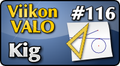

<!--
Title: Kig
Week: 3x12
Number: 116
Date: 2013/03/17
Pageimage: valo116-kig.png
Tags: Linux,FreeBSD,OpenBSD,NetBSD,Geometria,Matematiikka,Opiskelu,Opetus
-->

**Kig on vapaa työkalu geometristen kuvioiden piirtämiseen.**

 Kig on [KDE
edutainment](http://edu.kde.org/) -projektin interaktiivisen geometrian
sovellus, jolla käyttäjä voi piirtää erilaisia geometrisia
konstruktioita. Piirretyt kuviot ovat interaktiivisia, eli kuvion
pisteitä ja muita osia voi liikutella, jolloin myös liikuteltavasta
objekteista riippuvat muut kuviot päivittyvät. Ohjelmassa on
monipuolinen valikoima käytettävissä olevia objekteja kuten piste,
suora, puolisuora, jana, ympyrä, kulma, ellipsi sekä paraabeli.
Objektien piirtämisessä voi hyödyntää leikkauspisteitä, keskipisteitä,
kohtisuoria, kulmanpuolittajia sekä monia muita geometrisia käsitteitä.
Objektien ominaisuuksia, kuten väriä, viivan paksuutta ja tekstejä, voi
muokata hiiren oikealla näppäimellä objektin kohdalta saatavan
kontekstivalikon kautta. Koordinaatistona ohjelmassa voi käyttää joko
tavallista karteesista koordinaatistoa taikka polaarikoordinaatistoa.

Kig käsittelee piirrettyjä kuvioita objekteina ja niiden piirtäminen
tapahtuu joko lisäämällä piirtoalustalle uusia pisteitä tai
hyödyntämällä jo olemassa olevia objekteja. Esimerkiksi ympyrän voi
määritellä kahden joko olemassa olevan tai vasta luotavan pisteen,
keskipisteen ja kehäpisteen, avulla taikka yhden pisteen ja jo olemassa
olevan janan pituuden avulla. Kuvion luomisen jälkeenkin objektit
säilyttävät keskinäisen riippuvuutensa. Esimerkiksi, jos ympyrä on luotu
käyttämällä sen säteenä jonkin olemassa olevan janan pituutta, muuttuu
ympyrän koko, jos janan päätepistettä siirretään. Ohjelmassa on myös
mahdollista määritellä omia makroja, eli uusia kuviotyyppejä.
Esimerkiksi kahden pisteen välisen janan keskinormaali on mahdollista
määritellä makroksi piirtämällä ensin kyseinen keskinormaali itse
geometrisena konstruktiona ja opettamalla tämän jälkeen uudelle
makrolle, mitkä piirretyn kuvion osista ovat syöte (kaksi pistettä) ja
mikä tai mitkä lopputulos (keskinormaali). Ohjelman toimintaa on myös
mahdollista [skriptata
Python-kielellä](http://edu.kde.org/kig/manual/scripting-api/index.html).

Kuvia on mahdollista tallentaa Kigin oman tiedostomuodon lisäksi
useammassa bittikarttamuodossa, svg- ja xfig-vektorimuodoissa sekä
asymptote- ja latex-muodoissa. Latex-muotoinen tallennus tapahtuu
PSTricks-, Tikz/PGF- tai asymptote-piirtokäskyinä. Kigillä piirrettyjä
kuvia on siis mahdollista käyttää monipuolisesti erilaisissa
käyttötarkoituksissa.

Kig eroaa aiemmin esitellystä [GeoGebrasta](GeoGebra) muun
muassa sillä, että Kig keskittyy erityisesti geometriseen piirtämiseen,
kun GeoGebra hallitsee lisäksi myös esimerkiksi funktioiden kuvaajien
piirtämisen. Toinen ero on se, että Kig istuu natiivina sovelluksena
ulkoasultaan ja käyttölogikaltaan paremmin muiden KDE-ohjelmien
joukkoon, kun taas GeoGebra Java-sovelluksena toimii useammalla
laitealustalla ja jopa www-sivulle upotettuna sovelmana.

Kotisivu
:   <http://edu.kde.org/kig/>

Lisenssi
:   [GNU GPL](GNU_GPL)

Toimii seuraavilla alustoilla
:   Linux, FreeBSD, OpenBSD, NetBSD

Asennus
:   Linux-jakeluihin Kig löytyy paketinhallinnan kautta. Muihin
    Unix-tyyppisiin järjestelmiin ohjelma löytyy tyypillisesti samaa
    kautta kuin muutkin asennettavat [KDE](KDE)-ohjelmat.
    Windows-alustalle KDE-ohjelmista on toistaiseksi tarjolla vasta
    [kokeellisia versioita](http://windows.kde.org/).

Käyttöohjeet
:   [Kig-esittely](http://www.linuxjournal.com/content/teaching-math-kde-interactive-geometry-program)
    Linux Journal -lehdessä.
:   [Kig-käsikirja](http://docs.kde.org/stable/en/kdeedu/kig/kig.pdf)

-   [Kig ja tyhjä piirtoalue. Ylhäällä valikot ja toimintopalkki.
    Vasemmalla työkalupalkit pisteiden, janojen ympyröiden ja monien
    muiden objektien piirtämiseen. Oikealla paneelit muunnosten, kuten
    siirtojen, peilausten, kiertojen ja skaalausten
    tekoon.](images/kig-1.png)
-   [Kuvioita koostetaan erilaisista objekteista. Kuvassa kahden pisteen
    kautta piirretty suora sekä kahden pisteen välille piirretty jana.
    Parhaillaan piirretään ympyrää, jonka keskipisteenä on annettu piste
    ja säteeksi valitaan annetun janan pituus.](images/kig-2.png)
-   [Uusia objekteja voi luoda aiempien pohjalta. Kuvassa kaksi ympyrää,
    joiden keskipisteet ovat annetun janan päätepisteet ja säteinä
    toisen annetun janan pituus. Kuvassa muodostetaan ympyröiden
    leikkauspisteet.](images/kig-3.png)
-   [Kahden pisteen välisen janan keskinormaalin konstruointi.
    Ympyröiden säteinä käytetty kuvassa näkyvän janan pituutta,
    ympyröiden kaksi leikkauspistettä etsitty leikkauspistetyökalulla ja
    näiden leikkauspisteiden kautta piirretty suora, eli haettu
    keskinormaali. Kuvaan punaisella merkitty kulma on suora kulma,
    kuten käy ilmi kulmalle annetusta automaattisesti päivittyvästä
    tekstikentästä sekä kohtisuoruustestillä muodostuvasta, niin ikään
    automaattisesti päivittyvästä kentästä.](images/kig-4.png)
-   [Yhden objektin, esimerkiksi pisteen siirtäminen päivittää kaikkia
    siitä riippuvia muita objekteja.](images/kig-5.png)
-   [Ohjelmalla on mahdollista luoda uusia makroja piirtämällä ensin
    halutunlainen konstruktio ja sen jälkeen kertomalla makrotyökalulle,
    mitkä objektit ovat makron syötteitä ja mikä objekti makrolla
    tuotettava lopputulos.](images/kig-6.png)
-   [Kuva havainnollistaa, miten mikä tahansa ympyrän kaarta vastaava
    kehäkulma on puolet vastaavasta keskuskulmasta. Kuvan kaikki neljä
    pistettä ovat siirrettäviä.](images/kig-7.png)
-   [Kaikki tarjolla olevat objektit ovat valittavissa valikosta ja omia
    makroja tekemällä niitä voi luoda lisää.](images/kig-8.png)
-   [Ohjelmalla on mahdollista piirtää myös vektoreita ja muun muassa
    niiden summan, joka päivittyy alkuperäisiä vektoreita
    muokattaessa.](images/kig-9.png)
-   [Suoria, paraabeleja, ympyröitä, ellipsejä ja hyperbelejä voi
    piirtää niillä olevia pisteitä syöttämällä. Yleisen
    kartioleikkauksen voi syöttää antamalla viisi sillä olevaa pistettä.
    Kuvaajien karteesisen yhtälön voi laittaa tekstinä näkyviin.
    Tekstikentissä voi viitata muuttujilla objektien ominaisuuksiin,
    kuten suoran kulmakertoimeen tai ympyrän pinta-alaan. Objektien
    värejä, viivan paksuutta tai tyyliä, tekstejä yms. voi muuttaa
    hiiren kakkosnäppäimellä esiin tulevasta
    kontekstivalikosta.](images/kig-10.png)
-   [Ohjelma tukee useita geometrisia kuvauksia, kuten peilauksia ja
    kiertoja. Ohjelma opastaa objekteja piirtäessä käyttäjää sekä
    ikkunan alareunassa olevalla työkaluohjeella sekä hiiren viereen jo
    valmiiden objektien kohdalle siirryttäessä ilmestyvillä
    tilannekohtaisilla ohjeilla.](images/kig-11.png)
-   [Kolmannen asteen käyrä, paraabeli sekä paraabelin pisteeseen
    piirretty tangentti. Koordinaatistoksi valittu euklidisen
    koordinaatiston sijaan polaarikoordinaatisto.](images/kig-12.png)

*Teksti: Pesasa*  
*Kuvakaappaukset: Pesasa*

