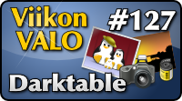

<!--
Title: 3x23 Darktable - Viikon VALO #127
Date: 2013/06/02
Pageimage: valo127-darktable.png
Tags: Linux,Mac OS X,Kuvat,Kuvankäsittely,Valokuvat
-->

**Darktable on avoimen lähdekoodin ohjelma valokuvien värikorjailuun ja
muuhun jälkikäsittelyyn.**

 Darktable on
useita kuvankäsittelysuodattimia ja -efektejä tarjoava ohjelma, jota
voivat käyttää sekä kokeilujaan tekevät harrastelijat että
ammattilaiset, jotka jo tietävät, mitä tekevät. Darktablella voi
käsitellä sekä useiden kameroiden tarjoamia jpeg-kuvia että monien
parempien kameroiden tuottamia mahdollisimman vähän prosessoituja
erilaisissa
[RAW-muodoissa](http://en.wikipedia.org/wiki/Raw_image_format) olevia
kuvia. Darktablen nimi on ilmeisesti yhdistelmä sanoista lighttable
(valopöytä, jota käytetään filminegatiivien tarkasteluun) ja darkroom
(pimiö, jossa tapahtuu paperikuvien kehittäminen negatiiveista).
Toimintatarkoitukseltaan Darktable vastaa lähinnä Adoben Photoshop
Lightroom -ohjelmaa.

Darktablen käyttöliittymä on tummanpuhuva, jotta se häiritsee
mahdollisimman vähän itse kuvan tarkastelua. Se koostuu neljästä eri
työtilasta: lighttable, darkroom, tethering ja map. Lighttable-työtilaan
voidaan tuoda filmirulliksi kutsuttuja kuvakokoelmia esimerkiksi
tiedostohakemistosta taikka suoraan digikamerasta, luokitella ja
arvioida niitä sekä valita yksittäisiä kuvia muokattavaksi
darkroom-työtilaan. Lightroom vastaa siis perinteistä valopöytää, jolla
voidaan tarkastella fyysisiä filminegatiiveja ja valikoida kehitettäviä
kuvia. Darkroom puolestaan on digitaalinen vastine perinteiselle
pimiölle, jossa valokuvaaja voi tehdä viimeiset hienosäädöt kuviinsa
kehittäessään ne paperikuviksi. Darkroom-tilassa käyttäjä voi oikean
reunan paneelista valita käyttöön erilaisia kuvaan vaikuttavia efektejä
ja suodattimia. Tarjolla olevia työkaluja ovat värikorjaus,
valotusarvot, kontrasti, valoisuus, kierto ja rajaus, vinjetointi sekä
lukuisia muita suodattimia. Kaikki käyttöön otetut efektit kerätään
ikkunan vasemmassa reunassa näkyväksi historialuetteloksi, josta on
mahdollista millä hetkellä tahansa tarkastella mitä tahansa vaihetta.
Huomattavaa Darktablen käytössä on, että se ei tee muutoksia
alkuperäiseen kuvaan vaan kaikki valitut muokkaukset ja efektit kerätään
erilliseen tekstimuotoiseen
[xmp](http://en.wikipedia.org/wiki/Extensible_Metadata_Platform)-tiedostoon.
Tämä tiedosto sisältää siis vain tiedot kuvalle tehtävistä
muokkauksista, jotka Darktable näyttää näytöllä kuvaan sovellettuina.
Itse muokkauksen aikana ei tarvitse tehdä tallennuksia, sillä ohjelma
tallentaa automaattisesti kaikki tehdyt muokkaukset. Vasta, kun kaikki
tarvittavat muokkaukset ovat valmiit, voidaan alkuperäisestä kuvasta
export-toiminnolla tuottaa lopullinen kuvatiedosto. Samasta
alkuperäisestä tiedostosta voidaan tehdä useita erilaisia muokattuja
versioita, jotka näkyvät lighttable-tilassa erillisinä kuvina tai
yhdeksi esikatselukuvaksi ryhmiteltynä. Kuvalle tehty muokkaushistoria
on mahdollista myös tallentaa nimettynä Darktable-tyylinä, jota on
mahdollista käyttää myöhemmin muiden kuvien käsittelyyn samoja
muokkauksia ja asetuksia käyttäen.

Darktablen kolmas työtila, eli tethering-tila, on tila jossa voidaan
käyttää tietokoneen usb-porttiin liitettyä digikameraa suoraan
tietokoneelta käsin. Erityisesti monia järjestelmäkameroita on
mahdollista käyttää tähän tapaan. Kameran merkistä ja mallista riippuen
voi olla mahdollista katsella suoraa live-kuvaa kamerasta taikka ottaa
vain still-kuvia, jotka latautuvat suoraan Darktablen filmirullalle
käsiteltäviksi. Tätä esittelyä varten kokeiltu Nikon D3100 ei
valitettavasti tukenut live-kuvaa, mutta kameran laukaiseminen ja
joidenkin kuvausasetusten asettaminen tietokoneelta käsin onnistui
hyvin.

Neljäs työtila näyttää [OpenStreetMapia](OpenStreetMap)
käyttävän kartan, johon ikkunan alareunan paneelissa näkyvän filmirullan
kuvia voi hiirellä raahata ja näin merkitä kuville niiden kuvauspaikan.

Kun muokkaukset ovat valmiit, tapahtuu muokattujen kuvien vieminen
erillisiksi kuvatiedostoiksi lighttable-tilan export-toiminnolla, jolla
kuva voidaan tiedostoon tallentamisen lisäksi esimerkiksi viedä Flickr-,
Picasa- tai Facebook-palveluun tai lähettää sähköpostina.
Export-toiminto antaa lisäksi valita muun muassa kuvan tiedostomuodon,
jpeg:in tapauksessa pakkauslaadun sekä maksimikoon. Tiedostoon
tallennettaessa kuvien tiedostonimille ja polulle voidaan antaa halutun
muotoinen malli käyttäen muutamaa tarjolla olevaa muuttujaa, kuten
*$(ROLL_NAME)*, *$(FILE_NAME)*, *$(FILE_FOLDER)*, *$(YEAR)* ja
*$(STARS)*. Näin useampia kuvia kerralla vietäessä saadaan niille
annettua helposti järkevät nimet ja tallennuskansiot.

Kotisivu
:   <http://www.darktable.org/>

Lisenssi
:   [GNU GPL](GNU_GPL)

Toimii seuraavilla alustoilla
:   Linux, Mac OS X

Asennus
:   Usealle Linux-jakelulle Darktable löytyy suoraan paketinhallinnasta.
    Osalle jakeluista löytyvät uudemmat paketit ohjelman kotisivujen
    ohjeiden avulla. Linkki Mac OS X:lle tarkoitettuun asennuspakettiin
    löytyy ohjelman kotisivulta. Ohjelmasta ei ole versiota
    Windows-käyttöjärjestelmille, mutta Windows-käyttäjät voivat ladata
    itselleen [Ubuntu-live-levyn](http://files.pcode.nl/isos/), joka
    sisältää Darktablen ja käyttää ohjelmaa tältä live-levyltä käsin.

Käyttöohjeet
:   [Darktablen
    ohjekirja](http://www.darktable.org/usermanual/index.html.php)
:   [Resources](http://www.darktable.org/resources/)-sivulla on muun
    muassa joukko screencast-videoita, jotka opastavat Darktablen
    peruskäytössä. Osa videoista esittelee hieman vanhempia versioita ja
    jotkut yksityiskohdat ovat hiukan muuttuneet videoiden teon jälkeen,
    mutta periaate on niistä silti opittavissa.
:   Käyttäjien jakamia
    [Darktable-tyylejä](http://darktable.org/redmine/projects/darktable/wiki/DarktableStyles).

-   [Avataan hakemiston sisältö uudeksi filmirullaksi
    Darktableen.](images/darktable-1.jpg)
-   [Filmirulla lighttablella, eli valopöydällä,
    tiedostoselainnäkymässä.](images/darktable-2.jpg)
-   [Yksittäinen kuva käsiteltävänä darkroom-näkymässä. Kuvaan tehty
    muun muassa värikorjausta ja valotuksen säätöä. Vasemmassa palkissa
    näkyy lisättyjen efektien historia, oikealla käytettävät
    efektityökalut.](images/darktable-3.jpg)
-   [Map-näkymässä filmirullan kuvia voi raahata ikkunan alareunasta
    OpenStreetMap-kartalle.](images/darktable-4.jpg)
-   [Vinjetointityökalu, jolla kuvan reunoja on tummennettu. Ikkunan
    vasemman reunan palkissa näkyvät kuvan exif-tiedot, mukaan lukien
    kameran malli ja kuvausasetukset.](images/darktable-5.jpg)
-   [Kuvaan lisätty kehystä framing-työkalulla. Oikean palkin
    alareunassa näkyy "More modules"-valikko, josta voi valita ja
    piilottaa lisämoduleja.](images/darktable-6.jpg)
-   [Lighttable-tilassa kuville voi lisätä värikoodeja, joita voi
    käyttää kuvien luokitteluun tai ryhmittelyyn. Kuvia voi myös
    arvioida antamalla niille tähtiä. Valitusta kuvasta voi luoda
    duplikaatin, joka ei siis luo uutta kuvatiedostoa vaan erillisen
    kokonaisuuden muokkauksia samalle kuvalle.](images/darktable-7.jpg)
-   [Kuvalle tehdyn muokkaushistorian voi tallentaa nimettynä tyylinä,
    jota voi myöhemmin soveltaa muihin kuviin
    kokonaisuutena.](images/darktable-8.jpg)
-   [Sama tyyli sovellettuna toiseen kuvaan.](images/darktable-9.jpg)
-   [Lighttable-näkymässä kuvalistaa voi suodattaa esimerkiksi niille
    annettujen tähtien mukaan. Tässä näytetään kaikki vähintää kolme
    tähteä saaneet kuvat.](images/darktable-10.jpg)
-   [Koska muokkaukset eivät muuta alkuperäisiä kuvia, pitää muokatut
    kuvat viedä erikseen export-toiminnolla kuvatiedostoiksi.
    Tiedostonimissä ja polussa voi käyttää joukkoa erilaisia muuttujia,
    kuten *  $(FILE\_FOLDER)* ja *\$(FILE\_NAME)*. Export voidaan tehdä
    myös suoraan esimerkiksi Flickr-, Picasa- tai
    Facebook-palveluun.](images/darktable-11.jpg)
-   [Filmirulla voidaan tuoda tiedostohakemiston lisäksi myös
    esimerkiksi kamerasta, jolloin tiedostot tallennetaan halutun
    muotoiseen hakemistoon, halutun muotoisilla
    tiedostonimillä.](images/darktable-12.jpg)
-   [Kamerasta tuotavien kuvien ja filmirullan nimen
    valinta.](images/darktable-13.jpg)
-   [Kamerasta tuodut kuvat.](images/darktable-14.jpg)
-   [Ohjelman tethering-tila, jossa tietokoneeseen liitettyä digikameraa
    voidaan ohjata tietokoneelta käsin. Osa kameroista tukee myös
    live-kuvan näyttämistä Darktablessa.](images/darktable-15.jpg)
-   [Muokkaamaton kuva.](images/darktable-muokkaamaton-1.jpg)
-   [Muokattu versio kuvasta.](images/darktable-muokattu-1.jpg)
-   [Muokkaamaton kuva.](images/darktable-muokkaamaton-2.jpg)
-   [Muokattu versio kuvasta.](images/darktable-muokattu-2.jpg)

*Teksti: Pesasa*  
*Kuvakaappaukset: Pesasa*

