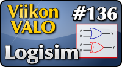

<!--
Title: Logisim
Week: 3x32
Number: 136
Date: 2013/08/04
Pageimage: valo136-logisim.png
Tags: Linux,Windows,Mac OS X,FreeBSD,OpenBSD,NetBSD,Solaris,Logiikka,Opetus,Opiskelu,Tiede
-->

**Logisim on vapaa työkalu loogisten piirien piirtämiseen ja niiden
simulointiin.**

 Logisim on
erityisesti logiikan ja piirisuunnittelun alkeiden opiskeluun sopiva
työkalu, jolla piirien piirtäminen on helppoa ja joka osaa näyttää
piirien toiminnan havainnollisesti. Ohjelmalla voi piirtää erityisesti
loogisista porteista koostuvia piirejä, mutta komponenttikokoelmasta
löytyy valmiina myös hieman monimutkaisempia komponentteja, kuten eri
tyyppisiä muistipiirejä ja aritmeettiseen laskentaan käytettäviä
piirejä. Sisään- ja ulostulojen joukosta löytyy myös erilaisia
laitteita, kuten peliohjain, näppäimistö, LED-valo, digitaalinäyttöjä,
terminaalinäyttö ja LED-matriisi. Ohjelman tärkeimpiä etuja ovat siisti
tulostusjälki verrattuna käsin piirrettyihin kaavioihin,
helppokäyttöisyys sekä havainnollinen piirin toiminnan simulointi.

Logisimilla onnistuu logiikan perusteiden opiskelu ja
havainnollistaminen piirtämällä loogisista lauseista yksinkertaisia
piirikaavioita, jotka näyttävät piirin lopputuloksen erilaisilla
lähtöarvoilla. Toisaalta, sillä onnistuu myös varsinaisen
piirisuunnittelun harjoittelu ja monimutkaisempienkin loogisten piirien,
kuten [Conwayn "Game of
Life"-simulaation](https://www.youtube.com/watch?v=KpBzN1Sodh0) tai
[yksinkertaisen tietokoneen](http://joshcorbin.com/?p=4) rakentaminen.
Ohjelman "Combinational Analysis"-työkalulla puolestaan onnistuu hyvin
totuustaulujen, loogisten lausekkeiden ja loogisen piirin yhteyksien
havainnollistaminen.

Ohjelman käyttöliittymä koostuu valikosta, sen alla olevasta
työkalupalkista, piirtoalueesta, selattavasta listasta, jossa projektin
piirit ja käytettävissä olevat valmiit komponentit luetteloidaan, sekä
valitun komponentin ominaisuudet esittävästä taulukosta. Piirien
piirtäminen on helppoa. Piiriin lisätään komponentteja valitsemalla ne
yksi kerrallaan ja lisäämällä ne piirtoalueelle haluttuun kohtaan.
Työkalupalkissa ovat valittavissa yksinkertaisimmat usein käytetyt
komponentit: input, output, NOT, AND ja OR. Muut valittavissa olevat
komponentit löytyvät vasemman reunan listasta tyypin mukaan
luokiteltuina. Kytkennät komponenttien välille piirretään
yksinkertaisesti raahaamalla hiirellä kytkentä yhden komponentin
ulostulosta toisen sisääntuloon. Oletuksena kaikkien komponenttien
asettelu on vasemmalta oikealle, eli niin, että niiden sisääntulot ovat
vasemmalla ja ulostulot oikealla. Valitun komponentin asentoa voi
kuitenkin muuttaa sen ominaisuudet näyttävästä taulukosta kohdasta
"Facing". Piirien muokkaaminen, eli komponenttien ja kytkentöjen
siirtäminen tai poistaminen, tapahtuu nuolityökalulla.

Piirien piirtämisen lisäksi toinen ohjelman hyödyllinen ominaisuus on
piirien toiminnan simulointi, jolla pystytään toisaalta testaamaan
piirien toimivuutta ja toisaalta myös käyttämään piirejä. Käden kuvalla
merkityllä simulaatiotyökalulla voi tutkia piirin toimintaa esimerkiksi
vaihtamalla syöttökomponenttien tiloja tilojen 0 ja 1 välillä. (Syötöt
voi määrätä myös kolmiarvoisiksi, jolloin kolmas arvo on x.) Logisim
näyttää havainnollisesti kytkennät eri väreillä sen mukaan kulkeeko
niissä signaali 1 vai signaali 0. Myös virhetilat ilmoitetaan omalla
värillään.

Samaan projektiin voi piirtää useampia piirejä ja piirejä voi käyttää
toisissa piireissä alipiireinä, eli itse luotuina komponentteina, joille
voi muokata oman havainnollisen komponenttisymbolin. Näin koko projektin
voi jakaa pienempiin osiin eikä tarvitse piirtää yhtä valtavan kokoista
piiriä. Tämä helpottaa myös, jos piirrettävässä piirissä pitää käyttää
toistuvasti jotain samaa alipiiriä, kuten kertolaskupiiriä. Itse
tehtyjen komponenttien käyttäminen ei eroa ohjelmassa valmiiksi
valittavissa olevien komponenttien käyttämisestä. Usein käytettävistä
omista komponenteista voikin tehdä oman kirjaston, jonka tallentaa
ohjelman käyttämässä circ-tiedostomuodossa. Tällaisen tiedoston voi
sitten ladata uuteen projektiin kirjastona "Project"-valikosta, jolloin
tuon tiedoston piirit näkyvät muiden komponenttien tapaan listassa oman
otsikkonsa alla.

Ohjelmassa on mahdollista käyttää yhtä bittiä kuljettavien johdinten
sijaan myös useamman bitin levyisiä väyliä. Kytkennät itse asiassa
kuljettavat automaattisesti niin montaa bittiä kuin komponenttien
sisään- ja ulostulot mahdollistavat. Useampibittisen väylän bitit voi
myös jakaa haaroittimella eri johtimiin.

"Combinational Analysis"-työkalulla voi tehdä muunnoksia loogisen
piirin, sen sisään- ja ulostulojen arvojen erilaiset yhdistelmät
kuvaavan totuustaulun sekä ulostulojen arvot sisääntulojen avulla
ilmaisevien loogisten lausekkeiden välillä.

Kotisivu
:   <http://ozark.hendrix.edu/~burch/logisim/>

Lisenssi
:   [GNU GPL](GNU_GPL)

Toimii seuraavilla alustoilla
:   Linux, Windows, Mac OS X, FreeBSD, OpenBSD, NetBSD, Solaris

Asennus
:   Linux-jakeluihin ohjelma löytyy todennäköisesti suoraan
    pakettivarastosta. Muille alustoille ohjelma on ladattavissa
    ohjelman kotisivuilta. Java-pohjaisena sama ohjelma toimii kaikilla
    alustoilla, joilla Java on käytettävissä, mutta vaatii Javan
    asentamisen.

Käyttöohjeet
:   Ohjelma sisältää "Help"-valikossaan hyvän tutoriaalin ohjelman
    käytön opetteluun. Ohjeet löytyvät myös
    [verkosta](http://ozark.hendrix.edu/~burch/logisim/docs.html).
    Youtube-palvelusta löytyy myös muutamia Logisimin käyttöön opastavia
    videoita:
    -   [Logisim Tutorial - Part 1: Basic
        Components](https://www.youtube.com/watch?v=WExVhr583vA)
    -   [Logisim Tutorial - Part 2: Basic Traffic
        Light](https://www.youtube.com/watch?v=eZ2SmsUi8kI)
    -   [Digital Design 5: LOGISIM Tutorial &
        Demo](https://www.youtube.com/watch?v=ATPqpFMlVdw)

Muita videoita
:   [Conwayn "Game of Life" toteutettuna
    Logisimilla](https://www.youtube.com/watch?v=KpBzN1Sodh0)

-   [Logisim.](images/logisim-1.png)
-   [Logisimin käyttöliittymä koostuu varsinaisesta piirtoalueesta,
    valikosta, nappulapaneelista, projektin piirejä ja käytettävissä
    olevia komponentteja luettelevasta listasta sekä valitun komponentin
    ominaisuudet näyttävästä taulukosta. Piirtoalueelle lisättynä neljä
    sisääntuloa.](images/logisim-2.png)
-   [Piirtoalueelle lisättyinä loogiset NOT-, AND- ja OR-portit sekä
    muutama kytkentä.](images/logisim-3.png)
-   [Komponentin ominaisuuksia voi muuttaa. Esimerkiksi komponentin
    suuntana "East" tarkoittaa, että sisääntulot ovat vasemmalla ja
    ulostulot oikealle (itään). Kuvassa muutetaan OR-portin
    sisääntulojen määräksi kaksi.](images/logisim-4.png)
-   [Komponenttilistassa on käytettävissä useita erilaisia valmiita
    komponentteja, kuten esimerkiksi loogiset portit. Kuvassa neljästä
    sisääntulosta kolme antaa 1-signaalia ja yksi 0-signaalia. Piirin
    toimintaa simuloidaan samalla. 1-signaalia kuljettavat johtimet
    näkyvät kuvassa kirkkaan vihreänä ja 0-signaalia kuljettavat tumman
    vihreänä.](images/logisim-5.png)
-   [Komponenttilistasta löytyy myös esimerkiksi muistipiirejä ja
    erilaisia syöttö- ja tulostuslaitteita.](images/logisim-6.png)
-   [Piiriin on lisätty kello, joka antaa vuorotellen signaaleja 1 ja 0.
    Piiriin on myös lisätty punainen LED-valo.](images/logisim-7.png)
-   [Valitun piirin kuvan voi tallentaa png-, gif- tai jpeg-muodossa.
    ](images/logisim-8.png)
-   [Logisim sisältää help-valikossa melko kattavan oppaan ohjelman
    käytöstä.](images/logisim-9.png)
-   [Ohjelmalla voi piirtää useampia erillisiä piirejä samaan
    projektiin. Kuvan projektissa on piirretty piirit "main" ja
    "valo1".](images/logisim-10.png)
-   [Projektin piirejä voi käyttää muissa piireissä komponentteina, eli
    alipiireinä. Tässä "valo1" piiriä on käytetty yhtenä komponenttina
    "main"-piirissä. Oletuksena itse tehty komponentti näkyy laatikkona,
    jossa on piirin mukainen määrä sisään- ja
    ulostuloja.](images/logisim-11.png)
-   [Itse tehdyn piirin ulkoasua alipiirinä voi muokata muokkaustilassa.
    Oikeassa alakulmassa näkyy "valo1"-alipiirin rakenne ja
    piirtoalueella näkyy, miltä se näyttää alipiirinä
    käytettynä.](images/logisim-12.png)
-   ["valo1"-alipiiri muokatulla ulkoasulla.](images/logisim-13.png)
-   ["Combinational Analysis"-työkalulla piirin loogisen toiminnan voi
    syöttää sisään- ja ulostulojen muodostamana totuustauluna. Työkalu
    osaa generoida tästä suoraan piirin kytkentäkaavion. Generoitavan
    piirin komponenteissa voidaan niin valittaessa käyttää myös vain
    korkeintaan kaksisyötteisiä komponentteja tai vain
    NAND-komponentteja.](images/logisim-14.png)
-   ["Combinational Analysis"-työkalu osaa kertoa totuustauluna syötetyn
    ulostulon loogisena lausekkeena. Ulostulon voi myös syöttää
    loogisena lausekkeena.](images/logisim-15.png)
-   [Ulostulojen lausekkeet voidaan normalisoida disjunktiiviseen tai
    konjunktiiviseen normaalimuotoon Karnaughn karttojen
    avulla.](images/logisim-16.png)

*Teksti: Pesasa*  
*Kuvakaappaukset: Pesasa*

