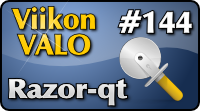

<!--
Title: 3x40 Razor-qt - Viikon VALO #144
Date: 2013/09/29
Pageimage: valo144-razor-qt.png
Tags: Linux,Työpöytä
-->

**Razor-qt on kevyt ja nopea Qt-pohjainen työpöytäympäristö Linux- ja
Unix-käyttöjärjestelmille.**

 Razor-qt on
suhteellisen nuori projekti, jonka tavoitteena on toteuttaa
Qt-kirjastojen varaan rakennettu työpöytäympäristö, joka on
samanaikaisesti yksinkertainen, nopea ja intuitiivinen käyttää.
Razor-qt-projekti sisältää jo paneelin, työpöydän, sovelluskäynnistimen,
järjestelmäilmoitukset, asetuskeskuksen sekä istunnonhallinnan, eli
tärkeimmät työpöytäympäristön rakennuspalikat. Razor-qt:lla ei ole omaa
ikkunamanageria vaan sen kanssa käytetään usein
Openbox-ikkunanhallintaa. Myös muiden ikkunamanagerien käyttö on
mahdollista. Taustalla käytetty Qt-kirjasto on sama, jota muun muassa
[KDE](KDE)-projekti hyödyntää, mutta Razor-qt pyrkii
keveyteen käyttämällä sitä suoraan eikä monipuolisten KDE-kirjastojen
kautta.

Razor-qt-työpöydän kanssa käytettäväksi on tarjolla joukko Qt-pohjaisia
sovelluksia, kuten qtFM- ja Beesoft Commander -tiedostohallinnat,
QupZilla-web-selain, JuffEd-tekstieditori,
[Clementine](Clementine)-musiikkisoitin ja
QTerminal-pääteohjelma. Esimerkiksi Linux-jakelussa nimeltä
[Siduction](http://siduction.org/) on Razor-qt mukana suoraan
asennuslevyllä. Razor-qt:n ulkoasussa on nähtävissä jonkin verran samaa
tyyliä kuin KDE:n Plasma-työpöydässä, mutta kevyempänä ja vanhemmillekin
koneille sopivampana toteutuksena.

Razor-qt-työpöytä on mahdollista asentaa useisiin eri Linux-jakeluihin
sen kotisivuilta löytyvien ohjeiden avulla. Esimerkiksi Ubuntuun sitä ei
vielä löydy suoraan Ubuntun omista pakettivarastoista, mutta Razor-qt:n
tarjoava PPA-pakettivarasto on helppo lisätä sivuston ohjeiden avulla.
Tämän jälkeen asentaminen tapahtuu samoin kuin minkä tahansa muunkin
ohjelmistopaketin asennus. Razor-qt:n kotisivuilla on myös tarjolla
muutama eri Linux-jakeluihin pohjautuva live-cd, jolla työpöytää pääsee
kokeilemaan.

Jatkossa Razor-qt aikoo
[<https://groups.google.com/forum/>\#!topic/razor-qt/PNvkoidV2Ik
heinäkuussa 2013 tehdyn ilmoituksen] mukaan yhdistyä toisen Qt-pohjaista
kevyttä työpöytäympäristöä tekevän projektin,
[LXDE-Qt](http://wiki.lxde.org/en/LXDE-Qt):n kanssa.

Kotisivu
:   <http://razor-qt.org/>

Lisenssi
:   [GNU GPL](GNU_GPL), [GNU LGPL](GNU_LGPL)

Toimii seuraavilla alustoilla
:   Linux

Asennus
:   Ohjelmiston asennuspaketit ja ohjeet asentamiseen löytyvät sen
    kotisivuilta.

-   [Razor-qt-työpöytä ja teemavalitsin.](images/razor-qt-1.png)
-   [Razor-qt:n valikko ja
    qtFM-tiedostohallinta.](images/razor-qt-2.png)
-   [QTerminal ja
    ScreenGrab-kuvankaappausohjelma.](images/razor-qt-3.png)
-   [Clementine-musiikinsoitto-ohjelma](images/razor-qt-4.png)
-   [Kaksisarakkeinen Beesoft Commander -tiedostonhallinta ja
    JuffEd-tekstieditori.](images/razor-qt-5.png)
-   [Asetuksia Razor-qt:lle, Qt:lle ja
    Openboxille.](images/razor-qt-6.png)
-   [QupZilla-www-selain](images/razor-qt-7.png)
-   [Rarzor-qt:n asetuskeskus](images/razor-qt-8.png)
-   [Ikkunanhallintana käytetään usein Openboxia, jonka ulkoasu on
    erikseen säädettävissä.](images/razor-qt-9.png)
-   [Irroitettavien massamuistien liittämiseen ja irroittamiseen
    käytettävä sovelma](images/razor-qt-10.png)

*Teksti: Pesasa*  
*Kuvakaappaukset: Pesasa*

