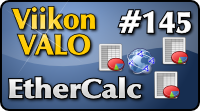

<!--
Title: 3x41 EtherCalc - Viikon VALO #145
Date: 2013/10/06
Pageimage: valo145-ethercalc.png
Tags: Linux,Windows,Mac OS X,FreeBSD,Kaikki alustat,Palvelin,Palvelu,Taulukkolaskenta,Yhteistyö,Toimisto
-->

**EtherCalc on verkkopalveluna toimiva taulukkolaskentaohjelma, jolla
usea käyttäjä voi muokata samaa taulukkoa yhtä aikaisesti.**

 EtherCalc on
taulukkolaskennalle samaa kuin [Etherpad](Etherpad) on
tekstinkäsittelylle ja [JSBin](JSBin) web-ohjelmoinnille. Se
toimii selainpohjaisesti ja taulukon sisällön tallentaminen tapahtuu
automaattisesti palvelimelle. Kukin laskentataulukko yksilöidään sen
URL-osoitteen perusteella, samoin kuin Etherpadissä ja JSBinissä, ja
kuka tahansa, joka tietää taulukon osoitteen, pääsee muokkaamaan sen
sisältöä. Avoimen luonteensa vuoksi EtherCalc ei siis sovellu
arkaluonteisen tiedon muokkaamiseen vaan on tarkoitettu erityisesti
julkisesti tapahtuvaan yhteismuokkaamiseen. EtherCalc on käytettävissä
palveluna osoitteessa <https://ethercalc.org> taikka sen voi asentaa
omalle palvelimelle, jolloin sen käyttö on omassa hallinnassa.

Taustaltaan EtherCalc on aiemman, [One Laptop Per
Child](http://one.laptop.org/) -projektissakin (OLPC) käytetyn,
[SocialCalcin](http://wiki.laptop.org/go/SocialCalc) seuraaja.
Laskentataulukon näyttäminen ja muokkaaminen tapahtuvat täysin käyttäjän
selaimessa (Javascriptillä) ja palvelinta käytetään taulukon
tallentamiseen sekä monen käyttäjän muokkausten synkronointiin. Muita
käyttäjiä voi kutsua muokkaamaan samaa taulukkoa kertomalla heille
taulukon URL-osoitteen. Taulukkoa voi muokata joko toisten kanssa yhtä
aikaa taikka eri aikaan. Muokkausten välillä taulukko säilyy tallessa
palvelimella ja saadaan muokattavaksi taas samaa URL-osoitetta
käyttämällä. Samaan aikaan muokattaessa käyttäjien muokkaukset
synkronoituvat muille käyttäjille reaaliaikaisesti ja muiden käyttäjien
aktiivisiksi valitsemat solut näkyvät sinisellä reunuksella
korostettuina.

EtherCalcissa on käytettävissä varsin kattava kokoelma taulukkolaskennan
perustoimintoja ja -funktioita. Käyttöliittymä on ulkoasultaan melko
pelkistetty ja muistuttaakin tyyliltään jonkin verran OLPC-projektin
XO-koneissa käytettyä
[Sugar](http://en.wikipedia.org/wiki/Sugar_%28software%29)-käyttöliittymää.
Tärkeimmät toiminnallisuudet löytyvät ohjelmasta vaakasuorana joukkona
välilehtiä, joiden toiminnot ovat: muokkaus, solun muotoilu,
järjestäminen, tehtyjen toimintojen seuranta, solun kommentointi, nimien
luonti, leikepöytä sekä graafit.

Nimien luonti tarkoittaa sitä, että EtherCalciin voi luoda nimettyjä
muuttujia, jotka ovat vakioita, soluja, alueita tai laskentakaavoja.
Näihin nimiin voidaan viitata soluissa tai niissä käytetyissä kaavoissa
taikka esimerkiksi graafien data-alueena.

EtherCalcin puutteena on, ettei siitä voi vielä toistaiseksi tallentaa
laskentataulukkoa mihinkään yleisesti käytettyyn taulukkolaskennan
tiedostomuotoon, kuten Libre-/OpenOfficessa käytettyyn ods-muotoon tai
Microsoftin Excel-ohjelman muotoon. Sen sijaan taulukon sisällön voi
kyllä kopioida leikepöytävälilehden ("clipboard") kautta
tabulaattori-merkillä eroteltuna tekstinä, csv-muodossa taikka
SocialCalc-tallennusmuodossa tekstiksi tai näistä muodoista takaisin
EtherCalciin. Näistä kaksi ensimmäistä antavat taulukon solujen sisällöt
vain arvoina, ei laskentakaavoina. SocialCalc-muoto sen sijaan sisältää
myös käytetyt laskentakaavat, mutta ei ole hyvin tuettu muoto muissa
taulukkolaskentaohjelmissa. EtherCalc-taulukoiden välillä tätä muotoa
sen sijaan voi käyttää laskentakaavoja sisältävien solujen ja alueiden
kopiointiin. Ohjelmalta voi pyytää taulukon csv-muotoisena tiedostona
tallennettavaksi myös suoraan lisäämällä taulukon URL-osoitteen loppuun
päätteen ".csv". Samaan tapaan taulukon voi ladata myös html-muodossa.
Tämä onnistuu myös taulukon vasemman yläkulman rataskuvaketta
napsauttamalla.

Taulukon lukuarvoista voi myös piirtää yksinkertaisia graafeja käytössä
olevalla graafi-työkalulla. Lisäksi tekstimuotoisiin soluihin voi lisätä
eri tavoin, esimerkiksi wiki-syntaksilla, muotoiltua tekstiä.

Kotisivu
:   <http://ethercalc.net/> (dokumentaatiota)
:   <https://ethercalc.org> (palvelu)
:   <https://github.com/audreyt/ethercalc> (lähdekoodi)

Lisenssi
:   [CPAL](http://opensource.org/licenses/CPAL-1.0) (Common Public
    Attribution License), [Artistic License
    2.0](http://opensource.org/licenses/Artistic-2.0), [MIT
    License](http://opensource.org/licenses/MIT), [CC0 Public
    Domain](http://creativecommons.org/publicdomain/zero/1.0/) (Osia eri
    lisensseillä)

Toimii seuraavilla alustoilla
:   Verkkopalveluna EtherCalc on käytettävissä www-selaimella millä
    tahansa alustalla.
:   Palvelinohjelmana EtherCalc on asennettavissa ainakin Windows-,
    GNU/Linux-, Mac OS X sekä FreeBSD -palvelimille. Se pohjautuu
    [Node.js](http://nodejs.org)-alustaan.

Asennus
:   EtherCalcia voi käyttää palveluna osoitteessa <http://ethercalc.org>
    tai sen voi halutessaan asentaa omalle palvelimelle. Asennuspaketit
    ja -ohjeet ovat saatavissa ohjelman
    [Github](https://github.com/audreyt/ethercalc)-sivuilta.

Muuta
:   [Esitys
    EtherCalcista](http://www.slideshare.net/autang/ethercalc-multiplayer-spreadsheet-12641848)
    (Slideshare)

-   [EtherCalcin aloitussivu](images/ethercalc-1.png)
-   [Tyhjä laskentataulukko](images/ethercalc-2.png)
-   [Solun muotoiluasetukset](images/ethercalc-3.png)
-   [Viemällä hiiren valitun solut oikean alakulman pienen neliön
    kohdalle, esiin tulevat työkalut, joilla solun sisältöä voi
    raahaamalla siirtää, liu'uttaa vaaka- tai pystysuunnassa taikka
    käyttää täyttämään viereisiä soluja.](images/ethercalc-4.png)
-   [Muotoiluvaihtoehtoja numeeriselle solulle](images/ethercalc-5.png)
-   [Kaavojen syöttäminen soluihin tapahtuu, kuten
    taulukkolaskentaohjelmissa yleensäkin.](images/ethercalc-6.png)
-   [Taulukon rivien järjestämistä haluttujen sarakkeiden
    mukaan.](images/ethercalc-7.png)
-   [Muokkauksen historiatiedot](images/ethercalc-8.png)
-   [Soluja voi kommentoida](images/ethercalc-9.png)
-   [EtherCalciin voi luoda nimettyjä muuttujia, jotka ovat joko
    vakioita, soluja tai alueita taikka
    laskentakaavoja.](images/ethercalc-10.png)
-   [Leikepöydälle kopioitu osa taulukkoa tabulaattorilla eroteltuna
    tekstinä.](images/ethercalc-11.png)
-   [Leikepöydälle kopioitu osa taulukkoa pilkuilla eroteltuna
    csv-muotoisena tekstinä.](images/ethercalc-12.png)
-   [Leikepöydän sisältö
    SocialCalc-tallennusmuodossa.](images/ethercalc-13.png)
-   [Taulukon arvoista piirrettu
    piirakkakuvaaja.](images/ethercalc-14.png)
-   [Sama taulukko avattuna samasta URL-osoitteesta neljään eri
    selaimeen yhtä aikaa. Muiden käyttäjien valitsemat solut merkittyinä
    sinisellä reunuksella.](images/ethercalc-15.png)
-   [Soluun voi syöttää tekstimuotoista sisältöä esimerkiksi
    wiki-muotoisena.](images/ethercalc-16.png)
-   [EtherCalc tukee yleisimpiä taulukkolaskentaohjelmien
    funktioita.](images/ethercalc-17.png)

*Teksti: Pesasa*  
*Kuvakaappaukset: Pesasa*

