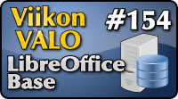
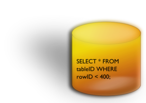

<!--
Title: 3x50 LibreOffice Base - Viikon VALO #154
Date: 2013/12/08
Pageimage: valo154-libreoffice_base.png
Tags: Linux,Windows,Mac OS X,FreeBSD,Solaris,Unix,Toimisto,Tietokanta
-->

**LibreOfficen Base on täysin varusteltu tietokantaohjelma, joka on
suunniteltu täyttämään monenlaisten käyttäjien tarpeet.**

[LibreOffice](http://fi.wikipedia.org/wiki/Libreoffice) on avoimeen
lähdekoodiin perustuva ilmainen toimisto-ohjelmisto, joka sisältää
tekstinkäsittelyohjelman ([Writer](LibreOffice_Writer)),
taulukkolaskentaohjelman (Calc), esitysgrafiikkaohjelman
([Impress](LibreOffice_Impress)), tietokantaohjelman (Base),
vektorigrafiikan tuottamiseen tarkoitetun piirto-ohjelman (Draw) sekä
matemaattisten kaavojen kirjoittamiseen tarkoitetun ohjelman (Math).

Writer ja Impress on
valotettu jo aiemmin, nyt on vuorossa Base. Base on vapaa
[tietokantaohjelma](http://fi.wikipedia.org/wiki/Tietokanta), saman
tapainen kuin kaupallinen Microsoft Access. Basella voi luoda ja muokata
tietokantoja. Base toimii myös edustaohjelmana muille
tietokantaohjelmille kuten [MariaDB](MariaDB), MySQL ja
PostgreSQL. Basessa on
[velhot](http://en.wikipedia.org/wiki/Wizard_(software)), joiden avulla
on helppo tehdä raportteja tietokannasta. Henkilökohtaisessa
tietokantakäytössä riittää Basen oma HSQL-tietokantamoottori, joka
tallentaa tiedot suoraan Base-tiedostoon. Lisäksi voit tallentaa ja
lukea tietoja dBase-tiedostoista, jotka toimivat myös monissa muissa
vastaavissa ohjelmistoissa.

Tehokäyttäjiä ja yrityksiä kiinnostaa mahdollisuus käyttää ulkoisia
tietokantoja. Base tukee suoraan yleisimpiä tietokantaohjelmistoja:
MySQL, Adadas D, MS Access ja PostgreSQL. Lisäksi JDBC- ja
ODBC-ajureiden avulla voi käyttää lähes mitä tahansa muutakin olemassa
olevaa tietokantaa.

LibreOffice on käännetty suomen lisäksi yli 30 kielelle, ja se on
asennettavissa kaikkiin yleisesti käytössä oleviin käyttöjärjestelmiin,
joita ovat Microsoft Windows, Mac OS X (PPC ja Intel) ja Linux (Debian,
Ubuntu, Fedora, Mandriva, Suse jne).

Windowsille on saatavilla myös mukana kulkeva versio LibreOfficesta
PortableApps.com-muodossa. Voit kuljettaa asiakirjoja ja ohjelmistoa
USB-tikulla tai säilyttää niitä verkossa. Lisää tietoa löydät
osoitteesta [Portableabbs.com](http://PortableApps.com).

Linuxissa oikoluku ja tavutus toimivat parhaiten käytettäessä
käyttöjärjestelmän mukana tulevaa LibreOfficea. Esimerkiksi uusimmissa
Ubuntuissa Voikkoon perustuva oikoluku ja tavutus ovat käytettävissä
heti käyttöjärjestelmän asennuksen jälkeen, jos asennuksen yhteydessä on
valittu asennettavaksi suomen kielen tuki.

Debian [Wheezyssä](Debian_Wheezy) jouduin asentamaan paketin
libmyodbc jotta MySQL-tietokantayhteys toimi. Lisäksi LibreOfficen
Java-asetuksissa piti valita käytettävä Java. Sitten sain käytettyä
aiemmin etäpalvelimelle tekemääni MySQL-tietokantaa.

Ohjeita löytyy netistä, esimerkiksi miten laskentataulukosta (eli Calc)
[saadaan tehtyä
tietokanta](http://www.openoffice.org/fi/vastauksia-base.html), jossa
kenttien nimeksi tulee laskentataulukon sarakkeiden nimet. Tämä on
kätevää, jos on pitänyt kortistoa taulukkolaskimella ja projekti on
kasvanut liikaa. Silloin on raporttien tuottaminen työlästä ja
ylipäätään työskentely tämän "tietokannan" kanssa hankalaa.

Basen tietokantaa voi [SQL](http://fi.wikipedia.org/wiki/SQL) -kielellä
muokata, tehdä hakuja tai tuottaa raportteja.

LibreOfficen kehitystyötä koordinoi riippumaton The Document Foundation
-säätiö. LibreOfficen kehittely aloitettiin OpenOfficen versiosta 3.2.
LibreOfficen ensimmäinen vakaa versio 3.3.0 julkaistiin 25. tammikuuta 2011.
Uusin versio 4.1.3 julkaistiin 1. marraskuuta 2013. The Document
-säätiön tavoitteena on julkaista uusi LibreOffice puolen vuoden välein
ja aikanaan ajoittaa julkaisu tärkeimpien vapaan koodin projektien
maaliskuu/syyskuu aikatauluun.

Kotisivu
:   <http://www.libreoffice.org/features/base/>

Lisenssi
:   [GNU LGPLv](GNU_LGPL) v.3

Toimii seuraavilla alustoilla
:   FreeBSD, Linux, Mac OS X, Solaris, Unix, Windows

Asennus
:   Linux-jakeluissa tulee jakelun omista pakettivarastoista.
    Windowsille Base on saatavilla myös VALO-CD:ltä. Muiden
    käyttöjärjestelmien käyttäjät joutunevat noutamaan asennustiedoston
    kotisivulta.

VALO-CD
:   LibreOffice Base löytyy myös
    [VALO-CD](http://www.valo-cd.fi/ilmainen_libreoffice)-kokoelmasta.

Käyttöohjeet
:   [Keskeneräinen englanninkielinen
    käsikirja](http://wiki.documentfoundation.org/Documentation/Publications#LibreOffice_Base_Guide)
:   [Suomenkielinen
    ohje](https://help.libreoffice.org/Common/Database_1/fi)
:   [Youtube video tietokannan
    luonnista](http://www.youtube.com/watch?v=NImUL3b_y0I)
:   [Kätevä ohjelappu
    pikanäppäimistä](https://wiki.documentfoundation.org/Documentation/Publications#LibreOffice_Base_Guide)
:   [Suomenkielinen luento Basen
    käytöstä](http://www.youtube.com/watch?v=5Vrq2AF8POM)

-   [Velholla saa tehtyä tietokannan](images/Base-01.png)
-   [LibreOffice ja erityisesti Base tarvitsee toimivan Javan](images/Base-02.png)
-   [Taulut, kyselyt, lomakkeet (tiedon syötöön)
    ja raportit saa luotua velholla](images/Base-03.png)
-   [Yhteys olemassa olevaan tietokantaan luodaan
    sekin velholla](images/Base-04.png)
-   [Linuxissa JDBC MySQL-yhteyksiin
    etäpalvelimeen](images/Base-05.png)
-   [Tietokannan tiedot](images/Base-06.png)
-   [Käyttäjä ja salasana](images/Base-07.png)
-   [Valmis](images/Base-08.png)
-   [Taulun suunnittelua velholla](images/Base-11.png)
-   [Esimerkkitauluja voi käyttää pohjana,
    valitaan niistä halutut kentät](images/Base-12.png)
-   [Valitut kentät saa haluamaansa järjestykseen](images/Base-13.png)
-   [Kun taulu on tehty, siihen voi lisätä tietueita](images/Base-14.png)
-   [Raportti luodaan samaan tapaan, siihen saa
    tulostumaan haluamansa kentät](images/Base-15.png)
-   [Raportin luonti valmis](images/Base-16.png)
-   [Tulostettu raportti. Sen saa paperillekin.](images/Base-17.png)

*Teksti: Taleman*  
*Kuvakaappaukset: Taleman*

