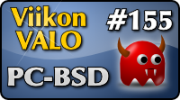

<!--
Title: 3x51 PC-BSD - Viikon VALO #155
Date: 2013/12/15
Pageimage: valo155-pc-bsd.png
Tags: Käyttöjärjestelmä
-->

**PC-BSD on työpöytäkäyttöön suunnattu FreeBSD-pohjainen avoimen
lähdekoodin käyttöjärjestelmä.**

 PC-BSD on
[FreeBSD:n](http://www.freebsd.org/), vapaan Unix-käyttöjärjestelmän,
pohjalta kehitetty käyttöjärjestelmä, jonka tavoitteena on olla
käyttäjäystävällinen erityisesti työpöytäkäytössä. Sen pyrkimyksenä on
yhdistää FreeBSD:n vakaus ja turvallisuus helppoon käytettävyyteen.
PC-BSD:n oletuskäyttöliittymänä on Linux-jakeluistakin tuttu
[KDE](KDE)-työpöytäympäristö, mutta muidenkin
käyttöliittymien asentaminen on mahdollista. PC-BSD:n
järjestelmäasetusten muokkaamiseen on tarjolla helppokäyttöinen
graafinen Ohjauspaneeli-sovellus, jolla voidaan muokata esimerkiksi
palomuurin ja erilaisten laitteiden asetuksia.

Ohjelmistojen asentamiseen on käytettävissä AppCafe-sovellus, joka
tarjoaa suuren joukon kategorioittain luokiteltuja pbi-paketteina
asennettavia sovelluksia. Pbi-pakettivarasto seuraa FreeBSD:n
ports-pakettijärjestelmän tarjoamia ohjelmia, jotka käännetään
automaattisesti pbi-paketeiksi. Linux-järjestelmistä ja muista Unixeista
poiketen PC-BSD:n paketit asennetaan sovelluskohtaisesti /usr/pbi
-hakemiston alle kukin paketti kokonaisuudessaan omaan hakemistoonsa.
Tämä siis muistuttaa esimerkiksi Mac OS X:n ohjelmapakettien
asentamista. Pbi-paketteja voi asentaa ja hallita myös komentoriviltä
käsin. Pbi-pakettien lisäksi ohjelmistoja voi asentaa myös suoraan
FreeBSD:n ports-järjestelmästä.

PC-BSD:n käyttöliittymä on tuttu niille, jotka ovat käyttäneet
KDE-työpöytää aiemmin jossain Linux-jakelussa. Myös suuri osa valmiiksi
asennetuista ohjelmista tai paketinhallinnan kautta asennettavista
ohjelmista on täsmälleen samoja sovelluksia, jotka ovat käytettävissä
myös Linux-jakeluiden kanssa. Tämä on luonnollista, sillä monien avoimen
lähdekoodin ohjelmien siirtäminen Unix-tyyppisestä käyttöjärjestelmästä
toiseen tapahtuu vain kääntämällä ohjelma uudelleen kohdejärjestelmään
lähdekoodeista. Erityisesti esimerkiksi Gnome- ja
KDE-työpöytäjärjestelmiin tarkoitetut ohjelmat toimivat hyvin samalla
tavoin eri alustoilla.

Erityisesti jo Linux-järjestelmiin tutustuneille PC-BSD voi olla
mielenkiintoinen tutustuttava. Suuri osa järjestelmän toiminnoista on
samanlaisia molemmilla alustoilla, mutta osa niistä on puolestaan
toteutettu hieman eri tavalla, mikä vaatii pientä opettelua ja
totuttelua. Esimerkiksi komentotulkkina BSD-järjestelmissä on usein
käytetty oletuksena csh:ta, kun Linux-järjestelmissä käytetään
tyypillisesti bash:ia. Tämäkin on toki muokattavissa oman mieltymyksen
mukaan. PC-BSD:n käytön opettelun voi aloittaa vaikka lukemalla sen
[käsikirjaa](ftp://ftp.pcbsd.org/pub/handbook/9.2/pcbsd9.2_handbook_en_ver9.2.pdf).
PC-BSD:n voi asentaa myös
[VirtualBox](Virtualbox)-virtuaalikoneeseen, johon
asennettuna se osaa automaattisesti ottaa käyttöön VirtualBoxin
vieraslisäosat ja siten esimerkiksi skaalata työpöydän ikkunan koon
mukaan.

Kotisivu
:   <http://www.pcbsd.org/>

Lisenssi
:   Ohjelmistoja useilla vapailla lisensseillä.

Asennus
:   PC-BSD:n asennuslevyn ISO-levykuva on ladattavissa sen kotisivuilta.

Käyttöohje
:   [PC-BSD 9.2
    handbook](ftp://ftp.pcbsd.org/pub/handbook/9.2/pcbsd9.2_handbook_en_ver9.2.pdf)
    (pdf, englanniksi)

-   [PC-BSD:n asennuslevy kysyy ensitöikseen, asennetaanko graafisessa
    tilassa vai tekstitilassa.](images/pc-bsd-1.png)
-   [Asennuslevyn käynnistyksen yhteydessä juoksevaa tekstiä ei kannata
    säikähtää.](images/pc-bsd-2.png)
-   [Asennuskieleksi voi valita myös suomen.](images/pc-bsd-3.png)
-   [Asennusvaihtoehtoja on kolme: Työpöytä (PC-BSD), palvelin (TrueOS)
    ja palautus varmuuskopioista.](images/pc-bsd-4.png)
-   [Asentaminen kestää jonkin aikaa.](images/pc-bsd-5.png)
-   [Sisään kirjaudutaan monesta Linux-järjestelmästäkin tutun GDM:n
    kautta.](images/pc-bsd-6.png)
-   [Työpöytäjärjestelmänä PC-BSD käyttää oletuksena
    KDE:tä.](images/pc-bsd-7.png)
-   [KDE-työpöytäympäristön tuttuja sovelluksia ja PC-BSD:n
    ohjauspaneeli.](images/pc-bsd-8.png)
-   [AppCafe on paketinhallintasovellus pbi-pakettien
    asentamiseen.](images/pc-bsd-9.png)
-   [Suuri osa sovelluksista on samoja, joita käytetään myös
    Linux-järjestelmissä ja toisinaan myös Windowsissa. Kuvassa
    Gimp-kuvankäsittelyohjelma.](images/pc-bsd-10.jpg)

*Teksti: Pesasa*  
*Kuvakaappaukset: Pesasa*

