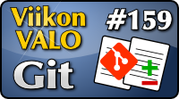

<!--
Title: Git
Week: 4x03
Number: 159
Date: 2014/01/12
Pageimage: valo159-git.png
Tags: Linux,Windows,Mac OS X,FreeBSD,OpenBSD,NetBSD,Solaris,Ohjelmointi,Versionhallinta
-->

**Git on hajautettu versionhallintajärjestelmä ohjelmointiin ja muuhun
tekstintuottamiseen.**

 Git on ohjelmointiprojektien
tai muiden tekstipohjaisten projektien versioiden hallintaan käytettävä
hajautetusti toimiva työkalu. Sen etuina joihinkin muihin
versionhallintajärjestelmiin ovat muun muassa hajautettu rakenne, helppo
rinnakkaisten versioiden tekeminen ja skaalautuvuus pienistä
projekteista jättimäisiin. Git toimii hyvin niin pienissä yhden hengen
yhdellä koneella toteutettavissa tuotoksissa kuin suurissa monen tekijän
ja monen koneen välillä synkronoitavissa projekteissakin.

Git-järjestelmän ohjelmoi alunperin Linus Torvalds Linux-ytimen
versionhallintaa varten tilanteessa, jossa aiemmin käytetyn kaupallisen
BitKeeper-ohjelman käyttö kävi mahdottomaksi ja muut vapaat
versionhallintajärjestelmät eivät hänen mielestään täyttäneet
Linux-projektin vaatimuksia. Sana "git" on brittislangia ja tarkoittaa
ääliötä. Linus on itse sanonut olevansa egoisti, joka nimeää projektinsa
itsensä mukaan: "I'm an egotistical bastard, and I name all my projects
after myself. First Linux, now git."

Git on toteutukseltaan [hajautettu
versionhallinta](http://en.wikipedia.org/wiki/Distributed_revision_control),
joka tarkoittaa sitä, että toisin kuin
[Subversionin](Subversion) kaltaisessa keskitetyssä
versionhallinnassa, versioiden ylläpito ja varastointi tapahtuukin
suoraan käyttäjän koneella projektin omassa kansiossa keskitetyn
palvelimen sijaan. Kullakin käyttäjällä on siis oma *repository*, jossa
projektin tiedostojen versiot ovat tallessa. Tämän takia käyttäjä voi
hyödyntää versiointia myös ilman verkkoyhteyttä. Hajautetun
versionhallinnan kanssa käytössä voi toki olla myös projektiin
osallistuvien yhteinen verkossa oleva repository, jonka kanssa
paikalliset repositoryt synkronoidaan. Hajautetun toteutuksen avulla
käyttäjä voi siis hyötyä versionhallinnan tuomista eduista myös
ollessaan verkon tai keskitetyn repositoryn tavoittamattomissa
esimerkiksi matkan aikana.

Muita Gitin ominaisuuksia ovat esimerkiksi helppo versiohaarojen
(branch) luominen, versiohistorian eheys ja hyvä skaalautuvuus. Gitillä
uusien versiohaarojen tekeminen, vertailu ja yhdistäminen on tehty
tarkoituksella helpoksi, jotta käyttäjän on helppoa tehdä esimerkiksi
erilaisia kokeilevia versioita häiritsemättä päähaaraa (master) tai
muita mahdollisia haaroja. Kokeellisen versiohaaran onnistuessa ja
valmistuessa se on helppo yhdistää (merge) takaisin päähaaraan. Monissa
tilanteissa Git osaa limittää uuden version tiedostoihin tehdyt
muutokset automaattisesti oikein päähaaran tiedostoihin. Vaikeammissa
tapauksissa se pyytää käyttäjää ratkaisemaan ristiriidat käsin.
Ristiriitojen ratkaisemiseen Git osaa ehdottaa käyttäjälle koneelta
löytyviä ohjelmia, kuten [Meld](Meld). Tarkoituksena onkin,
että esimerkiksi ohjelmointiprojektissa uuden ominaisuuden toteuttamista
varten voidaan luoda oma haaransa, jossa ominaisuus kehitetään valmiiksi
häiritsemättä päähaaraa, minkä jälkeen testattu haara yhdistetään
takaisin päähaaraan.

Versiohistorian eheydellä tarkoitetaan sitä, että aina kun uusi muutos
viedään versionhallintaan (commit), kyseiselle muutokselle lasketaan
tarkistussummana nimi, joka on käytännössä yksikäsitteinen koko
maailmassa. Tarkistussumman laskemiseen käytetään muun muassa kyseistä
muutosta edeltävän muutoksen (tai edeltävien muutosten, jos kyseessä
haarojen yhdistäminen) nimiä, käyttäjän sähköpostiosoitetta, itse
tiedostoja sekä muutamia muita tietoja. Näin kukin muutos on aina
kytketty yksikäsitteisesti edeltäjiinsä eikä muutoshistoriaa voi
jälkikäteen väärentää. Eräs tämän käytännön etu on, että jos saman
niminen muutos löytyy kahden käyttäjän repositoryistä, voidaan olla
varmoja, että kyse on silloin täysin samasta versiosta.

Git soveltuu erityisesti tekstimuotoisen datan versiointiin ja sitä voi
hyvin käyttää ohjelmointiprojektien lisäksi myös esimerkiksi
[oppikirjojen
kirjoittamiseen](https://github.com/avoimet-oppimateriaalit-ry). Myös
tieteellisessä tutkimustyössä on mahdollista käyttää versionhallintaa,
kun tutkijat kirjoittavat yhdessä tieteellisiä artikkeleita.
Tieteelliseen käyttöön onkin kehitetty myös erikoisversio
[SciGit](http://www.scigit.com/), jossa on tarkoituksena yksinkertaistaa
käyttöliittymää ja tuoda paremmin esille tieteellisessä työssä
oleellisia ominaisuuksia ohjelmoinnissa tarvittavien sijaan.

Binäärimuotoisia tiedostoja, kuten kuvia, voi toki myös laittaa mukaan
versionhallintaan, mutta niiden versioiden hallinta, esimerkiksi
rinnakkaisia versioita yhdistäessä, ei ole yhtä suoraviivaista kuin
tekstitiedostoilla. Pelkästään binäärisistä tiedostoista koostuvien
projektien versionhallintaan saattaa löytyä parempiakin työkaluja.

Gitin perustyökalut ovat kokoelma komentoriviohjelmia, joista kukin
tekee oman tehtävänsä. Git-versionhallinnan käyttöön löytyy kuitenkin
myös useita graafisia käyttöliittymiä. Osassa on keskitytty erityisesti
versiohistorian selailuun ja graafiseen havainnollistamiseen, kuten
esimerkiksi Gitin mukana tuleva yksinkertainen gitk tai hieman
"kauniimpi" qgit. Osa taas integroi versionhallinnan komentoja muuten
käytössä oleviin tiedostonhallintaohjelmiin, kuten Windowsiin asentuva
[Tortoisegit](http://code.google.com/p/tortoisegit/) tai
[KDE](KDE)-ympäristön Dolphin-tiedostoselaimen lisäosana
toimiva kdesdk-dolphin-plugins -paketti. [GitX](http://gitx.frim.nl/) on
puolestaan Mac OS X -ympäristössä käytettävä vapaa graafinen
käyttöliittymä. Myös monet ohjelmointiin käytettävät tekstieditorit,
kuten Eclipse, osaavat käyttää Git-versionhallintaa käyttöliittymänsä
kautta joko suoraan tai lisäosan avulla. Muita graafisia käyttöliittymiä
löytyy sivulta: <http://git-scm.com/downloads/guis> ja vielä pidempi
lista muita käyttöliittymiä ja työkaluja sivulta:
<https://git.wiki.kernel.org/index.php/InterfacesFrontendsAndTools> .

Git-versionhallinta osaa olla yhteydessä palvelimella olevaan
repositoryyn useammallakin tavalla, muun muassa ssh-yhteyden tai
http-yhteyden kautta. Palvelinkäyttöä varten on olemassa myös
ohjelmistoja ja valmiita palveluita. Yksi suosituimmista Gitin kanssa
käytetyistä palveluista on [GitHub](GitHub) osoitteessa
<http://github.com> . Vastaavia avoimella lähdekoodilla toimivia
palveluita ja omallekin palvelimelle asennettavissa olevia ohjelmistoja
ovat [Gitorius](https://gitorious.org/) ja [Gitlab](http://gitlab.org/).
Nämä kaikki tarjoavat mahdollisuuden repositoryjen, niiden tiedostojen,
haarojen sekä historian selaamiseen www-selaimella sekä paljon muita
kehitystyöhön hyödyllisiä toiminnallisuuksia.

Kotisivu
:   <http://git-scm.com/>

Lisenssi
:   [GNU GPL](GNU_GPL) v.2

Toimii seuraavilla alustoilla
:   Linux, Windows, Mac OS X, FreeBSD, OpenBSD, NetBSD, PC-BSD, Solaris

Asennus
:   Git löytyy Linux- ja BSD-järjestelmien paketinhallinnasta. Muille
    järjestelmille sen voi ladata ohjelmiston kotisivujen kautta.

Käyttöohjeet
:   [Git Linux.fi:ssä](http://linux.fi/wiki/Git)
:   [Git tutorial](http://gitbyexample.org/)
:   [Git by example (a little
    tutorial)](http://carlopecchia.eu/blog/2008/08/26/git-by-example-a-little-tutorial/)
:   [Git for ages 4 and up](http://www.youtube.com/watch?v=1ffBJ4sVUb4)
    (Youtube) Elokuvan mittainen havainnollinen esitys Gitin toiminnasta

-   [JSXGraph-projektin Git-repositoryn kloonaaminen GitHub-palvelusta
    komentorivillä.](images/git-1.png)
-   [Commit-login selaamista. Kukin suoritettu muutos, sen nimi, tekijä,
    päivämäärä ja muutoksen kommentti on
    selattavissa.](images/git-2.png)
-   [Versiohistorian selaamista Gitk-ohjelmalla.](images/git-3.png)
-   [Qt-pohjainen QGit ja haaroja versiohistoriassa.](images/git-4.png)
-   [kdesdk-dolphin-plugins-paketti integroi Git-komentoja KDE:n
    Dolphin-tiedostohallintaohjelmaan.](images/git-5.png)
-   [Versionhallinnan haaran vaihtaminen
    Dolphin-lisäosalla.](images/git-6.png)
-   [Versioihin tapahtuneiden muutosten tarkastelua
    komentorivillä.](images/git-7.png)
-   [Versioden muutoksia voi tarkastella myös ulkoisilla ohjelmilla,
    joita Git osaa ehdottaa automaattisesti.](images/git-8.png)
-   [Meld-työkalun käyttöä muutosten tarkasteluun.](images/git-9.png)

*Teksti: Pesasa*  
*Kuvakaappaukset: Pesasa*

