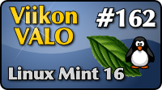

<!--
Title: 4x06 Linux Mint - Viikon VALO #162
Date: 2014/02/02
Pageimage: valo162-linuxmint.png
Tags: Käyttöjärjestelmä,Linux
-->

**Linux Mint on käyttäjäystävällinen ja visuaalisestikin hyvän näköinen
Linux-jakelu.**

 Linux Mint 16
"Petra" on Ubuntuun pohjautuva Linux-jakelu, joka on pyritty tekemään
mahdollisimman miellyttäväksi ja helpoksi käyttää. Helpon
käyttöliittymän lisäksi Linux Mint sisältää jo asennuksessa valmiiksi
muun muassa multimediakoodekit, joita tarvitaan joidenkin epävapaiden
tiedostoformaattien näyttämiseen ja kuuntelemiseen. Linux Mintin
versiossa 16 on keskitytty erityisesti ohjelmien vakauteen ja
toimintavarmuuteen. Linux Mint on ollut [Distro
Watch](http://distrowatch.com/) -sivuston seurannassa jo pidempään
suosituimpana Linux-jakeluna. Linux Mint 16 on asennettavissa neljänä
erilaisena versiona, jotka sisältävät oletuksena eri käyttöliittymät:
Cinnamon, Mate, KDE ja Xfce.

Cinnamon on käyttöliittymä, joka alunperin kehitettiin vaihtoehtoiseksi
käyttöliittymäksi Gnome 3 työpöydälle Gnome Shell- ja
Unity-käyttöliittymien tapaan. Gnome Shellin kehityssuunta ei
miellyttänyt Linux Mintin kehittäjiä vaan he halusivat pitäytyä
perinteisemmässä työpöytäkäyttöliittymässä paneeleineen. Sittemmin
nykyiseen versioon 2.0 mennessä Cinnamon on kehittynyt itsenäiseksi
työpöytäympäristöksi, joka ei tarvitse alleen enää täyttä
Gnome-työpöytää, vaikka hyödyntääkin Gnomen tekniikoita ja kirjastoja.
Myös ikkunanhallinta, asetustyökalu (control panel) sekä
tiedostojenhallintatyökalu ovat haarautuneet omiksi versioikseen
alkuperäisistä Gnome-työpöydän vastaavista. Esimerkiksi
tiedostonhallintana Cinnamon käyttää Nautiluksesta haarautunutta Nemoa.

Cinnamonin ikkunointi osaa monen muun nykyisen työpöytäympäristön tavoin
asetella ikkunan käyttämään puolikkaan tai neljänneksen näytöstä
raahaamalla ikkunan johonkin neljästä reunasta tai neljästä kulmasta.
Tämän lisäksi Cinnamonissa on kuitenkin erikoisuutena mahdollista
"napsauttaa" ikkuna näytön reunaan tai kulmaan niin, että muut ikkunat
eivät suurennettaessa peitäkään reunaan napsautettua ikkunaa vaan
täyttävät vain lopun osan näytöstä. Näin esimerkiksi jonkin seurattavaa
tietoa sisältävän ikkunan, kuten chat-ikkunan, voi asettaa vaikka näytön
oikeaan reunaan kapeana pystyikkunana ja käyttää loppua osaa näytöstä
normaalin työtilan tavoin.

MATE puolestaan on toinen työpöytäympäristö, joka syntyi Gnome 3
-työpöydän tulon myötä. Gnome 2:n käyttöliittymää kaipaamaan jääneet
jatkoivat jo pysähtyneen Gnome 2:n kehittämistä omaan suuntaansa nimellä
MATE. Samaan tapaan kuin Cinnamonin työkalut ovat periytyneet Gnome 3:n
vastaavista, sisältää MATE työkaluja, joiden juuret ovat Gnome 2:ssa.
Esimerkiksi tiedostonhallintaa hoidetaan Nautiluksesta haarautuneella
Cajalla. Sekä Cinnamon että MATE ovat hyviä esimerkkejä siitä, miten
vapaa ja avoin lähdekoodi mahdollistaa ohjelmistojen kehityksen viemisen
omaan suuntaan, kun ohjelman virallisen tahon valitsema suunta ei
miellytä.

Kolmantena työpöytävaihtoehtona Linux Mint tarjoaa jo aiemmin Viikon
VALOna esitellyn [KDE](KDE)-työpöydän. Neljäs vaihtoehto
oletuksena asentuvaksi työpöytäympäristöksi on kevyeksi vaihtoehdoksi
tarkoitettu Xfce. Kukin työpöytävaihtoehdoista on ulkoasultaan ja
käytettävyydeltään viimeistellyn oloinen sekä johdonmukainen.

Linux Mint tarjoaa käyttöliittymästä riippumatta järjestelmän ylläpitoon
ja sovellusten asentamiseen selkeät työkalut sekä laajan kirjon
sovelluksia, kuten musiikkisoitin Banshee, web-selaimet
[Firefox](Firefox) ja [Chromium](Chromium),
LibreOffice-toimistopaketin,
[VLC](VLC-mediasoitin)-mediasoittimen,
[GIMP](GIMP)-kuvankäsittelyohjelman,
[Inkscape](Inkscape)-vektoripiirto-ohjelman sekä lukuisia
muita ohjelmia. Mikä työpöydistä käyttäjää eniten miellyttääkin, Linux
Mintin asentamalla saa itselleen toimivan ja helpon järjestelmän.

Kotisivu
:   <http://linuxmint.com/>

Lisenssi
:   Ohjelmia useilla vapailla lisensseillä

Asennus
:   Asennuslevyn (dvd) iso-kuvat ovat ladattavissa Linux Mintin
    kotisivujen kautta. Kuvasta voi tehdä käynnistyvän dvd-levyn tai
    usb-tikun. Tarjolla ovat 64- ja 32-bittiset versiot kaikilla
    neljällä käyttöliittymällä. Osasta asennuslevyistä on tarjolla
    erikseen versiot, jotka eivät sisällä muun muassa epävapaita
    mediakoodekkeja.

-   [Linux Mint 16 Cinnamon-työpöydällä.](images/linuxmint-1.jpg)
-   [Muutamia ohjelmia auki Cinnamon-työpöydällä. Banshee-musiikkisoitin
    integroituu paneeliin ja on ohjattavissa sitä kautta vaikka ohjelman
    pääikkuna suljettaisiinkin.](images/linuxmint-2.jpg)
-   [Cinnamon-työpöydällä voi käyttää useampaa virtuaalityöpöytää,
    joille ohjelmia voi jaotella ja joita voi lisätä ja poistaa
    helposti. Työpöydät saa näkyviin ruudukkona helposti viemällä hiiren
    vasempaan ylänurkkaan.](images/linuxmint-3.jpg)
-   [Järjestelmän asetukset on koottu selkeästi luokiteltuina yhteen
    työkaluun. Ohjelmistohallinnasta voi asentaa ohjelmia, jotka on
    luokiteltu käyttötarkoituksen mukaan
    kategorioihin.](images/linuxmint-4.jpg)
-   [Linux Mint 16 KDE-työpöydällä.](images/linuxmint-5.jpg)
-   [KDE:n järjestelmäasetukset, Dolphin-tiedostonhallinta sekä
    VLC-mediasoitin.](images/linuxmint-6.jpg)
-   [Linux Mint 16 MATE-työpöydällä.](images/linuxmint-7.jpg)
-   [MATE-työpöydän Control Center. Samat ohjelmistohallinta ja Banshee
    ovat käytettävissä kuin
    Cinnamon-työpöydälläkin.](images/linuxmint-8.jpg)
-   [Linux Mint 16 Xfce-työpöydällä.](images/linuxmint-9.jpg)
-   [Asetuksia ja Gimp-kuvankäsittelyohjelma.](images/linuxmint-10.jpg)

*Teksti: Pesasa*  
*Kuvakaappaukset: Pesasa*

