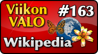

<!--
Title: Wikipedia
Week: 4x07
Number: 163
Date: 2014/02/09
Pageimage: valo163-wikipedia.png
Tags: Verkkoselaimet,Aineisto
-->

**Wikipedia on yhteismuokkauksellinen vapaa ja avoin
Internet-tietosanakirja.**

[Wikipedia](http://www.wikipedia.org/) on yhteisöllinen projekti, joka
tuottaa [joukkouttamista](http://fi.wikipedia.org/wiki/Joukkouttaminen)
([crowdsourcing](http://en.wikipedia.org/wiki/Crowdsourcing)) hyödyntäen
erittäin kattavaa Internetin välityksellä vapaasti käytettävää ja
muokattavaa sähköistä tietosanakirjaa. Wikipedian tavoite on saada
kaikki ihmiskunnan tietämys kaikkien saataville omalla kielellä.
Wikipedian nimi tulee käytetystä wiki-tekniikasta, jonka ansiosta kuka
tahansa käyttäjä voi kirjoittaa ja muokata Wikipedian artikkeleita.
Avoimuuden takia kynnys artikkelien tuottamiseen ja korjaamiseen on
matala. Näin artikkelien toivotaan vähitellen kehittyvän ajan myötä
hioutuvan entistä paremmiksi. Wikipedia koostuu useista rinnakkaisina
toimivista ja vastaavien artikkelien kautta toisiinsa linkitetyistä
kieliversioista. Nykyään Wikipediassa on noin 30 miljoonaa artikkelia
287 eri kielellä.

Koska Wikipedia on avoimesti muokattavissa, asetetaan sen luotettavuus
usein kyseenalaiseksi. Wikipedian artikkeleissa esiintyykin usein
epätarkkuuksia, virheitä tai jopa tahallista vääristelyä. Projektin
ajatuksena on, että virheet kuitenkin huomataan ja korjataan ennen
pitkää. Wikipedia-artikkeleita, kuten mitä tahansa muutakin lähdettä
lukiessa on kuitenkin syytä käyttää tervettä mediakritiikkiä.
Artikkelien kriittistä lukemista helpottaa toisaalta Wikipedian
sisäänrakennettu versiointi, jonka avulla artikkelin muutoshistoriaa on
helppo selata, sekä Wikipedian käytäntönä oleva tiukka vaatimus
lähteiden merkitsemisestä. Muutoshistoriasta on mahdollista huomata
esimerkiksi se, jos kyseinen artikkeli on selvästi kiistanalainen ja
tiiviiden vastakkaisten muokkausten alla. Wikipedian periaatteena on,
että sinne ei kirjoiteta niin kutsuttua uutta tutkimusta vaan jossain
muualla aiemmin julkaistua tietoa. Alkuperäiseen lähteeseen sitten
viitataan selkeällä lähdeviittauksella, jolloin lukija voi tarkistaa
tiedon luotettavuuden sitä kautta. Myös kuhunkin artikkelisivuun
liitettyä keskustelusivua voi käyttää artikkelin luotettavuuden
arvioimiseen.

Wikipedian sivut joutuvat toisinaan myös varsinaisen vandalismin
kohteeksi. Versiohistorian ansiosta ilkivallan kohteeksi joutuneiden
sivujen teksti on kuitenkin melko helppoa palauttaa aikaisempaan
versioonsa heti, kun ilkivalta on havaittu. Jotkin suuria tunteita
herättävät aiheet, kuten
[evoluutiota](http://en.wikipedia.org/wiki/Evolution) ja [profeetta
Muhammadia](http://en.wikipedia.org/wiki/Muhammad) käsittelevät
artikkelit voivat joutua suojatuiksi eriasteisin lukituksin, jolloin
esimerkiksi vain palveluun sisään kirjautuneet käyttäjät pääsevät
muokkaamaan kyseisiä artikkeleita.

Wikipedia-sivuston sisällönhallintaan käytetään tähän käyttöön
kehitettyä avoimen lähdekoodin
[Mediawiki](Mediawiki)-ohjelmistoa, jonka ominaisuudet
tukevat erityisesti juuri avointa ja mahdollisimman vapaata sisällön
tuottamista.

Wikipediaan tuotetut sisällöt on julkaistu vapailla lisensseillä, jotka
sallivat materiaalin uudelleenkäyttämisen ja muokkaamisen. Artikkelien
tekstisisältöihin on käytetty hieman artikkelista riippuen
[CC-BY-SA](http://en.wikipedia.org/wiki/Wikipedia:Text_of_Creative_Commons_Attribution-ShareAlike_3.0_Unported_License)-lisenssillä
ja/tai [GNU Free Documentation License
(GFDL)](http://en.wikipedia.org/wiki/Wikipedia:Text_of_the_GNU_Free_Documentation_License)
-lisenssiä.

Wikipedian perustivat [Jimmy
Wales](http://en.wikipedia.org/wiki/Jimmy_Wales) ja [Larry
Sanger](http://en.wikipedia.org/wiki/Larry_Sanger) 15. tammikuuta 2001.
Wikipediaa ylläpitää yhdysvaltalainen voittoa tavoittelematon
[Wikimedia-säätiö](http://fi.wikipedia.org/wiki/Wikimedia) ([Wikimedia
Foundation](http://en.wikipedia.org/wiki/Wikimedia_Foundation)).
Wikimedia pyörittää Wikipedian lisäksi niin ikään
Mediawiki-ohjelmistolla toimivia rinnakkaisia sisarprojekteja, kuten
[Wiktionary](http://www.wiktionary.org/)-sanakirjaa,
[Wikinews](http://www.wikinews.org/)-uutissivustoa,
[Wikiquote](http://www.wikiquote.org/)-sitaattiarkistoa,
[Wikibooks](http://www.wikibooks.org/)-wikikirjastoa,
[Wikiversity](http://www.wikiversity.org/)-virtuaaliopistoa.
Erikielisten Wikipedioiden yhteisenä mediapankkina käytetään [Wikimedia
Commons](Wikimedia Commons "wikilink")-palvelua, josta löytyy suuri
kirjasto kuva-, ääni- ja videotiedostoja.

Wikipedian rahoitus on täysin riippuvainen vapaaehtoisten
lahjoituksista. Wikimedia-säätiö on esimerkiksi ilmoittanut, että
Wikipediaan ei tule koskaan tulemaan mainoksia, jotta tietosanakirja
pystyy säilyttämään puolueettomuutensa. Toiminnan rahoittamiseksi
Wikimedia järjestää ajoittain Wikipedian sivujen ylälaidassa näkyviä
keräyskampanjoita. Näin pyritään saamaan käyttäjät lahjoittamaan varoja
käytännön kulujen, kuten palvelimien ja tietoliikenneyhteyksien
ylläpitoon sekä henkilökunnan palkkojen, kattamiseen.

Helmikuun 7. päivänä 2014 huomiota herättikin Suomessa tieto, että
poliisihallituksen arpajaishallinto oli esittänyt suomenkielisen
Wikipedian ylläpidolle lausuntopyynnön meneillään olevasta
varainkeruusta. Suomessa rahankeräykset ovat luvanvaraisia ja lupia
voivat hakea vain yleishyödylliset järjestöt. Toisaalta, Wikipediassa
esillä oleva varainkeruu ei ole minkään suomalaisen toimijan
toimeenpanema vaan se on yhdysvaltalaisen Wikimedia-säätiön keräys, jota
he mainostavat omilla (Suomesta katsoen) ulkomailla sijaitsevilla
palvelimillaan.

Kotisivu
:   <http://www.wikipedia.org/>

Lisenssi
:   Tekstit:
    [CC-BY-SA](http://en.wikipedia.org/wiki/Wikipedia:Text_of_Creative_Commons_Attribution-ShareAlike_3.0_Unported_License)
    /
    [GFDL](http://en.wikipedia.org/wiki/Wikipedia:Text_of_the_GNU_Free_Documentation_License),
:   Kuvat ja muu materiaali: useita vapaita lisenssejä

-   [Wikipedian etusivu ja linkkejä useisiin
    kieliversioihin.](images/wikipedia-1.jpg)
-   [Suomenkielisen Wikipedian etusivu. Suositeltu artikkeli ja
    ajankohtaisia aiheita.](images/wikipedia-2.jpg)
-   [Artikkelin muokkausnäkymä. Muokkaamisen voi tehdä
    wikitekstinä.](images/wikipedia-3.jpg)
-   [Sivun muutoshistoriasta näkee kaikki sivuun tehdyt muokkaukset ja
    versioita pystyy vertailemaan pareittain.](images/wikipedia-4.jpg)
-   [Lähdeviitteet ovat tärkeä osa luotettavaa
    Wikipedia-artikkelia.](images/wikipedia-5.jpg)
-   [Wikipediaa on 287 kielellä. Kuvassa armeniankielinen
    sivu.](images/wikipedia-6.jpg)
-   [Osittain suojattu englanninkielinen
    Evolution-artikkeli.](images/wikipedia-7.jpg)
-   [Wikipediaa eri kielillä ja sen
    sisarprojekteja.](images/wikipedia-8.jpg)
-   [Wikipedia-artikkeli voi sisältää tekstin lisäksi esimerkiksi
    valokuvia, piirroskuvia, karttoja ja
    tietolaatikoita.](images/wikipedia-9.jpg)
-   [Artikkelin muokkausnäkymä. Muokkaamisen voi tehdä
    wikitekstinä.](images/wikipedia-10.jpg)
-   [Wikipedian artikkeli Wikipediasta. Sivun yläreunassa on Wikimedian
    varainkeruuvetoomus.](images/wikipedia-11.jpg)

*Teksti: Pesasa*  
*Kuvakaappaukset: Pesasa*

