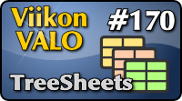

<!--
Title: 4x14 TreeSheets - Viikon VALO #170
Date: 2014/03/30
Pageimage: valo170-treesheets.png
Tags: Linux,Windows,Mac OS X,Toimisto
-->

**TreeSheets on työkalu muistiinpanojen tekemiseen ja tiedon
organisointiin taulukoiksi ja hierarkkisiksi puiksi.**

TreeSheets-työkalulla voi tehdä asioita, joihin on usein käytetty
taulukkolaskentaohjelmien taulukoita, miellekarttoja, käsitekarttoja,
jäsentimiä (outliner), tehtävälistoja tai muita tiedon organisointiin
soveltuvia työkaluja. TreeSheets lähestyy ongelmaa organisoimalla kaiken
taulukkoina, eli sisältösoluista koostuvina ruudukkoina, joita voi
sijoitella myös sisäkkäin.

Yksinkertaisimmillaan TreeSheetsillä voi muodostaa teksteistä koostuvia
taulukoita, joiden soluille voi määrätä erilaisia korostuksia, kuten
tekstin ja tausta värejä, lihavointia, alleviivausta, kursivointia ja
yliviivausta. Soluun voi tekstin lisäksi lisätä kuvan, joka näytetään
tekstin edessä. Ohjelma tarjoaa valikoiman valmiita pikkukuvakkeita,
kuten erivärisiä palloja, tähtiä ja sydämiä. Varsinainen hyöty
ohjelmasta kuitenkin saadaan, kun soluihin lisätään tekstin lisäksi
uusia taulukoita. Tällöin solun teksti toimii eräänlaisena otsakkeena
taulukolle, jossa on otsakkeeseen liittyvä asiasisältö. Taulukoita voi
upottaa sisäkkäin rajattomasti, jolloin saadaan ohjelman nimen
mukaisesti taulukoista muodostuva puu.

Taulukoiden käsittely onkin tehty ohjelmassa mahdollisimman helpoksi.
Uusia soluja, rivejä, sarakkeita tai kokonaisia taulukoita on helppo
luoda. Ohjelmassa voi näppäimistöllä tai hiirellä valita minkä tahansa
solun tai solun jonkin reunan ja enter-näppäimellä siirtyä
kirjoitustilaan. Jos valittuna oli solun reuna, luodaan automaattisesti
uusi rivi tai sarake ja siirrytään kirjoitustilaan kyseisessä kohdassa
olevaan soluun. Soluun voi puolestaan luoda alitaulukon helposti
insert-näppäintä painamalla. Solujen taikka kokonaisten rivien ja
sarakkeiden poistaminen tapahtuu yhtä helposti valitsemalla poistettava
solu ja painamalla delete-näppäintä.

Ohjelman käyttöä monipuolistaa se, että sen sisältämien solujen
esitystapaa voidaan vaihtaa muutaman erilaisen asettelun välillä.
Ensinnäkin voidaan valita, esitetäänkö solussa oleva teksti ja
alitaulukko vertikaalisesti vai horisontaalisesti, eli onko teksti
taulukon yläpuolella vai rinnalla vasemmalla puolella. Toiseksi voidaan
valita, esitetäänkö taulukot normaaleina ruudukkoina, soluista tehtyinä
"kuplina" vai kytkemällä rivit viivoilla isäntäsolunsa tekstiin
puumaisen ulkoasun luomiseksi. Esimerkiksi käyttämällä vertikaalista
asettelua ja viivoilla kytkemistä, saadaan helposti tehtyä puumaisia
listoja. Toisaalta horisontaalinen asettelu viivoilla muistuttaa
perinteisiä miellekarttoja. Asettelu voidaan valita solukohtaisesti,
jolloin esimerkiksi taulukon yhdessä solussa voi olla tietoa esitettynä
taulukkomuodossa ja toisessa puumaisena luettelona.

Taulukoiden solujen, rivien ja sarakkeiden sijoittelua on myös helppo
muokata. Valitun solun tai solujoukon voi helposti siirtää rivillä
sivusuunnassa tai sarakkeella pystysuunnassa näppäinyhdistelmillä
ctrl+nuoli. Valikoista löytyy myös välineet taulukon transponointiin,
eli sarakkeiden vaihtamiseen riveiksi ja päinvastoin, sekä taulukon
järjestämiseen valitun rivin tai sarakkeen mukaan nousevasti tai
laskevasti.

Ohjelman käytön opettelun helpottamiseksi sen mukana tulee
tutorialitiedosto, jossa sen toimintaa on esitelty ja johon käyttäjä voi
kokeilla esiteltyjä ominaisuuksia.

Ohjelmassa on mahdollista merkitä solujen tekstejä tageiksi, jolloin eri
soluissa käytettyinä samat tagien ymmärretään tarkoittavan samaa asiaa.
Tämä mahdollistaa sen, että saman hierarkian eri haaroissa esiintyvät
arvot voidaan samaistaa ja hierarkiaa voidaan tarkastella eri asioiden
mukaan järjesteltyinä. Ohjelman mukana tulevassa tutorialissa tätä
havainnollistetaan tilanteena, jossa kaksi työtekijää, Bob ja Fred,
työskentelevät molemmat useammassa projektissa. Tällöin tilanteesta
voidaan muodostaa puu, jossa on lueteltu projektit, joiden alla on
lueteltu työntekijät ja näiden alla työtekijöiden projektiin tekemät
suoritukset. Toisaalta samaa tilannetta voitaisiin tarkastella
henkilöiden mukaan, jolloin puussa olisikin lueteltuina työntekijät,
niiden alla projektit, joihin työntekijät osallistuvat, ja niiden alla
työntekijän projektiin tekemät suoritukset. TreeSheets mahdollistaa
tagien avulla tämän tyylisten taulukoiden näkymien vaihtamisen helposti.
Ohjelma sisältää myös kokeiluasteella olevia laskentaominaisuuksia.

Yksi ohjelman vahvoista toiminnoista on sen zoom-ominaisuus, jolla
käyttäjä voi siirtyä tarkastelemaan vain jonkin solun sisältöä.
Zoom-toimintoa käytetään joko näppäimistöltä ctrl+PgUp- ja
ctrl+PgDn-pikanäppäimillä tai ctrl-näppäintä ja hiiren rullaa yhtä aikaa
käyttämällä. Soluun zoomattaessa solun sisältö skaalautuu ikkunaan
täysikokoiseksi ja solun taulukon isäntäsolun otsikkoteksti näkyy sen
yläpuolella harmaalla. Kaikki muu solun ulkopuolella oleva sisältö
jätetään näyttämättä. Toisaalta kokonaisuusnäkymässä voi yksittäisen
solun sisällön kokoa pienentää niin, että sen sisällön teksti näkyy
pelkkinä pisteinä ja siten solusta näkyy vain sen rakenne, muttei itse
sisältöä. Tällöin sisällön näkee vain soluun sisään zoomaamalla. Tämä on
toisinaan hyödyllistä, kun päätasolla halutaan nähdä vain kokonaisuuden
rakenne ja yksityiskohdat halutaan näkyviin vain niitä tarkasteltaessa.

Ohjelmasta voi tallentaa sen oman tiedostomuodon lisäksi XML-, HTML- ja
tekstimuotoisena sekä lisäksi PNG-kuvana. Taulukot on mahdollista myös
tulostaa PDF-tiedostoiksi.

Kotisivu
:   <http://treesheets.com>
:   Lähdekoodit: <https://github.com/aardappel/treesheets>

Lisenssi
:   [Zlib-lisenssi](http://en.wikipedia.org/wiki/Zlib_License)

Toimii seuraavilla alustoilla
:   Linux, Windows, Mac OS X (beta)

Asennus
:   Asennuspaketit eri alustoille löytyvät ohjelman kotisivuilta

Käyttöohjeet
:   Ohjelman mukana tulee tutorialitiedosto, jolla sen eri toimintoihin
    on helppo tutustua.

Video
:   [Youtube-video](https://www.youtube.com/watch?v=UB-saQZfrsw)
    ohjelman käytöstä.

-   [Sisäkkäisiä taulukoita TreeSheetsin
    tutorialissa.](images/treesheets-1.jpg)
-   [Solujen ulkoasun ja koon muokkausta. Taulukoiden asettelun
    erilaisia yhdistelmiä tavallisesta taulukkonäkymästä
    puumaisiin.](images/treesheets-2.jpg)
-   [Yksittäinen taulukon solu zoomattuna.](images/treesheets-3.jpg)
-   [Muotoiluja ja kuvia.](images/treesheets-4.jpg)
-   [Hierarkkinen lista taulukoista
    muodostettuna.](images/treesheets-5.jpg)
-   [Sama lista puumaisella esityksellä ja vertikaalisella
    otsikoinnilla.](images/treesheets-6.jpg)
-   [Puumainen esitys, horisontaalisella
    otsikoinnilla.](images/treesheets-7.jpg)
-   [Taulukon sisältöä voidaan muokata transponoimalla, sarakkeiden tai
    rivien mukaan järjestämällä, vaihtamalla hierarkian tasoja keskenään
    tai muodostamalla hierarkiasta "litteä"
    taulu.](images/treesheets-8.jpg)
-   [TreeSheetsin käyttöä erilaisin tavoin.](images/treesheets-9.jpg)
-   [Esimerkkinä taulukko henkilöstöstä.](images/treesheets-10.jpg)
-   [TreeSheetsin laskentatoiminnallisuuden käyttöä yksinkertaisiin
    laskuihin.](images/treesheets-11.jpg)

*Teksti: Pesasa*  
*Kuvakaappaukset: Pesasa*

