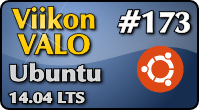

<!--
Title: Ubuntu 14.04 LTS
Week: 4x17
Number: 173
Date: 2014/04/20
Pageimage: valo173-ubuntu_1404_lts.png
Tags: Käyttöjärjestelmä,Linux
-->

**Ubuntu 14.04 LTS ”Trusty Tahr” on keväällä 2014 julkaistu versio
suositusta vapaasta Linux-käyttöjärjestelmäpaketista.**

Ubuntu 14.04 LTS on julkaistu versionumeronsa mukaisesti huhtikuussa
2014. *[LTS](https://wiki.ubuntu.com/LTS)* tarkoittaa pitkään tuettua
versiota (Long Term Support), joka on Ubuntun tärkein ja käytetyin
julkaisu tavallisille käyttäjille, palvelimille ja pilvikäytössä.
Ubuntua julkaiseva yhtiö, [Canonical](http://www.canonical.com/), lupaa
tukea ja päivittää järjestelmää viiden vuoden ajan. LTS-Ubuntusta
julkaistaan puolen vuoden välein myös päivitetty asennusmedia, joka
sisältää uusimman laitetuen. Tällä tavoin "vanhemmankin" Ubuntun voi
asentaa uusimpiin tietokoneisiin tulevina vuosina. Esimerkiksi
helmikuussa 2014 julkaistu 12.04.4 LTS sisältää laitetukea uusimmille
oheislaitteille, Intel Haswell- ja AMD Kaveri -suorittimille ja niin
edelleen.

Myös suomenkielinen [Finnish
Remix](http://wiki.ubuntu-fi.org/Ubuntu_Finnish_Remix) on saatavilla.
Ubuntu Finnish Remix on Ubuntun asennusmedia, joka sisältää koko suomen
kielen tuen valmiiksi ja suomi on asetettu oletuskieleksi. Muita eroja
viralliseen asennusmediaan ei ole. Tästä on etua, jos tarkoituksena on
esitellä Ubuntua suoraan USB-tikulta tai DVD-levyltä, tai asentaa Ubuntu
Internet-yhteydettömään laitteeseen. Myös viralliselta
Ubuntu-asennusmedialta asentuu suomen kielen tuki, jos suomi valitaan
kieleksi ja Internet-yhteys on käytettävissä.

Uutta Ubuntussa
---------------

**Unity 7** -käyttäjäkokemus on hiottu 14.04 LTS:ssä huippuunsa, ennen
seuraavan sukupolven Unity 8:aa. Useaa visuaalista yksityiskohtaa on
parannettu, ja nopeutta ja virheettömyyttä lisätty sadoin korjauksin.
Korkean tarkkuuden (HiDPI) näyttöjä tuetaan nyt laaja-alaisesti
näyttökohtaisella skaalausasetuksella. Paljon kaivattuna lisänä
ikkunoitujen sovellusten valikot saa nyt integroitua ikkunaan itseensä,
eli niitä ei tarvitse hakea näytön yläreunasta silloin kun sovellusta ei
käytetä koko näytön kokoisena.

Uusi Chromium-pohjainen nopea ja tietoturvallinen **Oxide**-webmoottori
vauhdittaa Ubuntuun integroituja webpalveluja. Oxide on tarjolla myös
itsenäisten sovelluskehittäjien uuden sukupolven sovelluksien
kehittämiseen sekä Ubuntun työpöydällä että tulevissa
Ubuntu-puhelimissa.

Tuttuun tapaan tuoreimmat sovellukset ovat löytäneet tiensä uuteen
Ubuntuun, esimerkkeinä: LibreOffice 4.2, Shotwell 0.18, GIMP 2.8,
Inkscape 0.48.4 sekä aina tuoreimpiin versioihin päivittyvät Firefox- ja
Chromium-selaimet. Linux-ytimenä toimii herra Linus Torvaldsin
julkaisema 3.13 Ubuntun lisäyksien kera.

Ubuntu Touch
------------

[Ubuntu Touch](https://wiki.ubuntu.com/Touch) tarjoaa
kosketusnäytöllisille laitteille upouuden **Unity 8** -käyttökokemuksen
sovelluskehittäjille ja kokeilunhaluisille.

Aktiivisesti tuettuja laitteita ovat puhelimista *LG Nexus 4* sekä
tableteista *Asus Nexus 7 (2013)* ja *Samsung Nexus 10*. Lisäksi yhteisö
työstää tukea kymmenille muille alun perin Androidia ajaneille
laitteille.

Ubuntun kehittäjäyritys on julkistanut, että ensimmäiset
Ubuntu-puhelimet saapuvat myyntiin *BQ*- ja *Meizu*-valmistajilta
myöhemmin tänä vuonna.

Rinnakkaisjakelut
-----------------

Unity-käyttöliittymällä varustetun Ubuntun lisäksi on saatavilla koko
joukko valmiita, joko Canonicalin tai muun yhteisön ylläpitämiä
[rinnakkaisjakeluita](http://wiki.ubuntu-fi.org/Kuvia_ja_videoita).
Jakelut käyttävät samaa Ubuntun pakettivarastoa, mutta poikkeavat
toisistaan oletuksena asennettavien ohjelmistokokonaisuuksien suhteen.
Kaikki samat ohjelmat ovat kuitenkin asennettavissa kaikkiin näistä.
Saatavilla ovat:

-   [Ubuntu](http://www.ubuntu.com) Unity-työpöydällä,
-   [Kubuntu](http://www.kubuntu.org) vaihtoehtoisella KDE-työpöydällä,
-   [Ubuntu GNOME](http://ubuntugnome.org/) vaihtoehtoisella
    GNOME-työpöydällä,
-   Koulu- ja muuhun opetuskäyttöön suunnattu
    [Edubuntu](http://www.edubuntu.org/),
-   Kevyellä XFCE-työpöydällä varustettu [Xubuntu](http://xubuntu.org)
-   Erittäin kevyellä LXDE-työpöydällä varustettu
    [Lubuntu](http://lubuntu.net),
-   Multimediatyöskentelyyn ja muuhun luovaan työhön optimoitu [Ubuntu
    Studio](http://ubuntustudio.org/),
-   Kotiteatterisoittimeksi sopiva
    [Mythbuntu](http://www.mythbuntu.org/),
-   Kiinalaiseen kulttuuriin mukautettu [Ubuntu
    Kylin](http://www.ubuntukylin.com/index.php?lang=en)
-   Palvelinasennuksiin tarkoitettu [Ubuntu
    Server](https://wiki.ubuntu.com/PrecisePangolin/ReleaseNotes/UbuntuServer)
-   Hyvin pieni ja riisuttu [Ubuntu Core](https://wiki.ubuntu.com/Core),
    tarkoitettu niille jotka itse muokkaavat asennustaltion
    erikoistarkoituksiin

**Kubuntu 14.04 LTS** sisältää KDE 4.13 -työpöytäympäristön, jonka
mukana tulee muun muassa uusi sovelluskauppa ja viestintäparannuksia.
**Ubuntu GNOME 14.04 LTS** sisältää aidon GNOME 3 -kokemuksen niille,
jotka jäivät sitä kaipaamaan Ubuntun siirryttyä oman näköiseensä
Unityyn. Uusia sovelluksia ovat muun muassa sää, kartat, valokuvat ja
musiikki.

**Ubuntu Server** palvelimille sisältää muun muassa seuraavat
teknologiat: OpenStack 2014.1, Puppet 3, Xen 4.4, Qemu 2.0, LXC 1.0,
Juju 1.18, MySQL 5.5 & MariaDB 5.5.

Rinnakkaisjakelut ovat itsenäisiä projekteja. Ubuntu 14.04 LTS:ssä
viiden vuoden tuen tarjoavat Ubuntu, Ubuntu Server, Ubuntu Core,
Kubuntu, Edubuntu ja Ubuntu Kylin. Kolmen vuoden tukeen tyytyvät GNOME,
Xubuntu, Mythbuntu, Ubuntu Studio ja Lubuntu. Kolmenkin vuoden tuki
riittää hyvin siihen, että seuraavaan pitkäaikaisen tuen 16.04 LTS:ään
ehtii päivittää.

Mikä Ubuntu valita?
-------------------

Ubuntu Suomi [tarjoaa](http://wiki.ubuntu-fi.org/PAE) pikaoppaan
Ubuntu-version valintaan seuraavasti, mikäli ei halua kokeilla
erityisesti jotain rinnakkaisversiota:

-   Mikäli tietokone on valmistettu 2007 tai myöhemmin, valitse tuorein
    Ubuntu 14.04 LTS
-   Mikäli tietokone on valmistettu ennen vuotta 2007, mutta
    RAM-keskusmuistia on 1GB tai enemmän, valitse tuoreimman Ubuntu
    14.04 LTS:n 32-bittinen versio joka toimii vanhemmillakin
    tietokoneilla – näytönohjaimen tulee kuitenkin tukea OpenGL 2.0
    -standardia
-   Mikäli tietokone on valmistettu ennen vuotta 2007, ja
    RAM-keskusmuistia on alle 1GB, tai jos joka tapauksessa halutaan
    kevyin mahdollinen vaihtoehto, valitse Lubuntu 14.04 LTS

Nykyiset Ubuntu-käyttäjät
-------------------------

Ubuntu 12.04 LTS:n tuki jatkuu vuoteen 2017 asti. Nykyisille 12.04 LTS
-version käyttäjille aletaan tarjota päivitystä 14.04 LTS:ään
heinä-elokuussa 2014, kun päivitetty 14.04.1-versio julkaistaan
asennusmediasta.

Muuta
-----

Ubuntulla on alusta saakka ollut jokaisella julkaisulla jonkinlainen
leikkisä kutsumanimi, joka koostuu adjektiivista ja jostakin samalla
kirjaimella alkavasta eläimestä. Ubuntu 14.04 LTS on kutsumanimeltään
**Trusty [Tahr](http://en.wikipedia.org/wiki/Tahr)**, eli **Luotettava
[Tari](http://fi.wikipedia.org/wiki/Tari)** (puolivuohi). Ubuntu 12.04
LTS esiteltiin [Viikon Valona numero 70](Ubuntu_12.04), ja
myös Ubuntun versio 11.04 esiteltiin [numero
18](Ubuntu_11.04 "wikilink"):na. Ubuntun ideologiasta ja perusasioista
kannattaa lukea ensimmäisestä artikkelista, tässä artikkelissa
keskityttiin uuden Ubuntun uutuuksiin.

Ubuntusta julkaistaan edelleen myös tehokäyttäjille ja kokeilijoille
puolivuosittainen välijulkaisu, jonka tukiaika on lyhentynyt vain
yhdeksään kuukauteen. LTS-versio on siis helposti suositeltavin
käytettävä useimmille kotikäyttäjillekin yritys- ja palvelinkäytön
lisäksi.

Kotisivu
:   <http://www.ubuntu.com/> ([Ubuntu Suomi](http://www.ubuntu-fi.org/))

Lisenssi
:   Sisältää ohjelmia useilla vapailla lisensseillä

Asennus
:   <http://wiki.ubuntu-fi.org/Asentaminen>

Käyttöohjeet
:   [Ubuntun
    käyttöopas](https://help.ubuntu.com/14.04/ubuntu-help/index.html.fi)
:   [Kokeile](http://www.ubuntu-fi.org/Ubuntu%2014.04%20LTS%20–%20verkkoesittely/fi/)
    Ubuntun käyttöä selaimella
:   [Linux.fi-wiki](http://linux.fi/), josta löytyy ohjeita ja opasteita
    moneen Linux-aiheiseen asiaan.
:   [Ubuntu Suomen keskustelualueet](http://forum.ubuntu-fi.org/)
:   [Lehdistötiedote: Ubuntu 14.04 desktop: trusted OS for consumers and
    business](http://insights.ubuntu.com/news/ubuntu-14-04-desktop-trusted-os-for-consumers-and-business/)
:   [Lehdistötiedote: Ubuntu 14.04 LTS: the cloud platform of
    choice](http://insights.ubuntu.com/news/ubuntu-14-04-lts-the-cloud-platform-of-choice/)
:   [Ubuntu Suomen
    lehdistötiedote](http://www.ubuntu-fi.org/Lehdistötiedote_Ubuntu_14.04_LTS.pdf)

-   [Ubuntun *Unity*-työpöytä](images/Ubuntu_14.04_LTS_-_1.png)
-   [Firefox ja LibreOffice](images/Ubuntu_14.04_LTS_-_2.png)
-   [Sovelluskauppa ja näytön asetukset](images/Ubuntu_14.04_LTS_-_3.png)
-   [Unity 8 -kuvakaappaus Nexus 4 -puhelimesta](images/Ubuntu_14.04_Unity8-1.png)

*Teksti: Tjyrinki*  
*kuvakaappaukset: Tjyrinki*

