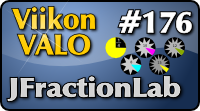

<!--
Title: 4x20 JFractionLab - Viikon VALO #176
Date: 2014/05/11
Pageimage: valo176-jfractionlab.png
Tags: Linux,Windows,Mac OS X,Matematiikka,Opetus,Oppiminen
-->

**JFractionLab on yksinkertainen ohjelma murtolukujen ja niillä
laskemisen harjoittelemiseen.**

JFractionLab on hyvin yksinkertainen ohjelma murtolukujen
harjoittelemiseen. Valittavissa on 14 erilaista tehtävätyyppiä, joista
kahdeksan ensimmäistä harjoituttaa murtoluvun käsitettä ja kuusi
jälkimmäistä niillä laskemista. Murtoluvuista harjoitellaan muun muassa
niiden muodostamista, vertailua, laventamista, supistamista,
murtolukujen muuntamista sekaluvuiksi ja takaisin sekä desimaaliluvuiksi
muuntamista. Laskutoimituksista harjoitellaan yhteen- ja vähennyslaskua,
kertolaskua sekä jakolaskua murtolukujen ja kokonaislukujen kanssa.
Laskutoimituksissa harjoitellaan tarvittaessa myös laventamista ja
supistamista sekä sekaluvuiksi muuntamista. Ohjelma pitää kirjaa kunkin
tehtävätyypin oikein vastatuista tehtävistä.

Kussakin tehtävätyypissä murtoluvut on havainnollistettu sektoreina
taikka suorakaiteen osina. Esimerkiksi laventamisissa ja supistamisissa
tämä havainnollistaa hyvin, miten väritetty sektori pysyy yhtä suurena
vaikka jako-osien määrä muuttuu.

Ohjelmaa ei valitettavasti ole käännetty suomeksi. Kielivaihtoehtoina
löytyy saksa, englanti, espanja, ranska, italia ja portugali.
Desimaalilukuja käsittelevien tehtävien kohdalla ohjelma hyväksyy sekä
suomalaisen desimaalipilkun että monissa maissa käytössä olevan
desimaalipisteen. Tästä huomaavaisesta toteutuksessa lienee kiittäminen
ohjelman saksalaista alkuperää.

Kotisivu
:   <http://jfractionlab.sourceforge.net/>

Lisenssi
:   [GNU GPL](GNU_GPL)

Toimii seuraavilla alustoilla
:   Linux, Windows, Mac OS X

Asennus
:   Ohjelma on ladattavissa sen kotisivuilta. Se löytyy myös joidenkin
    Linux-jakeluiden pakettivarastosta. Ohjelma vaatii toimiakseen
    Java-ympäristön.

-   [Tehtävävalikko](images/jfractionlab-1.jpg)
-   [Ensimmäisessä tehtävätyypissä valitaan hiirellä klikkaamalla oikea
    määrä osia.](images/jfractionlab-2.jpg)
-   [Supistamisen harjoittelua.](images/jfractionlab-3.jpg)
-   [Murtolukujen vähennyslasku aloitetaan laventamalla saman
    nimisiksi.](images/jfractionlab-4.jpg)

*Teksti: Pesasa*  
*Kuvakaappaukset: Pesasa*

