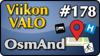

<!--
Title: 4x22 OsmAnd - Viikon VALO #178
Date: 2014/05/25
Pageimage: valo178-osmand.png
Tags: Android,SailfishOS,Kartta,Navigointi
-->

**OsmAnd on OpenStreetMap-karttoja käyttävä avoimen lähdekoodin kartta-
ja navigointisovellus Androidille..**

OsmAnd on varsin monipuolinen karttasovellus Android-laitteisiin ja
toimii hyvin myös SailfishOS-alustalla. Sitä voi käyttää sekä online-
että offline-karttojen kanssa. Ohjelma käyttää
[OpenStreetMap](OpenStreetMap)-projektin tarjoamia vapaata
karttadataa. Tarvittavan alueen kartat voi ladata valikkojen kautta
laitteen muistiin offline-käyttöä varten. Tämä toisaalta nopeuttaa
karttojen käyttöä ja on toisaalta hyödyllistä myös ulkomailla, missä
runsas verkkoliikenne voi tulla kalliiksi. OpenStreetMapin
offline-kartat ovat kompaktissa vektorimuodossa ja ovat hyvin ajan
tasalla. OsmAndia on mahdollista käyttää myös navigaattorina, jolloin se
laskee reitin lähtöpisteestä määränpäähän ja antaa reittiohjeet sekä
visuaalisina että ääniohjeina. Käytettävät äänet ja kielet ovat
ladattavissa laitteeseen samaan tapaan kuin kartatkin.

Ohjelmalla on kolme erilaista näyttötilaa kartoille: pohjoinen ylös,
kulkusuunta sekä kompassi. Ensimmäisessä kartta on aina asemoitu niin,
että pohjoinen on kartan yläreunassa. Toinen vaihtoehto seuraa käyttäjän
liikettä GPS:llä ja pitää kulkusuunnan aina eteenpäin. Kolmannessa
tilassa ohjelma tunnistaa laitteen asennon laitteen sisäisellä
kompassilla ja suuntaa kartan niin, että kartan pohjoinen on todellisen
pohjoisen suuntaan. Viimeinen vaihtoehto sopii erityisesti tilanteeseen,
jolloin ollaan liikkeellä esimerkiksi kävellen. Ohjelma osaa myös
näyttää kartat erikseen yö- tai päivätilassa. Yötilassa karttojen
väritys on sellainen, ettei se häikäise tai muuten häiritse hämäränäköä.
Asetusta voi vaihtaa käsin tai sen voi laittaa toimimaan automaattisesti
valoisuusanturin perusteella.

Ohjelmalla voi tehdä paikka- ja reittihakuja osoitteen tai paikan tyypin
perusteella ja hauissa voi hyödyntää OpenStreetMapin ja
[Wikipedian](Wikipedia) tarjoamaa dataa ja kiinnostavia
paikkoja (POI, Points Of Interest). OpenStreetMapin data sisältää muun
muassa tietoa kaupoista, ravintoloista, huoltoasemista,
majoituspaikoista, museoista tai vaikka pankkiautomaateista. Wikipedian
kautta saadaan myös tietoa vaikkapa nähtävyyksistä. Kiinnostavat paikat
voidaan näyttää myös kartalla tyypin mukaan. Ohjelma tukee jonkin verran
alueesta riippuen myös julkisen liikenteen hakuja, eli käytännössä osaa
ainakin näyttää linja-autopysäkkien sijainteja. Haettaessa kohteen
tyypin perusteella, esimerkiksi kauppaa, ohjelma näyttää listan
löydetyistä kohteista lueteltuna etäisyyden mukaisessa järjestyksessä.
Kunkin kohteen kohdalla on lisäksi pieni aktiivisesti päivittyvä nuoli,
joka osoittaa suunnan, jossa kohde sijaitsee.

Ohjelman navigointiominaisuutta voi käyttää erikseen auto-, pyöräily tai
kävelyasetuksilla, jolloin OpenStreetMapin kartoista osataan valita
parhaiten soveltuvia reittejä. Ohjelmalla voi tallentaa muistiin
kuljetut reitit GPX-tiedostona tai online-palveluihin. Kuljettuja
reittejä ja kiinnostavia voi ladata myös suoraan OpenStreetMap-palveluun
palvelun kehittämistä varten.

Ohjelmaan on ladattavissa myös joitain lisäosia, jotka laajentavat sen
toimintaa. Tällaisia ovat esimerkiksi etäisyyslaskuri, audio- ja
videomuistiinpanot sekä esteettömyyteen liittyvät toiminnallisuudet.

OsmAndin käyttöliittymä on osittain käännetty suomeksi, mutta käännös on
joiltain osin vielä kesken, joten valikoissa saattaa esiintyä myös
englanninkielisiä kohtia.

Kotisivu
:   <http://osmand.net/>

Lataus
:   <https://f-droid.org/repository/browse/?fdid=net.osmand.plus>
    (F-Droid)
:   <https://play.google.com/store/apps/details?id=net.osmand> (Google
    Play)

Lähdekoodi
:   <https://code.google.com/p/osmand/>

Lisenssi
:   [GNU GPL](GNU_GPL) v3

Toimii seuraavilla alustoilla
:   Android, SailfishOS

Asennus
:   Ohjelman voi asentaa Google Playn tai
    [F-Droidin](F-Droid) kautta.

OsmAnd ja OpenStreetMap
:   <http://wiki.openstreetmap.org/wiki/OsmAnd>

-   [Ohjelman ensimmäinen käynnistys kysyy, halutaanko ladata
    offline-karttoja.](images/osmand-1.jpg)
-   [Karttojen lataaminen.](images/osmand-2.jpg)
-   [Karttojen lisäksi ladattavissa on myös äänipaketteja joko
    tallenteina tai teksti puheeksi -toiminnolla sekä Wikipedian
    paikkatietoa.](images/osmand-3.jpg)
-   [Karttatietoa on paketteina ladattavissa alueittain ympäri
    maailmaa.](images/osmand-4.jpg)
-   [Ohjelman selkeästä päävalikosta pääsee suoraan karttaan,
    hakutoimintoon, suosikkipaikkoihin sekä
    asetuksiin.](images/osmand-5.jpg)
-   [Asetukset](images/osmand-6.jpg)
-   [Karttanäkymä ja GPS-sijainti.](images/osmand-7.jpg)
-   [Yleinen karttanäkymä kompassin mukaan
    suunnattuna.](images/osmand-8.jpg)
-   [Kartalla näkyvät ominaisuudet. Näkymän ominaisuudet voi valita
    neljän eri pikavalinnan mukaan: yleinen karttanäkymä sekä auto-,
    pyöräily- ja kävelytila.](images/osmand-9.jpg)
-   [Kartalla näytettävät kiinnostavat kohteet.](images/osmand-10.jpg)
-   [Osoitehaku](images/osmand-11.jpg)
-   [Ohjelman autolle laskema reitti, reitin pituus ja arvio
    ajoajasta.](images/osmand-12.jpg)
-   [Lista sijainnin lähellä sijaitsevista ruokakaupoista, niiden
    etäisyyksistä ja suunnista.](images/osmand-13.jpg)
-   [Vaiheittainen reittiohje kohteeseen.](images/osmand-14.jpg)

*Pesasa*  
*Kuvakaappaukset: Pesasa*

