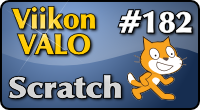

<!--
Title: Scratch
Week: 4x26
Number: 182
Date: 2014/06/22
Pageimage: valo182-scratch.png
Tags: Linux,Windows,Mac OS X,Ohjelmointi,Opetus,Opiskelu
-->

**Scratch on ohjelmoinnin alkeiden ja perusperiaatteiden opetteluun
hyvin sopiva ohjelma, jossa ohjelmointi tapahtuu valmiita peruspalikoita
paikoilleen raahaamalla.**

Scratch on erittäin suosittu ohjelmisto ohjelmoinnin perusteiden
opettamiseen alakouluikäisille lapsilla ja miksei vähän vanhemmillekin
ohjelmoinnista kiinnostuneille. Scratchissa ohjelmointi tapahtuu [Turtle
Art](Turtle_Art) -ohjelman tavoin raahaamalla muistakin
ohjelmointikielistä tuttuja rakenteita edustavia palikoita
ohjelmointialueelle ja kytkemällä niitä toisiinsa. Palikat muistuttavat
palapelin paloja tai Lego-palikoita, jotka loksahtavat toisiinsa kiinni
ja joista voi oikein järjesteltyinä rakentaa mielekkäästi toimivia
ohjelmia. Palikoiden joukosta löytyvät muun muassa ohjelmoinnissa
tavalliset kontrollirakenteet, kuten ehdolliset if- ja if-else-rakenteet
ja erilaiset silmukat, sekä palikat muuttujien käsittelyyn, niiden
operaatioihin ja vertailuihin.

Jotta ohjelmoinnilla saadaan helposti ja nopeasti aikaan jotain näkyvää,
käyttää Scratch tähän tarkoitukseen erilaisia hahmoja (sprite), joiden
liikkumista ja toimintaa käyttäjä voi ohjelmoida. Hahmoja ohjelmoimalla
voi luoda animaatioita tai pelejä ja ne voi laittaa piirtämään
kulkemaansa reittiä kilpikonnagrafiikan tapaan. Oletuksena
esiintymislavalla, eli taustalla on ohjelman nimen mukaisesti
Scratch-kissa, mutta ohjelman hahmovarastosta löytyy suuri joukko
valmiita hahmoja, kuten eläimiä, ihmisiä ja esineitä. Myös uusia omia
hahmoja on mahdollista piirtää. Taustalle voi valita yhtä aikaa useita
hahmoja ja kullekin niistä sekä itse esityslavalle voi ohjelmoida omat
toimintonsa. Esityslavalle voi ladata myös omaan ohjelmaan sopivan
taustakuvan.

Hahmojen liikkumisen esityslavalla voi ohjelmoida ennalta suunnitelluksi
taikka toimintoihin voi ohjelmoida satunnaisuutta käyttämällä
satunnaislukuja annetulta väliltä tuottavaa ohjelmointipalikkaa. Kukin
hahmo voi myös havaita ja tuottaa tapahtumia (event), jolloin ne voivat
reagoida toistensa tekemisiin. Hahmon voi esimerkiksi ohjelmoida
tekemään jonkin tietyn toiminnon aina kun se törmää johonkin toiseen
hahmoon tai tausta-alueen reunaan. Hahmon voi ohjelmoida muuttamaan
ulkoasuaan tietyissä tilanteissa tai vaikka päästämään jonkin äänen ja
katoamaan tullessaan toisen hahmon syömäksi.

Scratchilla voi käsitellä myös matematiikkaa ja laskea jonkin verran
peruslaskutoimituksia. Jo yksinkertaisilla ohjelmilla on helppoa laittaa
vaikka Scratch-kissa piirtämään fraktaalikuviota kilpikonnagrafiikan
tapaan. Myös merkkijonomuuttujien tarkastelu ja muokkaus sekä musiikin
tekeminen ovat mahdollisia.

Scratch on käytettävissä usealla kielellä, mukaan lukien suomi.
Ohjelmasta on mahdollista jakaa tehtyjä Scratch-ohjelmia muiden kanssa
Scratch-sivustolla. Sivustolla jaetut ohjelmat ovat tarjolla
[CC-BY-SA-lisenssillä](http://creativecommons.org/licenses/by-sa/2.0/).

Kun ohjelmien koko alkaa kasvaa ja Scratch käydä riittämättömäksi, on
sen käytöstä varmasti melko yksinkertaista siirtyä jonkin muun, tekstinä
kirjoitettavan, ohjelmointikielen pariin, sillä tarvittavat
ohjelmointikielille yhteiset rakenteet on jo opittu.

Scratch on mukana valmiiksi asennettuna muun muassa Raspberry Pi
koneille tarkoitetussa Raspbian-käyttöjärjestelmässä ja Raspberry Pita
käytetäänkin jonkin verran juuri Scratchin käyttämiseen.

Scratchista on tarjolla kahta eri versiota: uudempi 2.0 ja vanhempi 1.4.
Uudempi versio julkaistiin 13.5.2014 vapaalla GNU GPL v.2 -lisenssillä.
Se on ohjelmoitu ActionScript-kielellä ja vaatii toimiakseen Adoben
Flash-soittimen. Vanhempi 1.4-versio on puolestaan ohjelmoitu
Smalltalk-kielellä eikä tarvitse Flashia toimiakseen. Sen lähdekoodi on
julkaistu kahdella eri lisenssillä, Scratchin omalla [Scratch Source
Code
License](http://wiki.scratch.mit.edu/wiki/Scratch_Source_Code_License):lla
ja GNU GPL v.2:lla. Näillä kahdella lisenssillä julkaistujen
lähdekoodien erona on ainakin Scratch-nimen, -logon ja -hahmon
käyttäminen brändäykseen sekä mahdollisuus ladata Scratchilla tehtyjä
ohjelmia suoraan Scratch-sivustolle. GPL-lisenssillä julkaistu versio on
tehty erityisesti helpottamaan ohjelman paketointia Linux-jakeluiden
mukaan.

Kotisivu
:   <http://scratch.mit.edu>
:   [Scratch 2.0:n lähdekoodi](https://github.com/LLK/scratch-flash)

Lisenssi
:   [GNU GPL](GNU_GPL) v.2

Toimii seuraavilla alustoilla
:   Linux, Windows, Mac OS X

Asennus
:   Ohjelma löytyy moniin Linux-järjestelmiin suoraan paketinhallinnan
    kautta. Muuten se on ladattavissa ohjelman kotisivuilta.

Linkkejä
:   [Lähdekoodista ja
    lisensseistä](http://wiki.scratch.mit.edu/wiki/Scratch_Source_Code)
:   [Ohjelmointia Scratchin
    kanssa](http://avoinoppikirja.fi/tite-scratch), suomenkielinen opas
    (Nelimarkka, Vainio, Kinnunen, CC-BY-SA)
:   [Peliohjelmointia
    Scratchilla](http://www.cs.helsinki.fi/group/linkki/materiaali/peliohjelmointi/scratch/)
:   [Sivusto Scratch-ohjelmoinnin opetteluun](http://learnscratch.org/)

-   [Scratchin perusnäkymä ja "Tietoa Scratchista"
    -ikkuna.](images/scratch-1.jpg)
-   [Muutamia hahmoja, kontrollirakenteiden paneeli sekä yksinkertainen
    ohjelma.](images/scratch-2.jpg)
-   [Scratchin mukana tulee suuri valikoima valmiita hahmoja. Eläimiä,
    ihmisiä, esineitä yms.](images/scratch-3.jpg)
-   [Taustakuvia on myös tarjolla useita valmiita tai vaihtoehtoisesti
    voi piirtää oman.](images/scratch-4.jpg)
-   [Scratchin mukana tulee muutamia esimerkkiohjelmia. Esimerkiksi
    tämä, jossa hiirellä liikuteltavalla isolla kalalla syödään
    pienempiä.](images/scratch-5.jpg)
-   [Yksinkertainen virtapiiri ohjelmoituna.](images/scratch-6.jpg)
-   [Hahmoilla voi luoda myös ajastettuja
    animaatioita.](images/scratch-7.jpg)

*Teksti: Pesasa*  
*Kuvakaappaukset: Pesasa*

