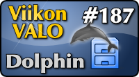

<!--
Title: 4x31 Dolphin - Viikon VALO #187
Date: 2014/07/27
Pageimage: valo187-dolphin.png
Tags: Linux,FreeBSD,OpenBSD,NetBSD,Tiedostonhallinta
-->

**Dolphin on selkeä ja monipuolinen tiedostonhallintaohjelma.**

 Dolphin on
[KDE](KDE)-työpöydän hyvin monipuolinen, mutta selkeä
tiedostonhallintaohjelma. Sillä voi hoitaa paikallisen levyn
tiedostonhallintatehtävät, mutta myös tiedostojen siirtämiset verkon
koneiden tai multimedialaitteiden välillä. Dolphinin toiminta nojaa
paljolti KDE-työpöydän
[KIO](http://en.wikipedia.org/wiki/KIO)-slave-järjestelmään (KDE
Input/Output), joka tarjoaa KDE-ohjelmille modulaarisesti pääsyn eri
protokollilla tarjottaviin palveluihin. Dolphinissa ovat käytettävissä
KIO-protokollina muun muassa tavallisia tiedostoja käsittelevä file,
ssh-yhteyden yli toimiva
[SFTP](http://en.wikipedia.org/wiki/SSH_File_Transfer_Protocol),
Windows-verkkojen selaamiseen käytettävä Samba, eli
[SMB](http://en.wikipedia.org/wiki/Server_Message_Block) sekä useat muut
protokollat.

Ohjelman käyttöliittymä on varsin yksinkertainen ja selkeä. Se
kehitettiin, kun KDE-työpöydälle haluttiin erillinen yksinkertainen
tiedostonhallintaohjelma aiemmin sekä tiedostonhallintana että
www-selaimena käytetyn Konquerorin rinnalle. Yksinkertaisesta
käyttöliittymästään huolimatta Dolphin on varsin monipuolinen juuri
KIO-slave-toiminnallisuuden sekä hyödyllisten sivupaneeliensa ansiosta.
Ohjelman yläpalkissa on vain muutama nappula, joilla navigoidaan
selaushistoriaa eteen- ja taaksepäin, valitaan tiedostojen näyttömuoto,
avataan hakutoiminnallisuus, kytketään päälle tiedostojen esikatselu
sekä jaetaan tiedostoalue kahteen rinnakkaiseen näkymään. Ohjelman
kaikki muut toiminnallisuudet on piilotettu yhden napin takaa esiin
saatavaan valikkoon. Valitun näyttömuodon Dolphin muistaa
kansiokohtaisesti.

Valitun kansion sijainti näytetään ikkunan yläreunassa hiirellä
navigoitavana polkuna vähän samaan tapaan kuin monilla www-sivuilla.
Vaihtoehtoisesti polkua voi tarkastella tai muokata puhtaasti tekstinä
klikkaamalla polun oikealta puolelta tai painamalla näppäimistöltä
yhdistelmää ctrl+L. Ikkunan sivuille voi lisäksi avata
lisätoiminnallisuuksia tarjoavia paneeleja. "Places"-, eli
"Paikat"-paneeli antaa näkyville järjestelmän ja käyttäjän luomat
kirjanmerkit, luettelot viimeksi käytetyistä tiedostoista, tiedostojen
haun niiden tyypin mukaan sekä pääsyn eri laitteisiin, kuten
usb-levyihin. Tiedostopuupaneeli tarjoaa puunäkymän tiedostojen
selaamiseen. Infopaneeli puolestaan näyttää tietoa valitusta tiedostosta
sekä esikatselun. Ääni- ja videotiedostojen esikatselu on soitettavissa
suoraan infopaneelissa.

Tiedostonäkymän jakaminen kahteen osaan mahdollistaa Dolphinin käytön
perinteisen kaksipaneelisen tiedostonhallinnan tavoin, jolloin
tiedostojen siirtäminen kahden eri kansion välillä sujuu helposti.
Dolphiniin voi avata useita kansioita myös erillisiin välilehtiin.
Dolphin-ikkunan alareunaan voi lisäksi avata terminaalinäkymän, johon
voi syöttää normaaleja komentorivikäskyjä. Aktiivisena oleva
tiedostonäkymä sekä terminaalinäkymä seuraavat toisiaan, joten kansion
vaihtaminen jommassakummassa vaihtaa sitä myös toisessa.

Verkkoa Dolphinilla voi selata esimerkiksi SMB- tai SFTP-protokollaa
käyttäen. Medialaitteiden, kuten puhelimen tai kameran sisältöön pääsee
käsiksi PTP- tai MTP-protokollilla. Dolphin näyttää linkit
medialaitteisiin suoraan Places-paneelin laiteosuudessa, johon
ilmestyvät näkyviin myös koneeseen liitetyt usb-levyt ja -tikut.
Tiedostojärjestelmien sekä verkko- ja usb-laitteiden lisäksi Dolphinilla
voi selata myös erilaisten paketoitujen tiedostojen sisältöjä.
Esimerkiksi ZIP-paketit voi avata näkyviin suoraan Dolphinilla ja selata
niiden sisältämiä tiedostoja samaan tapaan kuin mitä tahansa kansiota.
Jos Dolphin ei automaattisesti avaa tiedostopakettia itse, sen voi ottaa
käyttöön Dolphinin asetuksista. Dolphinilla voi selata myös
ISO-levykuvia käyttämällä iso-protokollaa, eli tiedoston osoitteena
'iso:/'-alkuista polkua. Dolphiniin saa lisättyä myös uusia protokollia
ja toiminnallisuuksia lisäosina. Tällaisia lisäosia ovat esimerkiksi
tuet erilaisille versionhallintajärjestelmille.

Audio-CD-levyt Dolphin osaa näyttää virtuaalisena levyjärjestelmänä,
jonka sisältönä näytetään levyllä olevat kappaleet WAV-tiedostoina sekä
omiin kansioihinsa jaoteltuina CDA-, FLAC-, MP3- sekä Ogg Vorbis
-tiedostoina. Nämä eivät siis ole todellisia cd-levyllä olevia
tiedostoja vaan virtuaalisia tiedostoja, jotka voi Dolphinilla kopioida
tietokoneen levyllä oikeiksi tiedostoiksi. KDE-työpöydän järjestelmät
hoitavat levyn raitojen muuntamisen ja pakkaamisen haluttuun
tiedostomuotoon kopioinnin yhteydessä. Lisäksi, kun cd-levy avataan
Dolphinilla, se käy automaattisesti hakemassa verkosta mahdollisuuksien
mukaan levyn kappaleiden tiedot, eli muun muassa esittäjän, raidan
numeron ja kappaleen nimen. Nämä näytetään kopioitavien tiedostojen
tiedostonimissä sekä id3-tagien tiedoissa. Tiedostonimien muodot ja
tiedostomuotojen pakkausasetukset ovat säädettävissä KDE-järjestelmän
multimedia-asetuksista.

Dolphinin hakutoiminnolla tiedostoja voi etsiä KDE:n muodostamasta
tietokannasta tiedostonimen, tyypin sekä sisällön perusteella.
Places-paneelissa ovat valmiit haut asiakirja-, kuva, audio- ja
video-tiedostotyypeille. Hakukriteereinä voi tekstin ja tyypin lisäksi
käyttää myös luontiaikaa sekä KDE:n tietokantaan tallennettua arvostelua
haettavasta tiedostosta.

Kotisivu
:   <http://dolphin.kde.org/>

Lisenssi
:   [GNU GPL](GNU_GPL) v.2

Toimii seuraavilla alustoilla
:   Linux, FreeBSD, OpenBSD, NetBSD

Asennus
:   Ohjelma on asennettavissa järjestelmän omista pakettivarastoista. Se
    asentuu automaattisesti, jos
    [KDE](KDE)-työpöytäjärjestelmä on asennettuna.

-   [Käyttäjän kotikansio kuvakenäkymällä.](images/dolphin-1.jpg)
-   [Kuvia sisältävä kansio esikatselukuvilla.](images/dolphin-2.jpg)
-   [Jaettu näkymä, jossa näkyvissä kaksi erillistä kansiota
    rinnakkain.](images/dolphin-3.jpg)
-   [Puunäkymä ja infonäkymä lisättyinä
    sivupaneeleiksi.](images/dolphin-4.jpg)
-   [Terminaalinäkymä avattuna paneeliksi.](images/dolphin-5.jpg)
-   [Yksityiskohtanäkymän näytettävien sarakkeiden
    valinta.](images/dolphin-6.jpg)
-   [Verkkonäkymässä ovat selattavissa muun muassa Samba-jaot sekä
    multimedialaitteet.](images/dolphin-7.jpg)
-   [Samba-jakojen käyttö suoraan verkon yli.](images/dolphin-8.jpg)
-   [Sftp-yhteyden käyttö Dolphinilla.](images/dolphin-9.jpg)
-   [Zip-paketin sisällön selaaminen suoraan
    Dolphinilla.](images/dolphin-10.jpg)
-   [Iso-levykuva avattu selattavaksi.](images/dolphin-11.jpg)
-   [Audio-cd:n sisältö esitetään virtuaalisena
    tiedostojärjestelmänä.](images/dolphin-12.jpg)
-   [Usb-tikun selaaminen ja irrottaminen.](images/dolphin-13.jpg)
-   [Puhelimen sisällön selaamista
    mtp-yhteydellä.](images/dolphin-14.jpg)
-   [Dolphinin hakutoiminnallisuus hyödyntää KDE:n luomaa tietokantaa
    levyllä olevista tiedostoista.](images/dolphin-15.jpg)

*Teksti: Pesasa*  
*Kuvakaappaukset: Pesasa*

