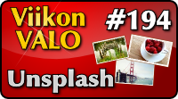

<!--
Title: Unsplash
Week: 4x38
Number: 194
Date: 2014/09/14
Pageimage: valo194-unsplash.png
Tags: Kaikki alustat,Kuvat,Valokuvat,Aineisto
-->

**Unsplash on kokoelma vapaasti käytettäviä korkeatarkkuuksisia ja
taiteellisia valokuvia.**

 Unsplash tarjoaa
täysin vapaaseen käyttöön kokoelman valikoitujen ammattilaisten ottamia
kauniita valokuvia hyvällä tarkkuudella. Kaikki Unsplashin kuvat on
lisensoitu [Creative Commonsin](http://creativecommons.fi/) täysin
vapaalla
[CC0](http://creativecommons.org/publicdomain/zero/1.0/)-lisenssillä,
joka antaa täysin vapaat kädet teosten hyödyntämiseen. Kuvia voi selata
suoraan sivuston [etusivulta](http://unsplash.com/) tai pienempinä
esikatselukuvina [arkistosta](http://unsplash.com/archive#_=_). Kaikki
kuvat ovat erittäin kauniita ja tunnelmallisia sekä riittävän korkealla
resoluutiolla moneen hyödylliseen käyttöön. Kuvat ovat selvästi
taitavien ja ammattitaitoisten kuvaajien ottamia.

Unsplash esittelee palvelusta saatuja kuvia käyttämällä tehtyjä teoksia
[Made with Unsplash](http://madewith.unsplash.com/) -osiossaan.

Palvelun takana on [Crew](https://pickcrew.com/), joka tekee
liiketoimintaa toimimalla linkkinä graafista toteutusta tarvitsevien
tahojen sekä ammattitaitoisten osaajien välillä.

Kotisivu
:   <http://unsplash.com/>

Lisenssi
:   [CC0](http://creativecommons.org/publicdomain/zero/1.0/)

Toimii seuraavilla alustoilla
:   Kaikki

-   [Etusivu](images/unsplash-1.jpg)
-   [Kuva etusivulla](images/unsplash-2.jpg)
-   [Arkisto](images/unsplash-3.jpg)
-   [Yksittäinen kuva](images/unsplash-4.jpg)
-   [Vanha kirjoituskone skaalattuna vähän pienemmäksi. Alkuperäinen
    koko 3997x2665 pikseliä.](images/unsplash-5.jpg)

*Teksti: Pesasa*  
*Kuvakaappaukset: Pesasa*  
*Kuvat: Unsplash*

