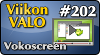

<!--
Title: 4x46 Vokoscreen - Viikon VALO #202
Date: 2014/11/09
Pageimage: valo202-vokoscreen.png
Tags: Linux,Video,Ruudunkaappaus
-->

**Vokoscreen on helppo ja selkeä työkalu ruutukaappausvideoiden
tekemiseen Linux-alustalla.**

 Vokoscreenillä
ruutukaappausvideoiden tekeminen onnistuu erittäin helposti. Ohjelman
käyttöliittymä on selkeä, mutta siitä löytyy silti tarpeellisimmat
ominaisuudet ja toiminnot. Ruutukaappausvideot ovat opetuksessa varsin
hyödyllisiä. Niitä voidaan käyttää joko jonkin sovellusohjelman käytön
opettamiseen tai muun tietokoneella tapahtuvan opetuksen tallentamiseen.

Ohjelman asetukset on jaoteltu välilehdille selkeinä ryhminä.
Ensimmäisellä välilehdellä valitaan kaapattavan alueen rajaus,
webkameran kuvan näyttäminen ruudulla sekä suurennuslasitoiminnon
käyttö. Toiselta välilehdeltä löytyvät ääniasetukset, joista valitaan
käytetäänkö äänien hallintaan PulseAudiota vai Alsaa sekä käytettävä
äänilaite. Kolmas välilehti sisältää videoasetukset. Valittavissa ovat
kuvatiheys, videon tallennusmuoto sekä näytetäänkö videolla hiiren
osoitin vai ei. Neljäs välilehti sisältää muita asetuksia, joihin
kuuluvat videotiedoston tallennuspaikka, esikatseluun käytettävän
videosoittimen valinta sekä Vokoscreen-ohjelman näyttämiseen liittyvät
asetukset.

Kaappausalueen rajaamiseen ohjelmassa on kolme vaihtoehtoa: koko ruutu
(fullscreen), ikkuna (window) sekä alue (area). Koko ruudun kaappaus
rajoittuu monen näytön järjestelmässä vain ensisijaiseen näyttöön, mikä
onkin hyvä ratkaisu. Jos alueeksi valitaan ikkuna, ohjelma rajaa
kaappaamisen valitun ikkunan reunojen mukaan ja kaikki tällä alueella
näkyvät muutkin ikkunat näkyvät videossa. Jos ikkunaa siirretään kesken
kaappauksen, myös kaappausalue siirtyy vastaamaan ikkunan uutta paikkaa.
Alueen kaappaamisessa käyttäjä voi itse rajata näytöltä haluamansa
alueen.

Ohjelma tukee webkameran kuvan näyttämistä kaapattavan alueen päällä.
Näin kaapattavaan videoon saadaan myös esiintyjä näkyville helposti.
Webkameran kuvan koko on valittavissa hiiren kakkospainikkeen takaa
tulevasta valikosta. Samoin kaapattavaan videoon voidaan ottaa
mikrofonin kautta mukaan myös ääni. Käytettävä mikrofoni voidaan valita
äänivälilehden asetuksista.

Erityisesti opetusvideoissa voi olla hyödyllistä korostaa esimerkiksi
joitain painikkeita tai valikon valintoja. Tällöin voidaan hyödyntää
suurennuslasitoimintoa, joka näyttää hiiren osoittimen alla olevan
alueen sen vieressä suurennettuna.

Itse kaappaukseen käytettävä käyttöliittymä on varsin selkeä ja koostuu
vain muutamasta nappulasta. "Start" nappula käynnistää videon
kaappaamisen, "Stop" pysäyttää sen ja "Pause" mahdollistaa väliaikaisen
pysäyttämisen ja kaappaamisen jatkamisen samaan tiedostoon. "Play"
nappula avaa kaapatun tiedoston valittuun esikatseluohjelmaan,
esimerkiksi [VLC-mediasoittimeen](VLC-mediasoitin). Lisäksi
käytettävissä on "Send"-painike, jolla videon voi lähettää
sähköpostilla. Vokoscreen näyttää myös työpöydän tehtäväpalkissa
painikkeet "Start"-, "Stop"- ja "Pause"-toiminnoille, jolloin
Vokoscreenin oma ikkuna voi olla kaappauksen aikana minimoituna.

Ohjelman asetuksista kannattaa kokeilla, mitkä säädöt sopivat parhaiten
käytettävälle laitteelle. Esimerkiksi kokeilulaitteella sopiva
kuvatiheys näytti olevan 15 kuvaa sekunnissa. Lisäksi kokeilulaitteella
PulseAudion käyttö näytti aiheuttavan ongelmia äänen ja kuvan
kohdistuksessa, mutta Alsan käyttäminen toimi hyvin.

Vokoscreen käyttää videokaappaukseen ja tallentamiseen
komentoriviohjelmaa nimeltä avconv. Komentoriviltä käynnistettynä
Vokoscreen tulostaakin näkyviin käytetyn avconv-komennon
komentoriviparametreineen. Osaava käyttäjä voi halutessaan kopioida tuon
komennon ja hyödyntää sitä myös ilman Vokoscreeniä esimerkiksi omassa
skriptissä.

Kotisivu
:   <http://www.kohaupt-online.de/hp/>

Lähdekoodi
:   <https://github.com/vkohaupt/vokoscreen>

Lisenssi
:   [GNU GPL](GNU_GPL) v.2

Toimii seuraavilla alustoilla
:   Linux

Asennus
:   Ohjelma löytyy suoraan ainakin Ubuntun sekä Debianin Jessie-version
    pakettivalikoimista. Vokoscreenin omilta kotisivuilta voi myös
    ladata zip-paketin, johon on paketoitu versiot useammalle Debianin,
    Ubuntun sekä OpenSusen versioille.

-   [Kaappausalueen, webkameran ja suurennuslasin valinnat Vokoscreenin
    päänäkymässä](images/vokoscreen-1.jpg)
-   [Ääniasetukset](images/vokoscreen-2.jpg)
-   [Videoasetukset](images/vokoscreen-3.jpg)
-   [Muut asetukset](images/vokoscreen-4.jpg)
-   [Tietoja ohjelmasta ja linkkejä](images/vokoscreen-5.jpg)
-   [Webkameran kuvan saa näkymään kaapattavan alueen
    päällä.](images/vokoscreen-6.jpg)
-   [Kaappausalueen rajaus työpöydältä](images/vokoscreen-7.jpg)
-   [Kaapatun videon esikatselu
    VLC-soittimella](images/vokoscreen-8.jpg)
-   [Suurennuslasitoiminnolla voi näyttää hiirellä osoitetun kohdan
    suurempana.](images/vokoscreen-9.jpg)
-   [Vokoscreenin hallintanappulat näkyvät myös työpöydän
    työkalupalkissa.](images/vokoscreen-10.jpg)
-   [Komentoriviltä käynnistetty Vokoscreen tulostaa käytetyn
    avconv-komennon parametreineen.](images/vokoscreen-11.jpg)

*Teksti: Pesasa*  
*Kuvakaappaukset: Pesasa*

