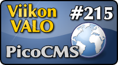

/*
Title: 5x07 PicoCMS - Viikon VALO #215
Date: 2015/02/16 23:00
Tags: PHP,www
Pageimage: valo215-picocms.png
*/

**PicoCMS on kevyt ja yksinkertainen tietokannaton
sisällönhallintajärjestelmä www-sivujen ylläpitoon.**

 Joidenkin
www-sivustojen ylläpitoon tietokantaa käyttävät
sisällönhallintajärjestelmät, kuten Drupal, Wordpress ja Joomla,
vaikuttavat yliampuvilta. Toisaalta, jo muutamastakin sivusta koostuvan
kokonaisuuden ylläpito staattisina HTML-tiedostoina voi käydä työlääksi,
jos niiden pitäisi yhtenäisiä, samalla sivupohjalla tehtyjä ja sisältää
samoja yhteisiä osia, kuten navigointi. Tällaiseen käyttöön voi sopia
tietokannattomasti pelkillä tiedostoilla toteutettu Pico. Picolla tehty
sivusto koostuu melko yksinkertaisesta PHP-kielellä toteutetusta
Pico-sisällönhallintajärjestelmästä, muokattavissa olevasta sivupohjasta
sekä hakemistosta, johon sisältö kirjoitetaan Markdown-merkkauskielisinä
tekstitiedostoina. Pico soveltuu erityisesti käyttäjille, jotka eivät
pelkää tekstitiedostojen muokkausta ja niiden siirtämistä palvelimelle
tiedostojensiirto-ohjelmalla. Pico ei oletusasennuksessaan sisällä
lainkaan verkkoselaimen kautta tapahtuvaa kirjautumista ja sivujen
muokkausta.

Picoon sisältö kirjoitetaan Markdown-kielellä, joka muistuttaa
läheisesti tekstimuotoisissa sähköposteissakin käytettyä varsin
luonnollista tapaa muotoilla tekstiä. Sama Markdown on käytössä myös
esimerkiksi GitHub- ja Stack Overflow -palveluissa. Satunnaisia
vaativampia muotoiluja voi Markdown-tekstin sekaan lisätä myös
tavallisena HTML-tekstinä. Sisältöä voi myös ryhmitellä muodostamalla
hakemistorakenteita.

Sivuston sivupohjien toteuttamiseen Pico käyttää
[Twig](https://en.wikipedia.org/wiki/Twig_%28template_engine%29)-moottoria,
jolla esimerkiksi blogisivuston artikkeliluettelon toteuttaminen
lyhennelmineen on melko helppoa. Markdown-muotoisiin sivutiedostoihin
voi lisätä kommenttilohkoon erinäisiä sivupohjissa käytettäviä tietoja,
kuten sivun otsikon, päivämäärän sekä sivun näyttämiseen käytettävän
sivupohjan.

Picon perusasennus on ominaisuuksiltaan melko suppea ja useimmat
tarvittavat ominaisuudet voikin lisätä siihen lisäosina eli plugineina.
Lisäosina Picoon ovat saatavilla muun muassa tuki RSS-syötteelle,
tag-järjestelmä, automaattisesti luotujen sivulistojen sivuttaminen,
monipuolisempi navigointijärjestelmä sekä online-editori. Lisäosia on
mahdollista tehdä myös itse ja niillä voidaan esimerkiksi tuottaa
sivupohjissa hyödynnettäviä muuttujia.

Kotisivu
:   <http://picocms.org/>

Lähdekoodi
:   <https://github.com/picocms/Pico>

Lisenssi
:   [MIT](MIT "wikilink")

Toimii seuraavilla alustoilla
:   PHP

Asennus
:   Ohjelmisto on ladattavissa ohjelman kotisivuilta tai
    GitHub-palvelusta ja sen voi asentaa www-palvelimelle, jolla voi
    käyttää PHP-kieltä (versio 5.3 tai uudempi).

* [Esimerkkisivuston etusivu](images/picocms-1.jpg)
* [Yksinkertainen oma sivu](images/picocms-2.jpg)
* [Sivu ja sen kirjoittamiseen käytetty Markdown-teksti.](images/picocms-3.jpg)
* [Markdownkin sekaan voi tarvittaessa kirjoittaa myös tavalista HTML-kieltä.](images/picocms-4.jpg)
* [Picon kotisivu](images/picocms-5.jpg)
* [Picoa voi laajentaa lisäosilla, joita löytyy sen kotisivuilta tai muiden vapaaehtoisten tekeminä.](images/picocms-6.jpg)

*Teksti: Pesasa*  
*Kuvakaappaukset: Pesasa*
