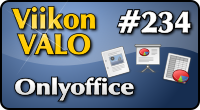

<!--
Title: Onlyoffice
Week: 5x26
Number: 234
Date: 2015/07/14
Pageimage: valo234-onlyoffice.png
Tags: Linux,Windows,Toimisto,Tekstinkäsittely,Taulukkolaskenta,Esitys
-->

**Onlyoffice on avoimen lähdekoodin verkkopohjainen toimisto-ohjelmisto.**

Onlyoffice on verkkoselaimella käytettävä toimisto-ohjelmisto samaan tapaan kuin Google Docs tai Microsoftin Office 365. Onlyoffice on kuitenkin asennettavissa omalle palvelimelle, jolloin sillä muokattavat tiedostot ovat aina käyttäjän omassa hallinnassa. Ohjelmisto sisältää työkalut tekstinkäsittelyyn, taulukkolaskentaan sekä esitysten laadintaan.

Onlyoffice on jo vuodesta 2009 TeamLab-nimellä tunnettu tuote, joka on vuonna 2014 julkaistu avoimena lähdekoodina. Onlyoffice tarjoaa ohjelmistoa kaupallisena pilvipalveluna sekä avoimena lähdekoodina, jonka voi asentaa omalle palvelimelle.

Onlyoffice koostuu kahdesta osasta: dokumenttipalvelimesta (documentserver) sekä yhteisöpalvelimesta (communityserver). Näistä dokumenttipalvelin sisältää varsinaiset toimistotyökalut, tekstinkäsittelyn, taulukkolaskennan ja esitystyökalun, muttei käyttäjätunnusten hallintaa, sisäänkirjautumisia tai asiakirjojen tallennustilaa. Tiedostojen muokkaaminen onnustuu pelkällä dokumenttipalvelimella yksinkertaisesti menemällä verkkoselaimella oikeaan osoitteeseen, lataamalla sovellukseen muokattavan tiedoston sekä muokkauksen jälkeen lataamalla tallennettavan tiedoston takaisin omalle koneelle.

Yhteisöpalvelin puolestaan tarjoaa Onlyofficen käyttöön kirjautumistunnukset, käyttäjien ryhmittelyn työryhmiksi, tiedostojen tallennustilan ja versioinnin. Asiakirjojen hallinnan lisäksi yhteisöpalvelin sisältää muita työkaluja esimerkiksi työprojektien käyttöön, kuten projektinhallinnan, asiakas- ja yhteystietojen hallinnan, työkaluja yhteisön sisäiseen käyttöön, kalenterin, Jabberilla toteutetun chat-palvelimen sekä webmail-ohjelman sähköpostin käyttöön.

Dokumentti- ja yhteisöpalvelimia voi käyttää yhdessä tai erikseen. Yksin käytettynä dokumenttipalvelin toimii kuin tavallinen toimisto-ohjelma ilman verkkotallennusta tai tiedostojen verkkojakoa. Yksinään yhteisöpalvelin puolestaan toimii työryhmäpalvelimena ja verkkotallennuspalveluna, jossa ei kuitenkaan ole asiakirjojen muokkausmahdollisuutta. Kun molemmat palvelimet ovat asennettuina, voidaan yhteisöpalvelimelle kertoa, mistä osoitteesta dokumenttipalvelin löytyy, jolloin yhteisöpalvelimen asiakirjoja voi myös muokata.

Yhteisöpalvelimen dokumenttiselaimeen voi integroida käytettäväksi myös ulkopuolisia pilvitallennuspalveluita, kuten [OwnCloud](OwnCloud). Tällöin palveluun tallennetut tiedostot näkyvät Onlyofficessa yhtenä kansiona.

Onlyofficen asetukset ovat muokattavissa esimerkiksi oman yrityksen tarpeiden mukaan vaihtamalla otsikoksi ja logoksi haluamansa nimet ja kuvat.

Laadultaan Onlyofficen toimistotyökalut ovat varsin hyvät. Työkalut on toteutettu HTML5:n canvas-elementtiä käyttäen ja ohjelmaa käyttäessä on helppoa unohtaa käyttävänsä websovellusta. Natiivina tiedostomuotoina ohjelmat käyttävät Microsoftin Office Open XML -tiedostomuotoja (DOCX, XSLS ja PPTX). Myös LibreOfficen käyttämiä Open Document Format -tiedostoja (ODT, ODS ja ODP) voidaan avata ja muokata, mutta nämä muunnetaan aina sisäisesti OOXML:n mukaiseen muotoon. Tiedostot voidaan kuitenkin tallentaa myös Open Document -muotoisina.

Kotisivu
:   <http://onlyoffice.org>

Lisenssi
:   [GNU AGPL](https://www.gnu.org/licenses/agpl-3.0.html)

Toimii seuraavilla alustoilla
:   Linux, Windows

Asennus
:   Ohjelmisto on asennettavissa Docker-sovelluksena tai perinteisempänä asennuspakettina. Ohjeet ja linkit löytyvät Onlyofficen kotisivuilta.

-   [Dokumenttipalvelimen etusivu, jolla voidaan ladata muokattava tiedosto.](images/onlyoffice-1.jpg)
-   [Tekstinkäsittelyohjelma ja esittelytiedosto.](images/onlyoffice-2.jpg)
-   [Tekstinkäsittelyyn upotetun kaavion muokkausta.](images/onlyoffice-3.jpg)
-   [Tekstiasiakirjan voi ladata omalle koneelle useassa eri muodossa.](images/onlyoffice-4.jpg)
-   [Tekstiasiakirjaan voi tehdä kommenttimerkintöjä ja kommentteihin voi kirjoittaa vastauksia.](images/onlyoffice-5.jpg)
-   [Samaa asiakirjaa voi muokata useampi käyttäjä yhtä aikaa. Muokattavat kappaleet lukitaan ja näytetään varattuina.](images/onlyoffice-6.jpg)
-   [Taulukkolaskenta ja esimerkkitiedosto.](images/onlyoffice-7.jpg)
-   [Kaavion asetuksia.](images/onlyoffice-8.jpg)
-   [Esitystyökalu ja sen esimerkkitiedosto.](images/onlyoffice-9.jpg)
-   [Esitystyökalun ruudun asetukset, kuten taustakuva ja siirtymä.](images/onlyoffice-10.jpg)
-   [Kaavion lisääminen esitykseen.](images/onlyoffice-11.jpg)
-   [Yhteisöpalvelimen etusivu tarjoaa kirjautumisen jälkeen erilaisia työkaluja](images/onlyoffice-12.jpg)
-   [Yhteisöpalvelimen asetuksia. Kustomointi oman yhteisön käyttöön.](images/onlyoffice-13.jpg)
-   [Yhteisöpalvelimen dokumenttiselain, jossa Owncloud-tili lisättynä](images/onlyoffice-14.jpg)
-   [Yhteisöpalvelimen sisäänrakennettu Jabber-palvelu.](images/onlyoffice-15.jpg)
-   [Sisäänrakennettu webmail-ohjelma, johon lisättynä yksi Gmail-tili.](images/onlyoffice-16.jpg)
-   [Yhteisöpalvelimen kalenterisovellus.](images/onlyoffice-17.jpg)

*Teksti: Pesasa*  
*Kuvakaappaukset: Pesasa*

