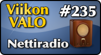

<!--
Title: Nettiradio
Week: 5x27
Number: 235
Date: 2015/07/14 20:00
Pageimage: valo235-nettiradio.png
Tags: SailfishOS,Musiikki,Audio
-->

**Nettiradio on sovellus suomalaisten nettiradioiden kuunteluun Jollan Sailfish-puhelimella.**

Nettiradio on hyvin yksinkertaisella käyttöliittymällä varustettu sovellus nettiradioiden kuunteluun. Nettiradio ei yritä tehdä mitään ylimääräistä. Se vain luettelee 54 suomalaista nettiradioasemaa luokiteltuna valtakunnallisiin, paikallisiin, NRJ-asemiin sekä tilapäisiin. Kanavan valitsemalla sovellus alkaa toistaa kyseisen radiokanavan lähetystä verkosta.

Kanavalistassa ei ole mukana Ylen kanavia, jotka käyttävät verkkolähetyksiinsä Windows Media -tekniikkaa.

Kotisivu
:   <https://openrepos.net/content/jollailija/finnish-net-radio-client-beta>
:   [Lähdekoodi (Github)](https://github.com/jollailija/nettiradio)

Lisenssi
:   [BSD](http://opensource.org/licenses/BSD-3-Clause) (3 kohdan)

Toimii seuraavilla alustoilla
:   SailfishOS

Asennus
:   Ohjelma on asennettavissa Jollan sovelluskaupasta. Uusin versio löytyy myös [Openrepos-palvelusta](https://openrepos.net/content/jollailija/finnish-net-radio-client-beta).

-   [Radioasemalista alkaa valtakunnallisilla asemilla.](images/nettiradio-1.jpg)
-   [Ohjelman kannesta saa pysätettyä ja jatkettua toistoa.](images/nettiradio-2.jpg)
-   [Paikallisia ja NRJ-kanavia](images/nettiradio-3.jpg)

*Teksti: Pesasa*  
*Kuvakaappaukset: Pesasa*

