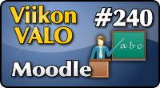

<!--
Title: Moodle
Week: 5x32
Number: 240
Date: 2015/11/29 16:00
Pageimage: valo240-moodle.png
Tags: Linux,Windows,Mac OS X,FreeBSD,OpenBSD,NetBSD,Palvelin,Oppiminen,Opetus
-->

**Moodle on yleisesti käytetty avoimen lähdekoodin oppimisalusta.**

Moodle on hyvin monissa kouluissa käytössä oleva palvelinpohjainen sähköinen oppimisalusta, jossa opettaja voi luoda ja pitää kursseja. Ohjelmisto on hyvin monipuolinen ja tukee muun muassa useiden erillisten opetusryhmien opettamista samalla kurssiaineistolla.

Moodlen monipuolinen hyödyntäminen vaatii jonkin verran opettelua ja tutustumista sen toimintalogiikkaan sekä sen tarjoamiin mahdollisuuksiin. Yksinkertaisimmillaan Moodleen rakennettu kurssi, eli työtila, on vain sivu, jolle opettaja on linkittänyt käyttämäänsä oppimateriaalia. Moodle on kuitenkin toiminnoiltaan hyvin monipuolinen ja sitä käyttämällä voi rakentaa hyvinkin rikkaan kurssimateriaalin, joka tarjoaa opiskelijalle esimerkiksi yksilöidyt opintopolut.

Moodle-kurssin sisällön voi järjestää aiheiden tai etenemisaikataulun mukaan. Kurssille voi lisätä useita erityyppisiä aktivitetteja tai aineistoja, kuten chatin, keskustelualueen, kyselyn, oppitunteja, sanastoja, tehtäviä, tenttejä, tietokantoja, työpajoja ja wikejä. Aineista voi jakaa opiskelijoille sivuina, Moodle-kirjana, linkkeijä ja tiedostoina. Oppitunneista opettaja tai muu aineiston tekijä voi rakentaa yksilöllisiä opintopolkuja. Polut koostuvat sivuista, joiden lopussa voi olla aineiston ymmärtämistä kontrolloiva kysymys. Opiskelijan vastauksen mukaan siirrytään sivujen muodostamassa verkossa seuraavalle sivulle. Esimerkiksi väärä vastaus voi johdattaa opiskelijan sivulle, jolla kerrataan käytyä asiaa tarkemmin. Moodlen kirjat puolestaan ovat perinteiseen tapaan kappaleista ja alikappaleista koostuvia sivukokonaisuuksia, joita käyttämällä on helppoa luoda lineaarisesti etenevä hirarkkisesti jäsennelty oppimateriaali. Kirja voi sisältää tekstin lisäksi kuvia ja muuta multimediaa.

Opiskelijoiden työskentelyä voi ohjata ja arvioida erilaisilla kyselyillä, tenteillä ja tiedostopalautuksilla. Työskentelyä varten voi luoda myös työpajoja, joissa voidaan hyödyntää itsearviointia sekä vertaisarviointia.

Moodelen vasta julkaistussa versiossa 3 on monia uudistuksia, joihin voi tutustua [esittelysivulla](https://docs.moodle.org/30/en/New_features) tai katsomalla uusien ominaisuuksien [esittelyvideoita](https://www.youtube.com/playlist?list=PLxcO_MFWQBDfJWBOxTHhqvp5mTHG5giAX) Youtubesta. Uudessa versiossa on muun muassa käytettävissä neljä uutta kysymystyyppiä. ["Valitse puuttuva sana"](https://docs.moodle.org/30/en/Select_missing_words_question_type) on perinteisen aukkotehtävän muunnelma, jossa tekstiin jätettyihin aukkoihin valitaan sisältö pudotusvalikosta. ["Raahaa tekstiin"](https://docs.moodle.org/30/en/Drag_and_drop_into_text_question_type) on aukkotehtävä, jossa tekstistä puuttuvat sanat on annettu irrallisina sanoina, jotka opiskelijan täytyy raahata oikeille paikoilleen. ["Raahaa kuvaan"](https://docs.moodle.org/30/en/Drag_and_drop_onto_image_question_type) on hyvin samanlainen kysymystyyppi, mutta tässä raahattavat vastaukset ovat tekstejä tai kuvia ja ne raahataan pohjana olevaan kuvaan valmiiksi merkityille paikoille. ["Raahaa merkinnät"](https://docs.moodle.org/30/en/Drag_and_drop_markers_question_type) on puolestaan edellisen muunnelma, jossa kuvassa ei ole valmiiksi merkittyjä paikkoja vaan opiskelija joutuu itse löytämään kuvasta oikean kohdan.

Käyttäjähallinta Moodlessa on toteutettu kahdella tasolla. Järjestelmätasolla ylläpitäjä voi luoda uusia käyttäjiä ja antaa heille oikeuksia ylläpitoon sekä uusien työtilojen luomiseen. Käyttäjähallinnan toinen taso tapahtuu työtilojen tasolla, missä työtilalle voi lisätä osallistujia, joille puolestaan voi antaa erilaisia rooleja, kuten "opettaja", "opettaja ilman muokkausoikeutta", "opiskelija" ja "vierailija". Työtilan osallistujia voi jakaa erillisiin ryhmiin, jotka eivät välttämättä näe toisiaan. Tätä voidaan käyttää esimerkiksi saman työtilan hyödyntämiseen eri vuosina järjestettävillä kursseilla.

Moodle tukee myös SCORM-standardia, jolla samoja opetussisältöjä voidaan käyttää erilaisissa oppimisympäristöissä.

Kotisivu
:   <https://moodle.org>

Twitter
:   [@moodle](https://twitter.com/moodle)

Lisenssi
:   [GNU GPL](GNU_GPL)

Toimii seuraavilla alustoilla
:   Windows, Mac OS X, Linux, FreeBSD, OpenBSD, NetBSD

Asennus
:   Ohjelman uusin versio on ladattavissa sen kotisivuilta. Ohjelman voi ladata joko pakettina tai suoraan Git-versionhallinnalla. Linux-jakeluissa ohjelmisto löytyy suoraan paketinhallinnasta, mutta sitä kautta tarjottu versio ei jakelusta riippuen ole välttämättä aivan tuorein.

-   [Moodlen asennus](images/moodle-1.jpg)
-   [Asennuksen yhteydessä tarkistetaan, että kaikki tarvittavat ohjelmistot on asennettuina.](images/moodle-2.jpg)
-   [Uuden Moodlen perustiedot.](images/moodle-3.jpg)
-   [Vasta asennettu Moodle](images/moodle-4.jpg)
-   [Uuden käyttäjän lisääminen.](images/moodle-5.jpg)
-   [Luodaan sisältöä uuteen työtilaan.](images/moodle-6.jpg)
-   [Oppitunnin päätteksi voi lisätä kysymyksen, jonka perusteella käyttäjä ohjataan seuraavalle oppitunnille.](images/moodle-7.jpg)
-   [Kursseille voi lisätä kyselyitä. Mukana esimerkiksi valmis asenteita kartoittava kysely.](images/moodle-8.jpg)
-   [Yhtenä materiaalityyppinä on tietokanta, jota voidaan käyttää ja kartuttaa kurssin aikana.](images/moodle-9.jpg)
-   [Kurssilla voidaan käyttää monen tyyppisiä aktiviteeteja ja aineistoja, kuten työpajaa.](images/moodle-10.jpg)
-   [Moodleen voidaan myös kirjoittaa oppimateriaalia perinteisen kirjan muotoon.](images/moodle-11.jpg)

*Teksti: Pesasa*  
*Kuvakaappaukset: Pesasa*

