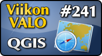

<!--
Title: QGIS
Week: 5x33
Number: 241
Date: 2015/11/29 17:00
Pageimage: valo241-qgis.png
Tags: Linux,Windows,Mac OS X,FreeBSD,Kartta,Paikkatieto,Tiede
-->

**QGIS on paikkatieto-ohjelmisto, jota käytetään karttojen piirtämiseen
ja sijaintiin liittyvien analyysien laatimiseen. Se soveltuu
kartoituksen ammattilaisille ja data-analyytikoille.**

Monissa paikkatietojärjestelmän tehtävissä voidaan käyttää QGISiä:
Käyttäjä voi luoda uutta paikkatietoaineistoa, ylläpitää tietokannan
materiaalia, laatia datasta analyyseja tai piirtää esitykseen soveltuvia
karttoja. Ohjelmiston avulla kartantekijä pystyy digitoimaan paperisia
karttoja, biologi tutkimaan kasvilajien levinneisyyttä tai kauppias
valitsemaan otollisimman paikan uudelle myymälälle.

Käyttäjä voi täydentää sisään rakennettuja työkaluja ulkoisilla
ohjelmilla, sillä QGIS toimii käyttöliittymänä muille vapaan lähdekoodin
paikkatieto-ohjelmille. Toiminnallisuutta voi laajentaa muiden muassa
GRASS- ja SAGA-ohjelmistojen työkaluilla. Ohjelmiston tekijät
ylläpitävät lisäosakirjastoa, joka sisältää lukuisia laajennuksia.
Esimerkiksi OpenLayers-lisäosa hakee OpenStreetMap -palvelun
rasterikarttoja.

Käyttäjä voi automatisoida usein toistuvia työvaiheita. Graafisessa
mallintajassa käyttäjä piirtää vuokaavion, joka kuvaa tietolähteet,
käytettävät algoritmit ja lopputuotteet. Toisena vaihtoehtona on
ohjelmoida Python-kielinen skripti, joka kuvaa työvaiheita. Käyttäjä voi
suorittaa valmiit prosessikuvaukset työkalupalkista.

QGISin käyttäjille on laadittu runsaasti ohjeistusta. Ohjeistus on
tarpeen, sillä QGISin käyttö edellyttää perustietoja kartoituksesta.
Verkkoaineisto ja kirjat ovat pääasiassa englanninkielisiä, mutta
ohjelmisto on käännetty suomeksi.

Kotisivu
:   <http://www.qgis.org>

Lisenssi
:   [GNU GPL](GNU_GPL)

Toimii seuraavilla alustoilla
:   Linux, Windows, Mac OS X, FreeBSD

Asennus
:   Lue kehittäjien laatimat
    [asennusohjeet](http://qgis.org/fi/site/forusers/download.html)

Käyttöohjeet
:   Linkkejä [oppimateriaaliin](http://qgis.org/fi/docs/index.html)
:   Ohjeet [Tilastokeskuksen rajapintapalvelun
    käyttöön](https://tilastokeskus.fi/tup/rajapintapalvelut/ohje_qgis_2.0.pdf)

-   [Tilastokeskuksen paikkatietoa QGISin karttanäkymässä](images/Qgis-1.png)‎
-   [Muutetaan OpenStreetMap-kartta esityskelpoiseen muotoon](images/Qgis-2.png)
-   [Tilastokeskuksen kartta sisältää paikkakohtaista tietoa](images/Qgis-3.png)
-   [Työvaiheet on laadittu vuokaavioksi graafisella mallintajalla](images/Qgis-4.png)
-   [Liitännäisillä voi hankkia lisätoimintoja](images/Qgis-5.png)

*Teksti: Mikko Harhanen*  
*kuvakaappaukset: Mikko Harhanen*
