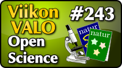

<!--
Title: Open Science
Week: 6x01
Number: 243
Date: 2016/01/10
Pageimage: valo243-open_science.png
Tags: Tiede, Openscience
-->

**Tieteen tekemisen tulisi olla läpinäkyvää ja kaikkien saatavilla. Open Science -liike pyrkii lisäämään tieteen avoimuutta ja varmennettavuutta.**

Tiedeyhteisö on 1600-luvulla aloitetusta tieteellisten lehtien julkaisemisesta lähtien pyrkinyt jakamaan tutkimustietoa keskenään, jotta tulokset olisivat helpommin
saatavissa ja vahvistettavissa sekä uusia tuloksia olisi mahdollista luoda pohjautuen aiempiin. Ennen tätä tieteellisiä tuloksia pyrittiin salailemaan siinä toivossa,
että niille löydettäisiin rahallisesti tuottoisaa käyttöä. Näin tiedemiehet olivat usein taiteilijoiden tapaan rikkaiden mesenaattien ylläpidettävinä. Koska
tieteelliset tulokset saatettiin pitää useitakin vuosia piilossa julkisuudelta, syntyi usein myös kiistaa siitä, kuka lopulta oli keksinyt tuloksen ensimmäisenä.
Tieteellisten julkaisujen myötä tieteen tekeminen kiihtyi, sillä tuli helpommaksi perustaa omat tuloksensa toisten jo aiemmin tekemien tieteellisten tulosten pohjalle.

Nykyisin tieteellisen julkaisemisen avoimuuden ongelmina on kuitenkin nähty toisaalta yritysten halu pitää teettämänsä tutkimuksen tulokset omana tietonaan ja
toisaalta perinteisten tieteellistä julkaisua harjoittavien painotalojen yritykset rajoittaa tiedon vapautta omien taloudellisten etujensa vuoksi.
Yritysten pyrkimykset pitää rahoittamansa tutkimus omassa käytössään on ymmärrettävää, mutta toisaalta usein, varsinkin haastajan asemassa oleville yrityksille,
tieteellisen tiedon vaihtaminen muiden tutkijoiden kanssa kiihdyttää myös oman tutkimuksen kehitystä ja tekee siitä luotettavampaa.
Painotalojen toiminnassa ongelmallisena nähdään erityisesti se, miten yleensä julkisella rahoituksella toimivat tutkijat tuottavat painotaloille vastikkeettomasti
julkaistavaa sisältöä, josta samat julkiset tahot, esimerkiksi yliopistot, jälleen maksavat paperille painettujen lehtien ja sähköisiin lehtiarkistoihin pääsyn muodossa.
Sen lisäksi, että tutkijat tuottavat lehtien sisällön ja maksavat kolleegojensa tuottamasta sisällöstä, he usein toimivat myös vastikkeettomasti julkaisujen
uskottavuutta ylläpitävinä artikkelien vertaisarvioijina. Painotalot lisäksi tyypillisesti vaativat tutkijoilta allekirjoitetun tekijänoikeussiirtosopimuksen, mutta ovat
alkaneet siirtyä sen sijaan julkaisulupiin.

Aiemmin paperille tapahtuva julkaiseminen vaati julkaisutalolta organisointityötä. Papereita kopioitiin ja läheteltiin fyysisinä kopioina vertaisarvioijille.
Latominen sekä painaminen tehtiin painossa ja painettuja lehtiä läheteltiin yliopistojen kirjastoihin ympäri maailmaa. Digitalisoitumisen myötä myös tieteellisten
tutkimusten julkaiseminen on yksinkertaistunut ja helpottunut eikä siihen kaivata samalla tavalla välikäsiä. Toisaalta julkaisujen hinnat ovat nousseet ja pääsy
julkaistuun tietoon on kallistunut. Lisäksi juuri oikean tiedon löytäminen voi olla vaikeaa ja kallista, kun jokaisesta julkaisusta pitää maksaa ennen sen lukemista.
Tieteen avoimuutta ja saatavuutta puolustavat tutkijat ovat alkaneet kannattaa [Open Science](https://en.wikipedia.org/wiki/Open_science)- ja
[Open access](https://en.wikipedia.org/wiki/Open_access) -liikkeitä, joiden tarkoituksena on helpottaa tutkijoiden välistä yhteistyötä. Tutkijat julkaisevat
tekemänsä tutkimuksen perinteisten lehtien lisäksi Open Access -tyyppisesti avoimesti saatavilla olevina artikkeleina verkkopalveluissa. Erityisesti
[arXiv.org](http://arxiv.org/)-palvelu on kerännyt suurta suosiota.

Tutkimusten ja tutkimusdatan avoimen julkaisun perusteluita:

* Mahdollistaa paremmin tutkimuksen ja datan oikeellisuuden vertaisarvioinnin.
* Tieteestä ja sen tekemisestä tulee läpinäkyvämpää ja toistettavampaa, jolloin sen luotettavuus lisääntyy.
* Avoin tiede saa aikaan suuremman vaikutuksen, koska useammat tutkijat voivat käyttää sitä oman tutkimuksensa pohjana. Tutkijoiden on aiempaa helpompaa löytää yhteyksiä
  eri tutkimusten välillä.
* Tutkimus on usein tehty julkisella rahoituksella, joten tulostenkin tulisi olla julkisia.

Avoimen julkaisemisen sudenkuoppia:

* Myös avoimesti julkaistu tutkimus tarvitsee vertaisarviointia ja kriittistä käsittelyä. Vaarana on, että tutkimuksia avoimena julkaiseviin palveluihin julkaistaan myös
  "huuhaatiedettä".
* Suuri yleisö voi ymmärtää tutkimuksen väärin. Alaan perehtymättömät mediat saattavat uutisoida tutkimuksesta suurelle yleisölle virheellisesti tai epätarkasti.

Vapaiden ja avoimien lähdekoodin ohjelmien aate on saanut alkunsa yliopistoympäristössä tutkijoiden keskuudessa ja avoimen tieteen liikkeiden myötä myös muu tiede on
pyrkimässä takaisin avoimempaan tutkimustapaan.

Verkkosivustoja
:   [arXiv.org](http://arxiv.org/) 
:   [Open Science Federation](http://opensciencefederation.com/)
:   [openscience.com](http://openscience.com)
:   [The OpenScience Project](http://www.openscience.org/)
:   [Open Access Week](http://openaccessweek.org/)
:   [Open science (Wikipedia)](https://en.wikipedia.org/wiki/Open_science)
:   [Open access (Wikipedia)](https://en.wikipedia.org/wiki/Open_access)

Twitter
:   [@openscience](https://twitter.com/openscience)

Video
:   [PhD Comics: Open Access Week (8:23 min)](https://upload.wikimedia.org/wikipedia/commons/7/71/PhD_Comics_Open_Access_Week_2012.ogv)

-   [arXiv.org](images/open_science-1.jpg)
-   [Open Science Twitterissä](images/open_science-2.jpg)
-   [PhD Comicsin video, joka kertoo, mistä Open Accessissa on kyse.](images/open_science-3.jpg)
-   [Open Science Federation](images/open_science-4.jpg)

*Teksti: Pesasa*  
*Kuvakaappaukset: Pesasa*

